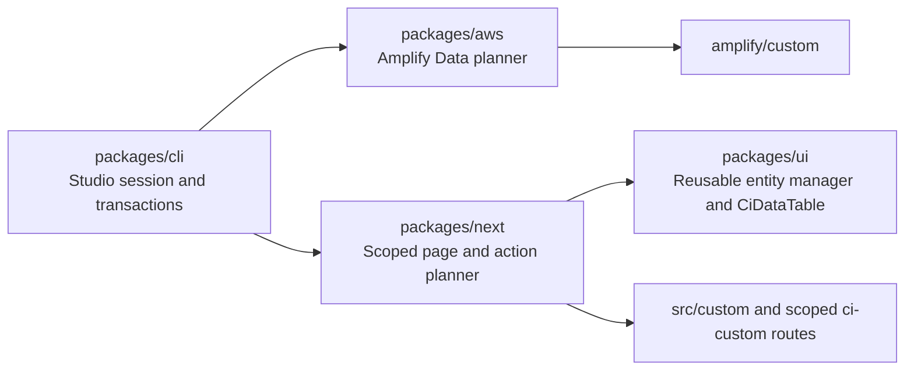

CloudIgniter applications need a hard ownership boundary so a template upgrade can replace company-maintained code without guessing whether a file contains customer work. A path being inside `apps/template` does not make it application-owned: the template contains both CloudIgniter-managed composition and explicit custom seams.

This boundary is mandatory for new work. Existing exceptions are migration debt, not precedents to copy.

## Ownership lanes

| Lane | Owners | Supported locations and responsibility |
| --- | --- | --- |
| Package core | CloudIgniter maintainers | Reusable contracts and algorithms in `packages/core`, Next.js integration in `packages/next`, AWS implementation in `packages/aws`, reusable presentation in `packages/ui`, and CLI orchestration in `packages/cli`. |
| Template core | CloudIgniter maintainers | Thin framework entry points, provider selection, default pages/configuration, and composition bridges in `apps/template`. An application upgrade may replace these files. |
| Application custom | Application developers | Provider/application additions under `amplify/custom/**`, configuration and hand-written application extensions under `src/custom/**`, and custom pages under a scoped `(ci-custom)` route tree. |
| Generated application custom | Resource Studio | Only registered generated entity folders, scoped generated page folders, and generated-owned registries within the application custom lane. |
| Machine-local state | Local operator/tool | Resource Studio transaction journals under `.cloudigniter/local/**`; never commit them. |

The supported custom page roots are:

```text
src/app/(ci-global)/ci-global/(ci-custom)/**
src/app/(ci-tenant)/ci-tenant/(ci-custom)/**
```

Application-owned management pages do not belong under `(system)`. The parenthesized group is an ownership marker and adds no URL segment.

## Thin bridges are the only cross-lane exception

A template-core entry point may import a custom registry or hook when the framework requires one application entry. It must remain a small composition layer and must not contain user business logic or a reusable algorithm.

Current examples are:

- `apps/template/routes.ts`, which composes package-owned core routes with `src/custom/routes`;
- `apps/template/amplify/data/resource.ts`, which composes core and custom schema fragments;
- `apps/template/amplify/backend.ts` and its backend shape, which compose the core backend with `amplify/custom/backend.ts` and call the custom post-construction hook.

The bridge remains CloudIgniter-managed. Application developers edit the custom input, not the bridge. Merge helpers reject duplicate route, schema, or backend resource keys so custom code cannot silently shadow core behavior.

## Resource Studio ownership contract

Resource Studio is split by capability owner:



The CLI resolves the target application's provider/framework package entries; it does not absorb AWS or Next.js compilation logic. A normal Data Entity uses native Amplify Data CRUD-and-list operations, so V1 does not generate a Lambda directory.

A generator may rewrite only:

- its entity folder, such as `amplify/custom/data/schemata/data-entities/book/**`;
- its scoped management folder, such as `src/app/(ci-tenant)/ci-tenant/(ci-custom)/dashboard/books/**`;
- shared files explicitly named as generated registries, currently `amplify/custom/data/schemata/registry.generated.ts` and `src/custom/routes/resource-studio.generated.ts`.

It must not rewrite a manual sibling registry, a template-core bridge, another resource's folder, or an unregistered file merely because its desired content differs. Creating or updating a resource must fail before transaction preparation when a generated model, globally unique logical route, list-query name, resource ID, reserved core/manual model or route, or target path collides with another owner. Strict core/custom schema, route, and backend merging remains defense in depth when the application loads.

Every multi-file plan uses the Resource Studio file transaction. The transaction confines paths to the application root, refuses symlink traversal and Git/journal internals, snapshots exact file states, uses atomic file replacement, and rejects apply or rollback when target images drift. Git is still the durable collaboration and release history; the local journal is a bounded manual-testing aid.

Cloud deployment is deliberately not part of that transaction. Before either the Studio or `ci amplify sandbox deploy` may run Amplify, the CLI verifies the generated plan and exact AWS account/caller/Region, issues a short-lived single-use intent bound to that target plus profile and identifier, and repeats every binding check at the deployment boundary. The provider subprocess receives the verified Region explicitly. This prevents a local generator action, stale Studio selection, expired SSO refresh, changed plan, or changed AWS identity from silently choosing the deployment target.

## V1 boundary improvements

The Resource Studio work establishes these upgrade-safe seams:

| Area | V1 result |
| --- | --- |
| Routes | `apps/template/routes.ts` is a thin composition file; manual and generated custom routes live under `src/custom/routes`; strict merging rejects shadowing. |
| Scoped pages | Generated management pages live under Tenant/Global `(ci-custom)` trees and route metadata restricts the allowed Tenant scope. |
| Data schema | `amplify/custom/data/schemata/index.ts` keeps a manual fragment separate from `registry.generated.ts`; strict schema merging rejects duplicate model/type keys. |
| Backend resources | The backend shape merges core and custom resource maps with duplicate-key protection; `amplify/custom/backend.ts` is the application hook. |
| Compilation | AWS, Next.js, UI, and transaction behavior live in their owning packages instead of a template-local Resource Studio implementation. |
| File reversal | Local create, update, and drop operations are journaled with before/after hashes and conflict-safe rollback. Cloud reconciliation remains an explicit deploy. |

## Remaining template boundary audit

The following paths still contain reusable or platform-owned implementation in the template. They need deliberate extraction or cleanup; Resource Studio V1 does not migrate them because that would combine unrelated compatibility work with the new custom seam.

| Status | Current path | Boundary issue and target direction |
| --- | --- | --- |
| Active migration debt | `apps/template/amplify/data/schemata/schema-cognito-user.ts`, `schema-emberguard.ts`, and `schema-user.ts` | Active CloudIgniter platform models remain template-local. Move reusable AWS model definitions/bindings to `packages/aws`; retain only application selection and custom schema composition in the template. |
| Inactive/legacy migration debt | Other files below `apps/template/amplify/data/schemata/**`, including Org Unit, Tenant, system, seeder, and settings schemas | Commented or inactive platform definitions share the core template tree and obscure the supported backend. Either migrate an owned capability with tests or remove the stale definition; do not revive it as new template-local platform code. |
| Active migration debt | `apps/template/amplify/auth/cognito-user/**`, `apps/template/amplify/functions/system/emberguard/**`, and their concrete imports in `amplify/backend/ci-core-amplify-manifest.ts` | Active provider handlers/resources are CloudIgniter implementation despite being bound from the template. Move the reusable resource factories/handlers into `packages/aws`; keep the target application's manifest binding thin. |
| Mixed active/legacy debt | The remaining `apps/template/amplify/functions/system/**`, `apps/template/amplify/functions/user/**`, and `apps/template/amplify/auth/post-confirmation/**` | Some directories are inactive or capability-specific, but ownership is not clear from location. Classify each capability, extract reusable provider logic, and delete unsupported remnants instead of adding another flat template function. |
| Migration debt | `apps/template/src/kernel/**` | The kernel includes reusable bootstrap, API, settings, i18n, and Amplify integration code beyond application configuration/adapters. Extract framework-neutral contracts to `core`, reusable Next.js orchestration to `next`, and AWS behavior to `aws`; leave app-specific binding and configuration only. |
| Migration debt | `apps/template/src/app/(system)/ci-internal/**/route.ts` | Route entry files may remain framework composition, but several contain complete reusable diagnostics, trace handling, session setup, and Tenant/Org Unit lookup logic. Move the algorithms behind intentional `packages/next` or provider APIs and leave thin handlers. |
| Duplicate abstraction | `src/kernel/server/amplify/app-amplify-server-client.ts` and `src/kernel/server/api/app-server-client.ts` | Two template-local Amplify server-client constructions can diverge (`api` versus `data` imports). Establish one supported adapter/entry point and migrate consumers before removing either name. |
| Demo/application mixing | `src/app/(system)/dashboard/tenants/page.tsx` | Static example records and browser-native `window.alert` actions sit in a system page. Move an application example to `(ci-custom)` or replace it with a package-owned, provider-backed core management surface using shared feedback/confirmation patterns. |
| Ownership ambiguity | Backup/removal trees and copied files such as `src/kernel/old_delete`, `src/custom/delete-amplify`, `amplify/backend/delete`, `globals copy.css`, and `layout copy.tsx` | Source-control history, not live source folders, should retain discarded implementations. Remove or archive these through a separately reviewed cleanup after confirming that no framework entry or test consumes them. |

Related quality debt is visible in `src/custom/locales/index.ts`: the registry imports only a subset of the locale JSON files present on disk. The location is correctly application-owned, but registration and stale-file validation should be made explicit so new routes do not assume that a JSON file is automatically loadable.

## Upgrade rule

A template release may replace package core and template-core files. An upgrade must preserve application custom paths, then validate strict merges against the new core catalogs. A collision is a required migration decision, never an invitation to restore silent custom precedence.

Commit application descriptors, generated schemas/pages/actions, and generated registries so a build is reproducible without opening Resource Studio. Do not commit `.cloudigniter/local`, AWS credential caches, or session URLs. Re-run generation only through the supported tool rather than hand-editing generated output after an upgrade.

## Review checklist

Before approving template or generator work:

1. Identify whether each changed file is package core, template core, manual custom, generated custom, or machine-local.
2. Move reusable behavior to its owning package before adding the template bridge.
3. Confirm that user code is confined to `amplify/custom`, `src/custom`, or a scoped `(ci-custom)` page tree.
4. Confirm that generated changes touch only registered generated-owned paths and strict merges reject all key/path collisions.
5. Validate package owners, the template consumer, a generated fixture, drop, drift conflict, and rollback.
6. Verify that deployment requires a fresh target-bound intent and rejects plan, profile, identifier, identity, account, ARN, Region, or expiry drift before Amplify runs.
7. Review Amplify schema/index changes independently from the local-file guarantee; a compensating deploy is not a data rollback.

Application developers should follow the [Resource Studio guide](/docs/resource-studio/overview). CLI maintainers should also read [Resource Studio's command architecture](../tooling/cli-architecture#resource-studio-flow) and AWS maintainers should apply the [DynamoDB bounded-context strategy](../persistence/dynamodb-strategy).
