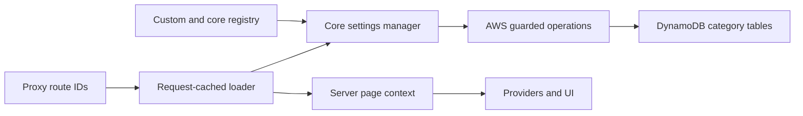

# Settings architecture

CloudIgniter Public and Private settings have separate System (Primary), GLOBAL, and tenant records.
Personal groups remain account-wide and owner-bound.
Definitions live in a shared server-side registry. Core owns validation/selection contracts; AWS owns persistence
and resolver authorization; Next.js binds the generated client; UI owns the reusable manager. Template files
compose these APIs and import `src/custom/settings/ci-settings-registry.ts` for developer extensions.

Settings category pages and `CiDataTable` share the internal `CiManagementHeader` in `packages/ui`, preserving
the Security management header's visual treatment without duplicating it in the template. The landing page
uses `CiNextDashboardOverview` and counts registry definitions without loading stored group values. Template
composition supplies the shared Dashboard breadcrumb menu and Public/Private Settings menu. The Dashboard tree
reuses the Security and Settings child arrays so every consuming page exposes their nested destinations.
`CiBreadcrumbs` in `packages/next` owns recursive rendering, locale-aware sibling ordering, current/hidden
filtering, and Next.js navigation. Radix submenu primitives in `packages/ui` own focus, direction-aware keyboard
controls, pointer traversal, and collision positioning; every submenu is portaled to avoid parent-panel clipping.
Parent links retain click navigation while their arrows provide touch disclosure. The shared `CiNavigateWithLoader`
forwards anchor props and refs and honors prevented clicks, so Radix can compose focus and event handlers through
the Next.js adapter. `DropdownMenuSubTrigger` with `asChild` accepts one complete child, including its indicator.
Register built-in
card icon names in Core's `ciIconRegistry`; unresolved `ci:` names render no icon.

## Request and mutation boundaries

The proxy selects a route and forwards identifiers only. `appGetSettings()` independently resolves the session,
cookies, and route, avoiding a bootstrap/next-intl recursion. React request caching shares this result with i18n,
configuration resolution, and bootstrap. The manager reads only selected and `alwaysLoad` groups and filters
Private/Personal groups for anonymous visitors. The trusted resolved request tenant selects the Public/Private
settings target; the snapshot shape and route selection contract are unchanged. Management pages explicitly
enumerate one authorized category. Never accept a browser cookie as a tenant authorization decision.

Public and Private management evaluates `platform.settings` for the selected target. `ciCanManageSettings`
allows explicit System administration of GLOBAL/tenant settings without changing Emberguard's scope hierarchy:
System assignments never implicitly propagate. It falls back to System permission only for a local absence of a
matching grant, and preserves local explicit denies, read-only restrictions, suspension, and unsupported catalogs.
`enforce` requires System scope; `overwrite` requires System permission plus target restrictions. Both default
administrator roles grant these capabilities in the default catalog. Provider groups remain exact System assignments. Each backend mutation reloads the active definition with a strongly
consistent read and queries the actor's active role assignments. Identity claims supply the subject and provider
groups. Explicit deny, assignment validity dates, and scope remain authorizer decisions. Personal operations
always derive the owner from the session and never accept an owner identifier. Direct model CRUD and subscriptions
are disabled; anonymous API-key access is limited to the guarded read resolver.

## Persistence decision and access patterns

The three existing settings model seams are activated as separate tables. Category separation keeps ordinary
configuration and owner-keyed preferences distinct and permits future separate policies and lifecycle controls.
The current two resolvers require access to all three tables to serve the category API; IAM alone does not enforce
owner isolation, so the session-derived key is mandatory. No secondary indexes, streams, or replication are
introduced by this feature. Tenant selection reuses the System table’s existing GSI1; every selected tenant is
validated by a strongly consistent base-record read and must be active and not deleted.

| Access pattern | Key and operation |
| --- | --- |
| Public group | Strong `GetItem`, PK `CI#SETTINGS#SYSTEM#PUBLIC`, SK `CI#GROUP#` + group ID |
| Private group | Strong `GetItem`, PK `CI#SETTINGS#SYSTEM#PRIVATE`, same SK convention |
| GLOBAL group | Strong `GetItem`, PK `CI#SETTINGS#GLOBAL#PUBLIC` or `CI#SETTINGS#GLOBAL#PRIVATE`, same SK |
| Tenant group | Strong `GetItem`, PK `CI#SETTINGS#TENANT#<tenantId>#PUBLIC` or `CI#SETTINGS#TENANT#<tenantId>#PRIVATE`, same SK |
| First GLOBAL/tenant read | Conditional transaction: check System revision and create local copy only if absent |
| Tenant save or overwrite | Conditional local puts and System revision checks in one transaction |
| Tenant selector | GSI1 active-tenant collection Query, 50 records/page; GLOBAL added on the first page |
| Personal group | Strong `GetItem`, PK `CI#SETTINGS#USER#` + authenticated subject, same SK convention |
| Save group | One conditional `PutItem`; new record requires absent PK, update requires matching revision |
| Check management permission | Strong definition `GetItem` and bounded, paginated subject-assignment `Query` |

All keys use Core table-key builders. No request scans, GSI authorization checks, or cross-owner listings occur.
Assignment queries have a 100-item page limit and a bounded page count; excessive assignments fail closed.
Missing System and Personal records yield registry defaults without writes. A missing GLOBAL/tenant group is
materialized once from the current System values (or defaults), with a System revision condition and an absent-key
condition. The provider returns a concurrent creator's record; Core retries a changed source twice before surfacing
a conflict. Existing local copies never reseed on ordinary System edits. New registry groups initialize only when
requested. This lazy strategy avoids eager loading and writing every settings group on tenant creation.
Strong reads avoid showing stale values immediately after save. Conditional revisions prevent lost updates, and a successful save returns the written revision.

Groups are expected to be small configuration objects, not documents or secrets. Read cost scales with selected
groups and item size, plus always-loaded preferences. Each GLOBAL/tenant group reads its local record and System
source; the first use also performs a conditional transaction. Tenant operations validate the tenant record once
per manager/request. Category management scales with registered groups; all-target overwrites additionally scale
with discovery pages and targets. System/Personal single-group saves incur one item write. Tenant and whole-form
saves use a transaction with no settings-index amplification; strong reads cost more than eventual reads. Three tables add independent storage/backup administration but no invented minimum-capacity
assumption. Review deployed billing mode, backup retention, item sizes, and consumed-capacity/throttling metrics
for each application. Provider errors must not be converted into successful default reads after deployment.

Settings values, cookies, and identities must not be logged in diagnostics. Monitor resolver errors, DynamoDB
throttles, request latency, and conditional conflicts without payload values. `ReturnConsumedCapacity` on writes
supports instrumenting capacity if applications need it; this implementation does not claim to publish that metric.

## Deployment and compatibility

Deploy the new table/function manifest together with the schema and the custom registry. Undeployed applications
can render defaults and allow authorized draft edits, but show a warning and a disabled Save button. Keep update
permission separate from backend readiness: `canUpdate` governs editing, while `saveUnavailableReason` explains
blocked persistence. The unprovisioned manager still rejects every write. Do not treat drafts as an offline write queue.
Existing System and Personal keys and revisions remain compatible; tenant copies initialize on first use. Do not
rename or migrate System records into GLOBAL. Deploy the tenant-aware handlers, table attributes, and least-privilege
IAM before the frontend. The GetSettings function now needs conditional Put/ConditionCheck on Public/Private tables
for initialization; both functions need System-table Get, and GetSettings alone needs Query on its exact GSI1 ARN.
No table scans or table-wide wildcard index grants are needed.

Persisted access catalogs are intentionally not silently replaced by a changed default definition. Use the audited
core override workflow to add the `enforce`/`overwrite` actions and `global`/`tenant` scope kinds to
`platform.settings`, and extend the default administrator settings privilege scope kinds where required. Preserve
application-specific privileges and denials. Until this catalog migration is performed, missing actions or unsupported
target scopes fail closed. Deploying code alone does not grant the new permissions.
Applications with their own historical settings persistence need an explicit migration into the new group keys;
there is no hidden dual-read or dual-write fallback. Preserve tables and records during rollback, and deploy
compatible readers before reverting code that understands the domain IDs.

Template core pages, actions, bootstrap, and Amplify handlers are thin platform composition. Application custom
changes belong in `src/custom/settings`; reusable behavior belongs in packages. Public contracts and signatures
are listed in the [Settings API](/docs/api-reference/shared-apis/settings).

## Validation

Test isolated snapshots, concurrent initialization, selective/all-target enforcement, restoration of previous local
values, locked-field tampering, stale source revisions, overwrite selection, target discovery pagination, tenant
existence/status, scoped grants, explicit tenant deny/read-only restrictions, and unchanged owner isolation.
Also test anonymous category filtering, exact route selection, cookie precedence, owner spoofing, ordinary-user denials,
both default administrator roles, strict schemas, canonical keys, and stale revisions. Validate manifests, IAM,
Resource Studio route generation, request-context round trips, package exports, and template consumers. A local
unit test cannot prove deployed AppSync/IAM behavior: smoke-test reads and saves with anonymous, ordinary-user,
and administrator sessions after an authorized deployment.

## Whole-form editing and saving

`CiSettingsManager` opens editable for authorized users and composes every section into one Smart Form. Its JSON
preview shows the selected group's draft without hiding the form actions. Close confirms only unsaved edits.
Section-prefixed field names and conditional
references keep duplicate names independent; reconstruction preserves non-field and immutable values. Inactive
sections stay mounted to preserve drafts and parse errors. `onValidationErrors` reveals the first invalid section
before Smart Form focuses it. `CiNextSettingsManager` owns loader-aware Close navigation. My Preferences captures
the previous path in `returnTo`, accepts only a different same-origin path, and falls back to Dashboard.

Core `saveAll` validates authorization, category membership, uniqueness, revisions, and every schema before calling
optional provider `setMany`. SetSettings repeats validation using trusted identity and sends one `TransactWriteItems`
request containing conditional puts and, for GLOBAL/tenant records, System revision checks. A stale local or source
revision cancels every write. Single-group APIs remain supported;
there is no sequential-write fallback. Existing read/list operations remain independent strongly consistent reads,
not an atomic multi-group snapshot during concurrent saves.

Transactions perform two underlying writes per item for prepare/commit. Independent puts cost less but can leave
a partly saved form, so they remain only in the single-group API. AWS transactions support 100 actions and 4 MB. Settings allow 100 System/Personal groups or 50 GLOBAL/tenant groups
(the latter also check each System source), subject to the 300 KB resolver-input limit. See [DynamoDB transactions](https://docs.aws.amazon.com/amazondynamodb/latest/developerguide/transaction-apis.html).
Transaction writes request consumed capacity. Table-scoped `dynamodb:PutItem` authorizes the puts and
`dynamodb:ConditionCheckItem` authorizes source checks; no separate TransactWriteItems IAM action is required. See [transaction IAM permissions](https://docs.aws.amazon.com/amazondynamodb/latest/developerguide/transaction-apis-iam.html).

Deploy the batch-capable SetSettings handler before the whole-form frontend. Existing records and single-group
callers remain compatible. On rollback, retain the batch handler until clients using it have been rolled back.
Validate all three categories, denial/spoofing, inactive-section validation, duplicate field names, conflict rollback,
backend failure feedback, and safe Close targets. Unit tests do not replace authorized deployed integration checks.

## Enforcement and overwrite lifecycle

System records carry per-group rules `{ fields: "*" | string[], targets: "*" | target[] }`. A target is GLOBAL or a
specific tenant; System cannot target itself. Rules select top-level fields (nested object fields move as one value).
Read resolution overlays matching saved System fields onto the local snapshot and returns `lockedFields` and
`systemRevision`. Ordinary runtime responses omit rule/target metadata. Tenant saves reject edited locked values,
then write back the prior local value for those fields; they never materialize enforced values into local records.
Removing the last matching rule therefore restores the previous local values immediately. Overlapping rules combine.
All-target rules cover future tenants; the UI's all-groups option applies rules to currently registered groups only.

The same form Save persists values and drafted rules. Only actors with `enforce` may change rules; update permission
alone can still edit System values, including values already enforced. Explicit preference cookies retain their
existing precedence over stored defaults, so this feature is configuration enforcement, not a browser security policy.

A one-time overwrite copies selected saved System fields into local records with an observed source revision. It
preserves unselected fields and existing rules. If a field is currently enforced, the overwrite intentionally replaces
its preserved local value, which becomes visible when enforcement is later removed. It requires confirmation and
saved source values. The shared UI exhausts tenant discovery before its first write (bounded to 200 continuation
pages with repeated-token rejection), then performs one atomic transaction per target and reports individual failures.
There is no cross-tenant transaction or background job; closing the page stops remaining work. Discovery is eventually
consistent, so concurrently created tenants may need a later overwrite. Retrying a failed target uses current source
revisions after review; never silently retry a stale System version.

The selector confirms discarding drafts before loading another scope and disables the form during target changes.
`CiSettingsTenancy` is internal reusable UI; the template supplies target discovery/load/overwrite server actions.
Personal settings always use the authenticated owner, regardless of the request tenant target, and reject enforcement metadata.

## Permission failure presentation

The Next.js AWS adapter `ciGetNextAwsSettingsAccess` returns `CiResult` using the existing `CiErrorBody` and
`CiErrorPayload` metadata. It preserves valid capabilities, maps confirmed authorization denial to 403, explicit
session failures to 401, and verification/provider failures to a retryable 500. The default error result contains
safe copy only; it does not echo a provider error, raw response, identity, or stack. An incompatible backend response
must never be interpreted as a grant, or mislabeled as a confirmed role denial.

Template Settings pages invoke Next.js `forbidden()` for confirmed 403 results before management-value loading.
The root `forbidden.tsx` boundary composes the shared illustrated 403 page, alongside the existing 404 boundary.
401 and verification failures still render `CiErrorPage` inside `CiPage`, retaining sign-in or retry recovery.
Server Actions convert the same safe result to their existing form-feedback path, retaining drafts.
Do not convert a provider failure to a permission denial or wrap a framework interrupt in a generic error.
See [HTTP error pages](./error-pages.mdx) for package ownership, localization, and validation.
