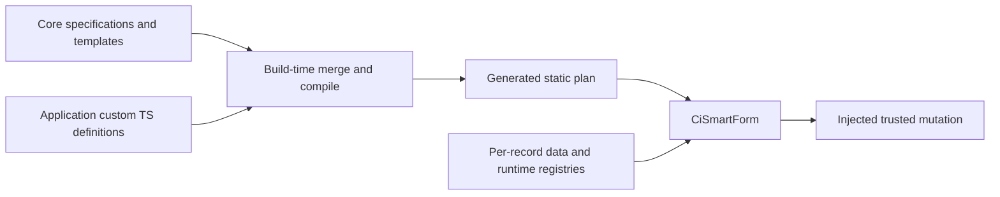

# Smart Form architecture

Smart Forms separate reusable serializable definitions from record-specific UI state. Core owns public contracts,
named merges, layout validation, mapping, compilation, default user forms, and source generation. UI owns controls,
accessible layout, input validation, async callbacks, feedback, and custom renderer bindings. Neither layer imports
Next.js or a provider. The existing Formik field components remain an additive compatibility surface.

`packages/core/src/lib/smart-form` exposes helpers through `/lib`; generic contracts live under
`src/types/smart-form-types` and `/types`. `packages/ui/src/client/components/smart-form` exposes `CiSmartForm`
through `/client`, UI-specific props through `/types`, and `ciValidateSmartForm` through `/lib`.

`CiUserManagementPage` consumes packaged static create/edit forms. Application composition passes optional compiled
forms from `src/custom/user`, with generated outputs in `src/custom/forms`. The profile adapter stores registered
custom field names under the existing `profile.extensions` object. Scoped assignment controls remain domain UI
inside the form. Permission-dependent role options and field states are runtime inputs. Root protections and
trusted user mutations retain their existing enforcement paths.

## Cache and generation invariants

- Module-level `ciDefineSmartForm` calls cache frozen plans by input identity. Replacing inputs invalidates reuse.
- Published default and application forms import generated plans, avoiding specification/layout compilation per request.
- Only structural definitions enter artifacts. Never serialize data, role-option results, callbacks, files, or permissions.
- JavaScript callbacks, renderers, and validators are bound by key after loading the static plan.
- Form data initializes per mounted session. A changed React key loads another record; reset discards drafts.
- Deterministic generation compares output before writing and recognizes only its exact generated target/header.
- Rerun generation after custom definition changes during a running development session. Core JavaScript builds and
  template dev/build scripts regenerate their respective outputs before compilation.
- Fixed core definitions ignore specification, template, and compiled overrides; this is presentation governance,
  never authorization of submitted values.

Compile rejects unsafe names/properties, duplicate definitions, unknown or repeated placeholders, wrong-group
placement, and nonserializable configuration. Named merging preserves extension intent; type objects replace
their union member and row field arrays replace placement. Compile-time normalization appends unplaced fields
instead of silently dropping custom inputs.

## Validation

Run Core/UI tests and typechecks, regenerate both artifact sets, build affected package entry points, and typecheck
the template consumer. Tests cover immutable cache reuse, JSON artifacts, mapping falsy values, main-group
reservation, layout errors, choice storage types, accessible deterministic rendering, fixed-form overrides, and
legacy Formik recursion. Keep application records out of any static snapshot. Exercise browser submission,
async failure, collapsed errors, keyboard controls, dark mode, narrow widths, and RTL when a browser is available.

See the [user guide](/docs/ui-components/smart-form) and [API reference](/docs/api-reference/components/ci-smart-form).
