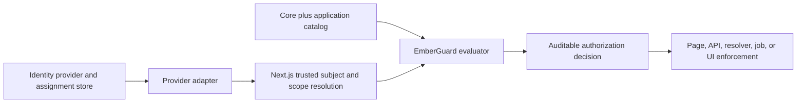

# Access-Control Strategy

CloudIgniter uses provider-neutral, scoped attribute- and role-based access control. EmberGuard owns the generic
evaluation engine, `@cloudigniter/core` exposes the supported public facade, framework packages resolve trusted
runtime context, and provider packages adapt identity groups and persistence.

## Ownership and decision flow



| Concern                                                              | Owner                                        |
| -------------------------------------------------------------------- | -------------------------------------------- |
| Generic evaluation, inheritance, matching, and catalog validation    | `packages/emberguard`                        |
| Public helpers and generic authorization types                       | `packages/core`                              |
| Request/session and authoritative runtime-context integration        | `packages/next`                              |
| Provider groups, claims, persistence, and infrastructure enforcement | `packages/aws` or another provider           |
| Application resources, actions, roles, and provider mappings         | `apps/template` or the consuming application |

Consumers import generic helpers from `@cloudigniter/core/lib` and types from `@cloudigniter/core/types`. Do not
make `@cloudigniter/emberguard` a second application-facing API.

## Evaluation invariants

For each request, resolve an authenticated subject, a registered resource/action pair, and an authoritative
scope. Select active assignments, expand inherited roles, match privileges, then apply the combining algorithm.
Default deny applies when no privilege allows the request.

The default `deny-overrides` algorithm lets any applicable deny win. The optional `highest-precedence` algorithm
selects direct privileges first or the numerically lowest assigned-role precedence, then applies deny-overrides
within that tier.

Keep four independent concepts explicit:

- inheritance composes a role's privileges;
- precedence resolves conflicts between assigned roles;
- scope establishes the authorization boundary;
- propagation controls whether an assignment reaches descendants.

Never infer inheritance or scope from precedence.

## Configuration boundary

`packages/core` owns the public `CiEmberguardConfig` and `CiEmberguardAccessControlConfig` contracts. Applications
place them beneath `auth.emberguard` in `cloudigniter.config.ts`; application composition passes
`auth.emberguard.accessControl` to `ciCreateAppAuthorizer()`.

Keep the configuration provider-neutral. The authorizer remains the source of the `deny-overrides` default, so
an omitted `emberguard` block behaves exactly like an omitted `CiAuthorizerOptions.combiningAlgorithm`. Add
provider group mapping, claims, and persistence configuration only in the relevant provider layer.

## Core role design

Core roles use separate business and technical administrator lanes:

```text
user
├── developer
├── admin
│   └── super-admin
└── system-admin
    └── system-super-admin
```

`admin` and `super-admin` own business administration. `system-admin` and `system-super-admin` are reserved for
technical administrators operating platform configuration, tenancy infrastructure, system access control, and
protected bootstrap workflows.

Preserve these rules:

- `system-admin` inherits `user`, never `admin` or `super-admin`.
- `system-super-admin` inherits `system-admin`.
- No other role may inherit `system-super-admin` or grant the core-override capability.
- Only a direct, system-scoped `system-super-admin` assignment may create a protected core override.
- Assign roles from both lanes when a person legitimately needs both responsibilities; do not merge the lanes.

The audited override validator protects both the bootstrap path and the technical/business separation. An
application layer cannot redefine any core role.

## Extension workflow

1. Define stable application resources and actions around capabilities rather than routes.
2. Add focused application roles and explicit privileges with stable IDs and required human-readable titles by using `ciCreateAppAccessControl()`.
3. Inherit the narrowest eligible core role only when it represents a real responsibility hierarchy.
4. Map provider groups to stable role IDs without copying privilege policy into the identity provider.
5. Resolve the subject and scope on a trusted server boundary.
6. Enforce the same resource/action at every relevant page and mutation boundary.
7. Test the intended allow, an adjacent denial, scope propagation, expiry, inheritance evidence, and conflicts.

Use `ciCreateCoreAccessControlOverride()` only for deliberate core-owned changes. Persist immutable override
records using conditional consecutive revisions, step-up authentication, and durable audit retention.

## Security administration role editor

The application route supplies authoritative role graph and privilege catalog options to the reusable
`CiSecurityDataPage` in `packages/ui`. Role records carry their complete direct privilege list so the editor can
round-trip additions and removals without reconstructing policy from display labels.

The reusable UI filters inheritance suggestions by walking the candidate role's ancestor graph. A candidate is
hidden when it is the current role, is already selected, or already inherits the current role directly or
transitively. Chips represent direct selections only; transitive ancestors remain evaluator behavior rather than
form state.

Role saves set `privilegesMode: "replace"` because the editor submits a complete direct selection. Normal catalog
layers continue to merge privileges by ID. EmberGuard still validates the resulting graph and prevents an
application role from acquiring the protected core-override capability, including when a privilege is copied
through the role editor.

Role suspension is owned by EmberGuard rather than the UI. `setRoleStatus()` loads the authoritative persisted
definition, verifies application/core management authority, records the actor, time, and required reason, then
persists a small role layer. Assignments remain unchanged. The authorizer treats an omitted status as active,
but compiles a suspended role to no privileges; this also stops that role from forwarding privileges inherited
from an ancestor. Provider-backed enforcement must load the active definition and invalidate compiled
authorizers after a definition change.

Never permit suspension of `system-super-admin`: it is the protected break-glass path needed to restore other
core roles. Status changes to other core roles use the same audited core-override machinery and direct
system-super-admin requirement as other protected catalog changes.

Resource-domain suspension follows the same provider-neutral administration path. `createResourceDomain()`
validates a new application-owned ID and merges it into the authoritative definition.
`setResourceDomainStatus()` re-resolves current management authority, records actor/time/reason metadata, and
uses audited core-override handling for a core domain. The authorizer resolves the requested resource's domain
before action and scope evaluation and returns `suspended-domain` when that domain is suspended. It does not
delete resources or privileges. The `platform` domain is never suspendable because doing so would remove the
authorization capability required to restore it.

The Amplify application reuses `SetEmberguardDefinition` for domain creation and status transitions. This keeps
the definition and mutation-maintained role-counter projection inside the same EmberGuard access-table state
write rather than introducing a second domain store or additional request-path query.

Individual resource suspension uses the same definition-write path through `setResourceStatus()`. EmberGuard
re-resolves authority, requires a reason, records actor/time metadata, and uses audited core overrides for core
resources. The authorizer checks domain status first and resource status second; this makes a suspended domain
the authoritative parent denial while allowing a resource to be restored independently in preparation for a
later domain restoration. `platform.authorization` and `platform.authorization.core` are never suspendable
because they preserve administration and break-glass recovery.

Generic resource editing never writes lifecycle metadata directly. `saveRecord()` detects a requested resource
transition and delegates immediately to `setResourceStatus()`, which rebuilds actor/time/reason metadata from
trusted context; a caller cannot forge transition evidence. The Amplify adapter needs no
new table, index, handler, or request-path read: the existing optimistic `SetEmberguardDefinition` transaction
persists resource status atomically with the authoritative catalog and role-counter projection.

## Persisted privilege-title compatibility

EmberGuard owns the provider-neutral migration for definitions persisted before `CiPrivilege.title` became
required. On read, `ciMigrateLegacyPrivilegeTitles()` supplies only missing privilege titles. It prefers the
matching configured catalog title and derives a label from the stable privilege ID only for an unknown custom
entry. It preserves explicit blank values so the normal validator continues to reject them.

Role IDs have no compatibility normalization. Definitions, inheritance references, assignments, and identity
groups must use canonical lowercase kebab IDs. This keeps invalid development data visible and prevents runtime
behavior from silently repairing authorization identifiers.

## Validation chain

Run focused catalog and authorizer tests in `packages/emberguard`, then validate the `packages/core` facade and
every affected framework, provider, and application consumer. Include tests proving that `system-admin` retains
base `user` access but gains no business-administration privileges through inheritance.

See [Roles, Inheritance, and Precedence](/docs/core-system/authorization/roles-and-precedence) for application
design guidance and [`CI_DEFAULT_ACCESS_CONTROL_DEFINITION`](/docs/api-reference/authorization/default-access-control-definition)
for the public built-in catalog.
