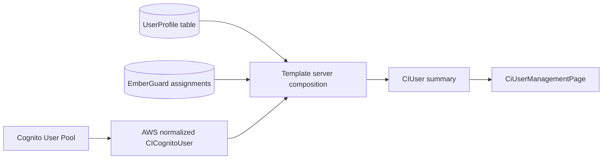

# User administration architecture

User administration crosses provider identity, application profile, authorization, persistence, and UI boundaries.
The application-facing `CIUser` projection is the join point; it is not a second identity directory.

## Ownership

| Responsibility                                                    | Owner                                           |
| ----------------------------------------------------------------- | ----------------------------------------------- |
| Provider-neutral user, profile, entity, and mutation contracts    | `@cloudigniter/core/types`                      |
| Cognito account normalization and list/enable/disable services    | `@cloudigniter/aws`                             |
| Role-assignment evaluation and administration                     | EmberGuard behind the core authorization facade |
| Reusable table, dialogs, feedback, and lifecycle presentation     | `@cloudigniter/ui/client`                       |
| Amplify model/function binding and trusted Next.js server actions | Template composition                            |

The AWS package must not depend on the application profile. Core must not import Cognito SDK types. The UI receives
serializable provider-neutral inputs and callback results; it never calls AWS or Amplify Data directly.

## Identity and profile rules

Cognito `sub` is the stable cross-store `userId`. Email is the login alias and may change. `username` is retained
only for Cognito administrative calls and its secondary profile lookup.

The fixed profile uses optional, provider-neutral fields, including title, gender, structured residence address,
locale, time zone, and an S3-compatible `avatarKey`, plus one `extensions` JSON object. Applications validate
and namespace extension values rather than changing the core record for every business field. The User Profile
record also stores operational status, reversible deletion metadata, and role strings as a list projection. Cognito
group membership and EmberGuard assignments remain authoritative for access.

`CIUser` defaults to a summary projection. Complete `CIUserProfile` and `CICognitoUser` objects are attached only
when `detailLevel` is `full`. Do not fetch or serialize address, birth date, gender, raw provider attributes, or
other full-detail fields for table and authorization paths.

Store the durable avatar object key in `avatarKey`; never persist an expiring signed URL as the source of truth.
An AWS adapter should resolve the key with Amplify Storage/S3 on read and replace the object under a stable
`user-avatars/{userId}/` prefix. Bucket registration belongs in the manifest/compiler resource boundary before the
upload adapter is enabled; the profile contract must remain independent from S3 SDK types.

## Persistence decisions

User Profile remains its own Amplify Data/DynamoDB bounded context because profile privacy, lifecycle, ownership,
and access patterns differ from the System table. The supported operations are:

| Operation             | Access pattern                        | Consistency                                        |
| --------------------- | ------------------------------------- | -------------------------------------------------- |
| Get/update/transition | Base-table get by Cognito `sub`       | Strong precondition where the provider supports it |
| Username/email lookup | Secondary-index query                 | Eventually consistent                              |
| Active/Trash list     | `deletionState` secondary-index query | Eventually consistent                              |

The one lifecycle index adds storage and write amplification but prevents request-path scans. No stream, replica,
TTL, or extra status index is required. GSI results are for collections only; restore and purge re-read the base
profile and prove the current deletion state. Current template list composition is bounded and should evolve to
explicit continuation tokens before using it for very large directories.

## Mutation and lifecycle participants

Creation provisions the Cognito identity and groups, the profile, then scoped EmberGuard assignments. A downstream
assignment failure triggers a reversible account rollback so the incomplete identity cannot sign in. All steps are
retry-safe, but Cognito and DynamoDB do not share a transaction; never report partial success as complete.

Suspension disables Cognito and records operational status plus trusted actor/time/reason metadata without changing deletion state. Soft deletion disables
Cognito and records trusted deletion metadata. Restore clears that metadata and re-enables the account unless its
independent status is suspended. Trash-only purge removes assignments, then the Cognito identity and profile; the
Cognito delete operation treats an already-absent provider account as success for retry safety.
Trash also retains a deleted profile-only row when the Cognito participant is already absent, allowing an operator
to retry and finish profile/assignment cleanup instead of losing the recovery handle.

Trusted server actions enforce `identity.users` permissions, reject self-suspension/self-deletion, require reasons,
protect `system-super-admin`, and require exact-ID confirmation for purge. Provider IAM grants are necessary but are
not a substitute for these application authorization checks.

Editing loads a full projection on demand, synchronizes the complete desired Cognito group set, updates the
profile, and replaces the user's EmberGuard assignments. `system-super-admin` grant/edit restrictions are repeated
on the server. Email is an explicit capability and may delegate to the operator's mail client.

Impersonation is a separate `identity.users.impersonate` privilege granted at system scope only to
`system-super-admin`. Cognito administrative authentication still requires the target user's authentication
factor; CloudIgniter must not manufacture or reuse provider tokens. A future impersonation adapter must create an
audited application session that retains both the administrator actor and effective subject, requires a reason,
expires quickly, and cannot invoke provider-administration operations as the target.

Profile owners may update ordinary profile fields, but provider linkage, email verification, role projection,
operational status, and deletion fields are owner-readable and administration-group writable. Never rely on the
client editor to protect account-control fields.

## Compatibility and validation

The `sub` key replaces legacy username-keyed profiles. Existing deployments require an explicit migration or
reseed. Cognito sign-in and required-attribute settings cannot be casually changed after pool creation.

The `test-users` development seeder is manifest-driven and uses explicit profile provenance. It refuses to adopt
or clean up a matching email unless `extensions.cloudigniterSeeder` equals `test-users`; cleanup uses the ordinary
soft-delete and purge lifecycle. Both seed and cleanup require development mode plus exact developer membership,
and the invoked user operations retain their normal administration permissions.

Validate core, AWS, UI, Next.js, and template consumers; exercise Cognito mapping and enable/disable behavior; verify
active/Trash index queries contain no scan; and test denial, protected-user, partial-failure, restore, and repeated
purge paths. See the [operator guide](/docs/users-management/intro) and
[`CIUser` API contracts](/docs/api-reference/type-definitions/ci-user-types).
