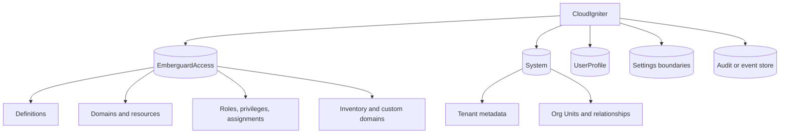

# DynamoDB bounded-context strategy

CloudIgniter uses **bounded-context tables**. Each table is an independent security and operational boundary and
may use single-table modeling for several related item types. CloudIgniter does not use one table for the entire
platform, and it does not create one table for every entity type.

The entities below `EmberguardAccess` share a capability owner and authorization access patterns, so they can be
stored as different item types in one dedicated table. An EmberGuard _resource domain_ is an authorization-catalog
entity; it does not mean an infrastructure or database domain.

EmberGuard role administration uses a mutation-maintained counter projection stored with the active access
definition. Role-list rendering is one strongly consistent item read and never queries assignments. Assignment
mutations transactionally update the subject record, a strongly consistent administration-collection copy, and
the projection. Definition mutations rebuild the projection through a paginated collection query. This favors
the expected workload—many reads and comparatively rare security-administration writes—without adding another
table, GSI, stream, or request-path fan-out.

## Recommended boundaries

| Boundary            | Data                                                                                                                   | Reason                                                                                                 |
| ------------------- | ---------------------------------------------------------------------------------------------------------------------- | ------------------------------------------------------------------------------------------------------ |
| `EmberguardAccess`  | Access definitions, resource catalog, roles, privileges, assignments, resource inventory, custom authorization domains | Privileged IAM boundary, authorization consistency, independent restore and failure isolation          |
| `System`            | Tenants, Org Units, system relationships and control-plane metadata                                                    | Shared control-plane lifecycle and administrative access patterns                                      |
| `UserProfile`       | User-facing profile data                                                                                               | Distinct owner/field authorization and GraphQL access patterns                                         |
| Settings boundaries | Public, private-system, and owner-scoped settings                                                                      | Keep separate when IAM exposure differs; combine only where authorization and operations are identical |
| Audit/event store   | Sustained append-only audit or event records                                                                           | Different write volume, retention, TTL, export, and analytics requirements                             |

Do not move roles or privileges into `System`; they belong to the EmberGuard capability. Do not move public
settings into a private table merely to reduce table count. Conversely, do not create separate role, privilege,
and assignment tables when the EmberGuard access patterns are better served by one access table.

The Amplify-generated physical name, such as
`EmberguardAccess-<deployment-id>-<environment>`, is a deployment detail. Application code resolves the table
name and ARN through the backend manifest and environment projection. Never hard-code the console name.

## Boundary decision

Combine item types only when all of these are compatible:

- capability ownership and least-privilege IAM;
- tenant isolation and data classification;
- encryption, backup/PITR, retention, TTL, export, and residency;
- throughput, hot-key risk, storage class, streams, and regional replication;
- restore unit, deployment lifecycle, failure isolation, and monitoring;
- known queries, transactions, and co-located item collections.

Create another table when a material security or operational requirement differs. Entity type alone is not a
reason to split, and table-count reduction alone is not a reason to combine.

## Cost model

Do not estimate DynamoDB cost from table count alone. Review:

- item sizes and read/write frequency;
- consistency and transaction multipliers;
- every GSI's projected storage and write amplification;
- backups, PITR, streams, exports, global replicas, and encryption choices;
- storage class and capacity mode;
- operational overhead for IAM, alarms, dashboards, restore tests, and incident isolation.

For early or unpredictable workloads, use on-demand capacity and the Standard table class by default. Move an
individual table to provisioned capacity only after measurements show a predictable workload and the comparison
includes auto-scaling behavior. Consider Standard-IA only when measured storage is the dominant cost.

Before approving a cost-sensitive design, verify current behavior and pricing against the official
[DynamoDB pricing](https://aws.amazon.com/dynamodb/pricing/),
[capacity-mode](https://docs.aws.amazon.com/amazondynamodb/latest/developerguide/capacity-mode.html), and
[data-modeling](https://docs.aws.amazon.com/amazondynamodb/latest/developerguide/data-modeling-foundations.html)
documentation. Do not copy remembered prices or quotas into an architecture decision.

## Interaction rules

- Start from documented access patterns. Use `GetItem`, `BatchGetItem`, or bounded `Query` operations for request
  paths; never introduce a request-path `Scan`.
- Add a GSI only for a named access pattern that the base table cannot serve safely and efficiently. Project the
  minimum attributes required.
- Use the strongly consistent base-table path where current authorization state must be proven. A GSI or stream
  is eventually consistent and cannot prove a current grant or revocation.
- Use conditions or transactions for uniqueness, concurrency, and multi-item invariants. Make retryable writes
  idempotent.
- Paginate every multi-item operation and keep page sizes bounded.
- Treat TTL as asynchronous cleanup and enforce expiry in application logic.
- Grant each handler only the required table/index actions and resources.
- Use the [CloudIgniter table-key convention](./table-key-convention) for all primary and secondary-index keys.
- Log safe operation metadata, latency, throttling, and consumed capacity—not complete policies or personal data.
- Define tables, indexes, capacity, backups, streams, and IAM in code. Do not make untracked console changes.

## Required decision record

Every new table, GSI, stream, replica, or capacity-mode change must document:

1. bounded context and owner;
2. exact read, write, query, transaction, and administration access patterns;
3. tenancy, IAM, consistency, lifecycle, restore, and failure-isolation requirements;
4. expected item size, traffic shape, index amplification, and optional-feature cost drivers;
5. the chosen design and the cheapest safe alternative that was rejected;
6. key grammar, conditions, pagination, and migration/rollback behavior;
7. tags, budgets/limits, metrics, alarms, and validation evidence.

If these facts are unknown, keep the change reversible, avoid speculative indexes, and gather measurements before
locking in a more complex design.
