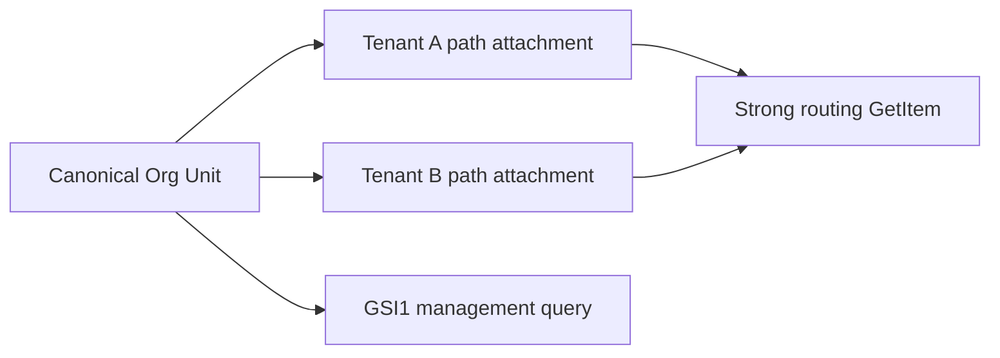

# Org Unit tree persistence

Org Unit definitions belong to the `System` bounded context with tenants. `packages/core` owns public contracts and hierarchy-aware scope helpers; `packages/aws` owns keys, DynamoDB operations, handlers, and IAM; `packages/ui` owns the reusable tree explorer, focused-node browser, lifecycle editor, confirmed drag/drop interaction, and deterministic timestamp rendering; the template binds Amplify functions, supplies the resolved locale and direction, and composes the route.

The management UI reconstructs the forest from canonical `parentId` values and alphabetizes siblings without changing predecessor order. Search and filter results retain predecessor nodes, selection drives a sibling detail panel, and the resizable tree is placed at logical inline-start so RTL locales require no application-owned layout fork. UI lifecycle commands call the existing optimistic update boundary; archive is the audit-safe replacement for permanent deletion.

Do not mark the complete context-menu tree row as native HTML `draggable`: nested buttons and browser-specific `DataTransfer` behavior make that surface unreliable. The explorer uses a dedicated 44px move button. After a small movement threshold it captures the pointer, hit-tests node/root targets with `elementFromPoint`, updates target feedback, and opens confirmation on release. This single path supports mouse, pen, and touch. Clicking or keyboard-activating the handle opens Edit, which remains the complete non-drag re-parenting path.

Resource recency is split by ownership: `packages/core` defines the five-minute default and pure `ciIsNewResource()` predicate, while `packages/ui` owns the hydration-stable `CiNewResourceBadge` timer and presentation. The tree explorer and `CiDataTable` consume that shared component rather than creating page-local timers.

## Access patterns and consistency

| Operation            | DynamoDB path                                                     | Consistency and bound                          |
| -------------------- | ----------------------------------------------------------------- | ---------------------------------------------- |
| Resolve tenant/path  | Exact attachment `GetItem`                                        | Strongly consistent, one item                  |
| List management tree | `GSI1PK = CI#SYSTEM#ORG_UNITS`                                    | Paginated, at most 100 per page                |
| Read parent/children | Exact base-table `GetItem`/`BatchGetItem`                         | Strongly consistent for mutation invariants    |
| Create               | Tenant condition checks plus node, attachments, and parent update | One transaction, maximum 30 tenant attachments |
| Edit/share           | Expected-version node replacement plus attachment puts/deletes    | One transaction after strong invariant reads   |
| Move subtree         | Strong child-ID traversal plus canonical and attachment rewrites  | One transaction, maximum 100 operations        |
| Seed cleanup         | Bounded marker query                                              | Strong query; descendants before predecessors  |

The existing GSI1 and GSI2 support management and child collections, so the feature adds no table or index. Attachment records add one write and one stored projection per tenant/node relationship. That amplification is justified by direct route resolution. A canonical-only alternative requires scans or unbounded filtering; per-tenant node duplication breaks shared identity.

Slug remains immutable. `CiUpdateOrgUnitInput.parentId` is the explicit subtree-move contract: omission preserves the parent, `null` makes the node a root, and an ID assigns a new parent. The provider strongly traverses stored `childIds`, rejects cycles and tenant-incompatible targets, and plans one transaction containing version-conditioned canonical replacements, old attachment deletes, collision-conditioned new attachment puts, and version-conditioned old/new parent child-list updates. No request-path scan or new index is introduced.

The provider returns the moved canonical root only after `TransactWriteItems` succeeds. The template server adapter and reusable explorer both compare that authoritative `parentId` with the requested destination. This postcondition prevents an older deployed Lambda—which may accept the wider JSON input while ignoring `parentId`—from producing a false move-success message during UI/backend version skew.

Each moved canonical record and attachment is rewritten once; attachment count is the primary transaction and write-capacity multiplier. The existing System table, GSI1 management ordering, GSI2 child collection, IAM boundary, backup settings, and capacity mode remain unchanged. The cheapest safe alternative—client-only parent editing—was rejected because it leaves routing and authorization ancestry stale. A multi-transaction resumable migration could support larger trees, but would require explicit migration state and dual-path routing; the current interactive contract instead fails before writing when its transaction exceeds 100 operations.

## Safety and IAM

Creation verifies every active tenant and parent containment. Editing verifies optimistic version, parent containment, and each direct child's tenant requirements before detaching a tenant. The list handler receives only `Query`; route lookup receives only `GetItem`; writers receive the minimum strong reads and transactional write action. No handler scans the System table.

Seeder records add `CI#RESOURCE#ORG_UNIT#<id>` markers under the tenant seeder partition. Cleanup removes descendants first, prunes each deleted child from its predecessor, and conditionally removes attachments, the canonical node, and the marker. A node with surviving children, ownership drift, or a malformed marker fails closed.
