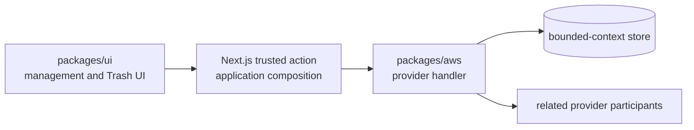

# Resource deletion lifecycle

CloudIgniter treats deletion as a cross-layer lifecycle, not a database `DeleteItem` convenience. The default
user-facing **Delete** action is reversible. Permanent deletion is a separate purge operation available from Trash.

## Ownership and flow

Generic lifecycle contracts belong in `@cloudigniter/core/types`. Reusable presentation belongs in
`@cloudigniter/ui/client`. Provider-specific DynamoDB, Cognito, or external-service behavior belongs in the provider
package. The template binds authenticated server actions and routes; it must not own a parallel deletion algorithm.

## Participant planning

For every resource, inventory the primary record, lookup/list projections, relationships, counters, caches,
authorization records, identity provider, files, domains, and external provider objects. Mark each participant as
reversible, purge-only, asynchronous, or not applicable.

Tenant deletion currently updates the System-table record and its GSI projections. Cognito is explicitly not
applicable because a tenant is not an identity. When the strategy is applied to users, Cognito becomes required:
disable the identity on soft delete, re-enable it on restore, and delete it only during purge according to retention
policy.

Cross-service lifecycles that cannot share a transaction must use an idempotent operation/saga with a stable
operation ID and persisted participant progress. Required participant failure must remain visible and retryable; do
not report a partially applied lifecycle as successful.

## Tenant access patterns

Tenant records remain in the System bounded context:

| Operation   | Access pattern                                                     | Consistency           |
| ----------- | ------------------------------------------------------------------ | --------------------- |
| List active | Query `GSI1` for `CI#SYSTEM#TENANTS` plus `CI#ACTIVE` prefix       | Eventually consistent |
| List Trash  | Query `GSI1` for `CI#SYSTEM#TENANTS` plus `CI#DELETED` prefix      | Eventually consistent |
| Set status  | Strong `GetItem`, conditional `UpdateItem`, retain list/slug keys | Strong precondition   |
| Soft delete | Strong `GetItem`, conditional `UpdateItem`, remove slug keys       | Strong precondition   |
| Restore     | Strong `GetItem`, conditional `UpdateItem`, rebuild slug keys      | Strong precondition   |
| Purge       | Strong `GetItem`, conditional `DeleteItem` only from deleted state | Strong precondition   |

This design adds one tenant-list GSI and reuses it for active and deleted collections. The index creates storage and
write amplification, but it avoids request-path scans and is the cheapest safe access pattern for management lists.
No stream, replica, TTL, or new table is required. The existing System-table IAM boundary remains in place, with
`Query`, `UpdateItem`, and `DeleteItem` granted only to the handlers that require them.

## Invariants

- Deletion is orthogonal to `active`, `suspended`, and `archived` operational status.
- Suspend/activate preserves active list and slug projections, records trusted transition metadata, and rejects
  system, archived, or deleted tenants.
- Actor and time come from trusted Cognito/AppSync identity state, not browser input.
- Protected system tenants are rejected in provider logic.
- Ordinary lookup keys are removed before a delete operation reports success.
- Restore and purge require the current base record to be deleted.
- Purge requires an exact tenant-ID confirmation and a reason.
- Ordinary lists and routing never use a scan or filter expression to hide deleted rows.

Validate exact keys, active/deleted queries, repeat transitions, protected resources, concurrent conditions, IAM
actions, UI pending/error states, dark mode, keyboard use, and the Amplify manifest contract. See the
[tenant lifecycle guide](/docs/core-system/multi-Tenancy/lifecycle-operations) for the operator workflow.
