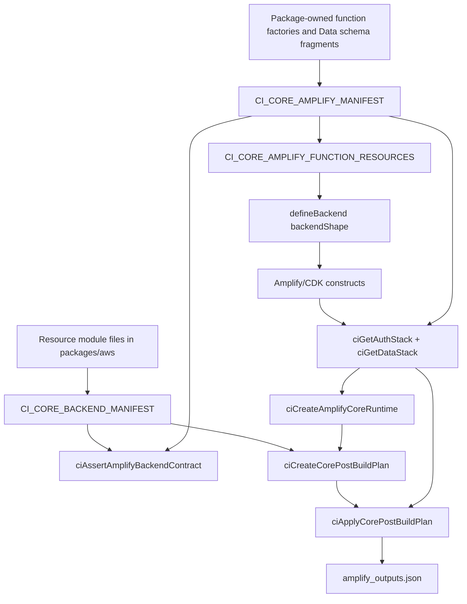

# Amplify backend build strategy

This page is the architectural reference for CloudIgniter developers adding or
maintaining core AWS resources. It explains why the system has two manifests,
what each field means, how the helpers cooperate, which files a feature owns,
and what the build derives automatically.

CloudIgniter separates a backend feature into two descriptions:

1. The **package contract** in `packages/aws` describes the feature in
   provider-oriented terms: logical resources, handler IDs, environment values,
   dependencies, and permissions.
2. The **package-owned Amplify implementation** supplies concrete function
   factories and Data schema fragments, while a thin binding in
   `apps/template/amplify` connects those exports to the target application.

The separation keeps `@cloudigniter/aws` independent of an application template
and prevents application configuration from leaking into reusable backend logic.
Some current core factories and schema fragments are still template-local; they
are [recorded migration debt](../../architecture/core-custom-ownership#remaining-template-boundary-audit),
not the location for new core implementation.

## What “dynamic” and “autonomous” mean

The build is dynamic because the active manifests are the input to a set of
projections. The projections derive the backend shape, function lookup, table
lookup, environment map, policies, grants, and outputs. They replace the old
pattern of maintaining the same handler or table in several unrelated arrays.

The system is autonomous after a resource is registered at its two legitimate
boundaries:

- Register the logical module once in `CI_CORE_BACKEND_MANIFEST`.
- Bind its concrete Amplify resources once in `CI_CORE_AMPLIFY_MANIFEST`.

From those declarations, the system automatically:

- rejects duplicate module, handler, backend-key, table, model, and output IDs;
- removes `planned` and `disabled` package modules from the deployable contract;
- checks that active dependencies also exist and are active;
- verifies that the package and Amplify manifests contain the same active
  handlers and tables;
- builds the object passed to Amplify's `defineBackend(...)`;
- resolves function IDs to synthesized Lambda constructs;
- resolves logical table keys to physical table names and ARNs;
- supplies only allowlisted environment variables to each function;
- prepares and applies common IAM statements, per-function policies, and table
  grants;
- publishes manifest-declared table names to `amplify_outputs.json`; and
- fails before partial mutation when strict post-build inputs are incomplete.

It does **not** discover source files by scanning directories. Registration is
explicit so a file cannot accidentally become deployable merely because it was
added to the repository.

## End-to-end build pipeline



The stages are intentionally split into **declaration**, **compilation**, and
**application**. Declaration should remain feature-specific. Compilation and
application should remain generic.

## Architecture map

```text title="Backend architecture files" showLineNumbers
packages/aws/src/server/backend/
├── amplify/
│   ├── ci-amplify-backend-manifest.ts # Manifest types/compiler/projections
│   ├── ci-amplify-backend-helpers.ts  # Runtime, allowlist, resource helpers
│   └── index.ts                       # Public Amplify backend API
├── core-types/
│   ├── functions.ts              # Known handler ID catalog
│   ├── tables.ts                 # Known table keys and grant actions
│   ├── plan.ts                   # Post-build compiler options
│   └── policy.ts                 # Policy fragment and prepared-policy types
├── env/
│   ├── env.keys.ts               # Canonical environment variable names
│   └── env.build.ts              # Environment-plan preparation
├── policy/
│   └── ci-prepare-policy.ts      # Policy fragment preparation/validation
├── resources/
│   ├── backend-manifest.ts       # Package manifest compiler
│   ├── resource-module.types.ts  # Module contract
│   ├── resource-module.helpers.ts# ciCreateResourceModule
│   ├── resource-registry.ts      # Single module registration point
│   ├── resource-types.ts         # Runtime state for logical resources
│   ├── env-map.ts                # Allowlist projection and env-map merging
│   ├── auth/
│   │   └── module.ts
│   └── data/
│       └── <feature>/
│           ├── module.ts
│           ├── handlers.ts
│           ├── policy.ts
│           ├── types.ts
│           └── index.ts
└── post-build.ts                 # Plan creation and CDK application

apps/template/amplify/
├── backend.ts                    # defineBackend + post-build entry point
├── auth/
│   └── <feature>/<handler>/
│       ├── handler.ts            # Lambda entry point
│       └── resource.ts           # Amplify defineFunction factory
├── data/
│   ├── resource.ts               # defineData
│   └── schemata/                 # Core Data models and operations
└── backend/
    ├── ci-core-amplify-manifest.ts # Minimal concrete binding declaration
    ├── backend-core.ts             # Derived core defineBackend shape
    ├── auth.ts                     # Auth construct projection
    ├── data.ts                     # Data construct/table projection
    ├── ci-post-build.ts            # Template orchestration
    └── types.ts                    # Merged shape and backend type
```

Not every feature needs every recommended module file. Keep `module.ts` as the
declarative entry point; extract `handlers.ts`, `policy.ts`, and `types.ts` when
their contents are substantial. `index.ts` should expose the feature through its
folder boundary.

## Layer 1: the package resource module

A resource module is the smallest package-side unit owned by a backend feature.
Use `ciCreateResourceModule(...)` to preserve the correlation between its logical
ID and the runtime state declared in `CiCoreResources`.

```ts title="Example package resource module" showLineNumbers
export const ciInvoiceTableResourceModule = ciCreateResourceModule({
  id: "invoiceTable",
  kind: "table",
  status: "active",
  handlers: ["ciCreateInvoiceHandler"],
  dependencies: ["auth"],
  tableKeys: ["invoiceTable"],
  envKeyAllowlist: {
    ciCreateInvoiceHandler: [
      CI_ENV.CI_INVOICE_TABLE_NAME,
      CI_ENV.CI_INVOICE_TABLE_ARN,
    ],
  },
  resolveEnvValues: ({ resource }) => ({
    [CI_ENV.CI_INVOICE_TABLE_NAME]: resource.name,
    [CI_ENV.CI_INVOICE_TABLE_ARN]: resource.arn,
  }),
  resolvePolicies: () => ({
    tableGrants: [
      {
        for: "ciCreateInvoiceHandler",
        table: "invoiceTable",
        actions: ["Write"],
      },
    ],
  }),
});
```

### Resource module fields

| Field              | Required | Meaning and usage                                                                                                                                                                                                                            |
| ------------------ | -------- | -------------------------------------------------------------------------------------------------------------------------------------------------------------------------------------------------------------------------------------------- |
| `id`               | Yes      | Logical resource ID. For a core module it must be a key in `CiCoreResources`, so the compiler can correlate the module with its runtime state. It must be unique across the package manifest.                                                |
| `kind`             | Yes      | Classification such as `auth`, `table`, `bucket`, or `api`. It is descriptive and available to tooling; it does not itself create infrastructure.                                                                                            |
| `status`           | No       | `active`, `planned`, or `disabled`; defaults to `active`. Only active modules contribute handlers, tables, environment values, and policies to the compiled manifest. Use `planned` to retain design work without making it deployable.      |
| `handlers`         | Yes      | Core handler IDs owned by the module. IDs come from `CiCoreFunctionId`. An active handler must have an explicit environment allowlist, even if that allowlist is empty.                                                                      |
| `dependencies`     | No       | Other logical resource IDs whose runtime state this module requires. Compilation rejects dependencies that are missing or inactive. This is logical validation—not a CDK stack-ordering mechanism.                                           |
| `tableKeys`        | No       | Logical DynamoDB table keys owned by the module. Keys come from `CiCoreTableKey` and must be unique across active registrations.                                                                                                             |
| `envKeyAllowlist`  | Yes      | Per-handler list of environment keys the function may receive. `{}` is valid only when the module has no handlers. Use an explicit empty array when a handler needs no feature-specific values. Global region/mode keys are added centrally. |
| `resolveEnvValues` | Yes      | Produces flat key/value candidates from runtime resource state. Values are not injected automatically; the handler's allowlist still controls delivery. Conflicting values for the same key cause compilation to fail.                       |
| `resolveEnvMap`    | No       | Produces exceptional per-handler overlays. Prefer `resolveEnvValues` plus allowlists for ordinary values. The final template allowlist still filters applied variables.                                                                      |
| `resolvePolicies`  | Yes      | Returns the module's `CiPolicyFragment`. Return `{}` when no permissions are needed. Keep policy ownership beside the resource that requires or exposes the permission.                                                                      |

### Resource module context

Resolvers receive `CiResourceModuleContext<TState>`:

| Property    | Purpose                                                                                                                                       |
| ----------- | --------------------------------------------------------------------------------------------------------------------------------------------- |
| `resource`  | Runtime state for this module's `id`, such as `{name, arn}` for a table. This is the preferred source for the module's own values.            |
| `resources` | Complete active `CiCoreResources` state. Use only when a legitimate cross-resource relationship is required.                                  |
| `region`    | Deployment region resolved from the Amplify backend stack.                                                                                    |
| `envMode`   | Current CloudIgniter environment mode; defaults to `live` in the template runtime adapter.                                                    |
| `options`   | `CiPlanOptions`, including Auth environment behavior, Auth parameter names, and default DynamoDB-policy behavior.                             |
| `extra`     | Provider-specific values not represented in portable runtime state. The current template supplies Cognito pool ID and ARN under `extra.auth`. |

### `ciCreateResourceModule`

This helper is a typed identity function with one runtime default: it changes an
omitted `status` to `active`. Its overloads correlate `id` with
`CiCoreResources[id]`, so `resource` has the correct state type inside the
resolvers. It does not register, compile, or deploy the module.

Use the helper in every package module. Do not construct `CiResourceModule`
objects with a broad type assertion, because that discards the ID/state safety.

## Layer 2: the package manifest

`CI_CORE_BACKEND_MANIFEST` in `resource-registry.ts` is the only package-side
registration point.

```ts title="packages/aws resource-registry.ts" showLineNumbers
export const CI_CORE_BACKEND_MANIFEST = ciDefineBackendManifest({
  modules: [
    ciAuthResourceModule,
    ciUserProfileTableResourceModule,
    ciInvoiceTableResourceModule,
  ] as const,
});
```

### `ciDefineBackendManifest` and `ciCompileBackendManifest`

`ciDefineBackendManifest(...)` delegates to `ciCompileBackendManifest(...)` and
preserves the literal module types. Compilation validates the declaration and
returns a normalized, active-only `CiCompiledBackendManifest`:

| Projection                  | Consumer                                              |
| --------------------------- | ----------------------------------------------------- |
| `modules`                   | Environment and policy resolvers.                     |
| `moduleIds` / `resourceIds` | Diagnostics and compatibility consumers.              |
| `handlerIds`                | Contract validation and strict post-build targeting.  |
| `tableKeys`                 | Contract validation and table resolution.             |
| `envKeyAllowlist`           | Environment planning and final application filtering. |

Compilation rejects empty or duplicate module IDs, duplicate handlers inside or
across modules, allowlists for handlers not owned by the module, missing active
handler allowlists, duplicate environment keys, duplicate table keys, and active
dependencies on absent/inactive modules.

### Known IDs versus active IDs

`CI_AUTH_FUNCS_IDS`, `CI_DATA_FUNCS_IDS`, and `CI_CORE_TABLE_KEYS` are catalogs of
known type-safe IDs. They may include planned compatibility IDs.

`CI_CORE_BACKEND_MANIFEST.handlerIds` and `.tableKeys` are the active deployable
contract. Never use the broad catalogs to decide what should be synthesized.

## Environment compilation

Environment handling uses a candidate-and-allowlist model:

1. `ciResolveResourceEnvValues(...)` asks each active module for flat values and
   adds the global `CI_REGION` and `CI_ENV_MODE` values.
2. `resourceEnvKeyAllowlist` merges the global keys into each active handler's
   module allowlist.
3. `ciBuildEnvMapFromAllowlist(...)` projects the flat values into a map keyed by
   handler ID.
4. Optional module overlays from `resolveEnvMap(...)` are merged.
5. `ciPickEnvKeyAllowlistForFunctions(...)` narrows the package allowlist to the
   functions actually present in each Amplify resource group.
6. `ciApplyCorePostBuildPlan(...)` filters again before calling
   `lambda.addEnvironment(...)`.

This double filtering is deliberate. A value can exist in runtime state without
being exposed to every Lambda. Add an environment key only when the handler reads
it; unnecessary CDK tokens can create cross-stack dependencies.

## Policy compilation

`resolvePolicies(...)` returns a `CiPolicyFragment` with three possible channels:

| Channel            | Scope                         | Use                                                                                               |
| ------------------ | ----------------------------- | ------------------------------------------------------------------------------------------------- |
| `commonStatements` | Every included active handler | Truly universal runtime permissions only. Keep this list small.                                   |
| `inlinePolicies`   | One handler selected by `for` | AWS actions that do not fit a typed resource grant.                                               |
| `tableGrants`      | One handler and logical table | Preferred DynamoDB access declaration. It is resolved against the physical ARN during post-build. |

```ts title="Example policy fragment" showLineNumbers
resolvePolicies: () => ({
  inlinePolicies: [
    {
      for: "ciCreateInvoiceHandler",
      id: "PublishInvoiceEvents",
      statements: [
        {
          effect: "Allow",
          actions: ["events:PutEvents"],
          resources: [invoiceEventBusArn],
        },
      ],
    },
  ],
  tableGrants: [
    {
      for: "ciCreateInvoiceHandler",
      table: "invoiceTable",
      actions: ["Write"],
    },
  ],
});
```

Use either `tableGrants` or inline DynamoDB statements for the same handler/table,
not both. Policy preparation rejects mixed DynamoDB representations. The table
grant shim expands `Read` and `Write` into concrete DynamoDB actions and includes
the table's `index/*` ARN.

## Layer 3: concrete Amplify resources

The package contract is separate from the concrete provider definition. For a
CloudIgniter-owned capability, keep both in `packages/aws` under the feature's
provider implementation and export the stable factory/schema fragment through
`@cloudigniter/aws/server/backend`. The template binding imports that export; it
does not copy the implementation.

For a Lambda, keep the implementation and resource factory together:

```text title="Example Amplify handler files" showLineNumbers
packages/aws/src/server/backend/resources/billing/create-invoice/
├── handler.ts
└── resource.ts
```

```ts title="resource.ts" showLineNumbers
import { defineFunction } from "@aws-amplify/backend";

export const createInvoiceHandler = defineFunction({
  name: "ci-create-invoice",
  entry: "./handler.ts",
  resourceGroupName: "data",
});
```

The factory's `resourceGroupName` and the manifest feature's
`resourceGroupName` must describe the same ownership. The manifest groups
bindings for projection; Amplify decides the actual nested stack from the
resource factory.

For a CloudIgniter-owned Amplify-managed DynamoDB table, define and export its
`a.model(...)` fragment from `packages/aws`. The template's core schema
composition imports the package fragment, and the manifest later resolves that
model's synthesized table construct. Application-owned models instead belong in
`apps/template/amplify/custom/data/schemata`; Resource Studio owns only its
registered folders and generated registry within that custom seam.

Choose the model/table boundary through the
[DynamoDB bounded-context strategy](/company-developers/persistence/dynamodb-strategy) before adding it. An
Amplify model is not automatically the correct boundary for one business entity: related item types may share
a capability model, while different IAM, consistency, lifecycle, throughput, stream, or restore requirements
require separate tables. Document the access pattern and cost impact of every secondary index.

## Layer 4: the Amplify manifest

`CI_CORE_AMPLIFY_MANIFEST` is the template-side binding point. It is organized by
feature, not by deployment stage. Its types, validation, compiler, and core
factory/schema exports are imported from `@cloudigniter/aws/server/backend`; the
application retains only the thin selection needed to connect those exports to
the target Amplify backend and its model names.

```ts title="Example Amplify feature binding" showLineNumbers
export const CI_CORE_AMPLIFY_MANIFEST = ciDefineAmplifyBackendManifest({
  features: {
    billing: {
      status: "active",
      resourceGroupName: "data",
      functions: {
        ciCreateInvoiceHandler: {
          backendKey: "createInvoiceHandler",
          resource: createInvoiceHandler,
        },
      },
      tables: {
        invoiceTable: {
          modelName: "Invoice",
          outputName: "invoiceTableName",
        },
      },
    },
  },
});

export const compiledBackend = ciCompileAmplifyBackendBindings(
  CI_CORE_BACKEND_MANIFEST,
  CI_CORE_AMPLIFY_MANIFEST
);
```

### Amplify manifest fields

| Field               | Meaning and usage                                                                                                                                                                                                     |
| ------------------- | --------------------------------------------------------------------------------------------------------------------------------------------------------------------------------------------------------------------- |
| `features`          | Record of cohesive backend capabilities. A feature can bind functions, tables, or both. Feature IDs must be non-empty and unique object keys.                                                                         |
| `billing`           | The example feature ID. It is an organizational owner used in validation messages and duplicate detection; it does not become a CloudFormation resource name.                                                         |
| `status`            | Currently only `active` is accepted in the Amplify manifest. Planned/disabled resources remain solely in package catalogs or package modules and must not have concrete Amplify bindings.                             |
| `resourceGroupName` | `auth` or `data`. Selects the projection that will resolve the feature's functions. It must agree with the concrete Amplify factory's stack ownership.                                                                |
| `functions`         | Map keyed by package `CiCoreFunctionId`. This key is the stable logical ID used by environment and policy plans.                                                                                                      |
| `backendKey`        | Property name inserted into the object passed to `defineBackend(...)`. After synthesis, `backend[backendKey].resources.lambda` is the Lambda construct. It must be non-empty, unique, and cannot be `auth` or `data`. |
| `resource`          | Concrete Amplify `defineFunction(...)` factory imported from the handler's `resource.ts`. It is a factory before `defineBackend`, not the resulting Lambda construct.                                                 |
| `tables`            | Map keyed by package `CiCoreTableKey`. Each active package table requires exactly one template binding.                                                                                                               |
| `modelName`         | Exact key in `backend.data.resources.tables`, normally the name used in the `a.model(...)` schema. Synthesis fails if it cannot be found.                                                                             |
| `outputName`        | Stable application-facing key written beneath `custom.cloudigniter` in `amplify_outputs.json`. It must be unique. The value is the physical table name.                                                               |

The earlier `billing` snippet is therefore read as: “the active billing feature
owns a Data-stack function whose stable CloudIgniter ID is
`ciCreateInvoiceHandler`; add its factory to `defineBackend` under
`createInvoiceHandler`, then find its Lambda construct using that property.”

### `ciDefineAmplifyBackendManifest`

This helper validates the template declaration while preserving literal factory
types. It rejects empty features, features with no bindings, duplicate function
owners, empty/reserved/duplicate backend keys, duplicate logical tables, duplicate
Data model bindings, and duplicate output names.

### Amplify compiler and projection helpers

| Helper                                           | Responsibility                                                                                                                                                           |
| ------------------------------------------------ | ------------------------------------------------------------------------------------------------------------------------------------------------------------------------ |
| `ciCompileAmplifyBackendBindings(...)`           | Public high-level compiler used by the template. Validates package parity once and returns all Auth, Data, function-resource, and table projections.                     |
| `ciGetAmplifyFunctionBindings(...)`              | Collects a resource group's function bindings and preserves their combined type. Package-level primitive used by the high-level compiler.                                |
| `ciGetAmplifyFunctionResourcesFromBindings(...)` | Re-keys function factories by `backendKey` to produce the object spread into `defineBackend(...)`. Package-level primitive used by the high-level compiler.              |
| `ciResolveAmplifyFunctionLambdas(...)`           | Converts logical function IDs into synthesized Lambda constructs by reading `backend[backendKey].resources.lambda`. Throws when a registered backend resource is absent. |
| `ciGetAmplifyTableBindings(...)`                 | Collects Data table bindings from all Data-group features.                                                                                                               |
| `ciCompileAmplifyDataBindings(...)`              | Resolves model names to physical `{name, arn}` state, builds the table ARN map, and creates declared output values. Throws when a model is missing.                      |
| `ciAssertAmplifyBackendContract(...)`            | Compares active package handler/table sets with template handler/table sets and reports missing and unexpected IDs. The high-level compiler invokes it during import.    |

The template declares values with `ciDefineAmplifyBackendManifest(...)` and passes
the result to `ciCompileAmplifyBackendBindings(...)`. The remaining helpers are
package-owned compiler primitives and should change only when the compiler itself
gains a new resource category.

## How the derived template stages cooperate

### `backend-core.ts`

Combines `auth`, `data`, and `CI_CORE_AMPLIFY_FUNCTION_RESOURCES`. A newly bound
function appears in the `defineBackend(...)` shape automatically; do not add it
again manually.

### `auth.ts`

Prepares the Cognito User Pool, resolves Auth-group Lambda constructs, derives the
active Auth handler IDs, and narrows their environment allowlists.

### `data.ts`

Resolves manifest table models to physical table state, resolves Data-group
Lambdas, derives active Data handler IDs, narrows their allowlists, and prepares
declared output values.

### `ciCreateAmplifyCoreRuntime(...)`

This package helper adapts the region, environment mode, and resolved logical
tables into the provider-neutral `CiCoreRuntime` consumed by the post-build plan.
Keeping this construction in `@cloudigniter/aws` prevents applications from
recreating the core runtime shape.

### `ci-post-build.ts`

Orchestrates the build after `defineBackend(...)` has created constructs:

1. build Auth and Data views;
2. build provider-neutral runtime state;
3. call `ciCreateCorePostBuildPlan(...)`;
4. call `ciApplyCorePostBuildPlan(...)` in strict mode; and
5. publish manifest-derived outputs.

Do not add feature-specific handler or table lists to these stage files. A need to
edit them while adding an ordinary handler/table usually means the manifest lacks
a required projection.

## Plan creation and application

`ciCreateCorePostBuildPlan(...)` is pure planning. It merges default options,
prepares the environment map, and prepares policies. Its result contains no CDK
mutation:

```ts title="Post-build plan shape" showLineNumbers
type PostBuildPlan = {
  env: CiEnvMap;
  inlinePolicies: CiInlinePolicySpec[];
  commonStatements: CiPolicyStatementInput[];
  tableGrants: CiTableGrantSpec[];
};
```

`ciApplyCorePostBuildPlan(...)` is the mutation boundary. It receives actual
Lambda constructs, selected function IDs, allowlists, IAM constructors, and table
ARNs. In strict mode it validates all targets before applying anything:

- every included handler is active;
- every included handler has a Lambda construct and environment plan;
- a handler can accept environment variables when variables are planned;
- a handler has an IAM role when policies or grants require one;
- table grants are enabled and every referenced table ARN exists.

It then adds environment values, attaches per-handler and common policies, and
converts logical table grants into IAM policies.

## Complete workflow: add a core handler

Assume `ciCreateInvoiceHandler` belongs to a new billing feature.

1. Add the ID to the appropriate known function catalog in
   `core-types/functions.ts`.
2. Implement the reusable service/handler in `packages/aws` and export it through
   the package's public backend boundary.
3. Create or update the feature resource module. Add the handler ID, an explicit
   allowlist, environment resolution, dependencies, and one permission
   representation.
4. Add the module to `CI_CORE_BACKEND_MANIFEST.modules` if it is new.
5. Create `handler.ts` and `resource.ts` in the matching `packages/aws` feature
   folder and export the resource factory through the public backend boundary.
6. If the handler is an AppSync operation, add its schema operation and handler
   reference to the Data schema. If it needs Auth access, add only the required
   Auth access relationship.
7. Import the package factory and add one `functions` binding to the feature in
   the template's thin `CI_CORE_AMPLIFY_MANIFEST`.
8. Run package tests, package typecheck, and template manifest tests.

You do **not** manually edit `backend-core.ts`, `auth.ts`, `data.ts`, or
`ci-post-build.ts` for an ordinary handler.

## Complete workflow: add a core Data table

1. Add its key to `CI_CORE_TABLE_KEYS`.
2. Add its state to `CiCoreResources` through `CiCoreTables`.
3. Create the package feature folder and resource module; declare the `tableKeys`,
   name/ARN environment values, handler ownership, and grants.
4. Register the module in `CI_CORE_BACKEND_MANIFEST`.
5. Add and export the `a.model(...)` schema fragment in `packages/aws`; bind the
   package export through the template's thin core schema composition.
6. Add one `tables` binding to the matching feature in
   `CI_CORE_AMPLIFY_MANIFEST`, using the exact model name and a unique output name.
7. Add table access through `tableGrants` or inline DynamoDB statements, never
   both for the same handler/table.
8. Verify that the table output is available under `custom.cloudigniter` after
   sandbox synthesis/deployment.

You do **not** manually maintain table ARN maps or output maps; they are compiled
from the binding.

## Adding a new resource category

Buckets, queues, event buses, or other categories require compiler work because
the current automatic projections understand functions and Amplify Data tables.
When adding a category:

1. define its runtime state in `resource-types.ts`;
2. extend the package module/manifest types if it needs a new logical key catalog;
3. add a typed binding shape to `CiAmplifyFeature`;
4. add duplicate/required-field validation to
   `ciDefineAmplifyBackendManifest(...)`;
5. add a projection that resolves the concrete construct into portable runtime
   state;
6. extend the post-build plan only if the category introduces a new generic
   mutation; and
7. add contract, projection, strict-apply, and failure-path tests.

Do not force a new resource category into `tables` or an untyped `extra` bag merely
to avoid extending the compiler.

## Dependency and nested-stack discipline

There are two different dependency concepts:

- `dependencies` in a package resource module validates logical availability.
- Passing CDK tokens such as an ARN between Amplify constructs creates physical
  CloudFormation nested-stack dependencies.

Amplify commonly creates separate Auth and Data stacks. Data already references
Auth for authorization. Injecting a Data table ARN into an Auth-stack Lambda adds
the reverse Auth-to-Data edge and produces a circular dependency.

Before adding an environment value, policy resource, or event target:

1. confirm the handler actually consumes it;
2. identify the source and destination Amplify resource groups;
3. inspect the existing nested-stack dependency direction;
4. keep tightly coupled resources in the same group when possible; and
5. use a neutral custom stack or parameter indirection when a reverse token edge
   would create a cycle.

The environment allowlist is therefore an architectural boundary, not only a
security convenience.

## Invariants and common mistakes

- Do not place planned handlers in the Amplify manifest.
- Do not use known-ID catalogs as the active deployment set.
- Do not declare a handler in more than one resource module or feature.
- Do not reuse a `backendKey`, Data `modelName`, or `outputName`.
- Do not use `auth` or `data` as a function `backendKey`.
- Do not manually add a manifest-bound function to `coreResources`.
- Do not expose a runtime value to handlers that do not read it.
- Do not combine table grants with inline DynamoDB access for the same target.
- Do not silently skip missing constructs; keep strict application enabled.
- Do not edit generated `theme.generated.css`, `amplify_outputs.json`, or CDK
  artifacts as part of backend registration.

## Verification checklist

```sh title="Verify backend manifests" showLineNumbers
pnpm --dir packages/aws test
pnpm --dir packages/aws typecheck
pnpm --dir apps/template test
```

The package tests should cover module/manifest validation, environment projection,
policy preparation, strict apply, and missing-resource failures. Template tests
should cover package/template parity, resource projection, table/output bindings,
and reserved-key rejection.

After local verification, run an Amplify sandbox. If synthesis reports a nested
stack cycle, inspect the generated root template parameters to identify both token
directions before changing stack ownership or removing a dependency.
