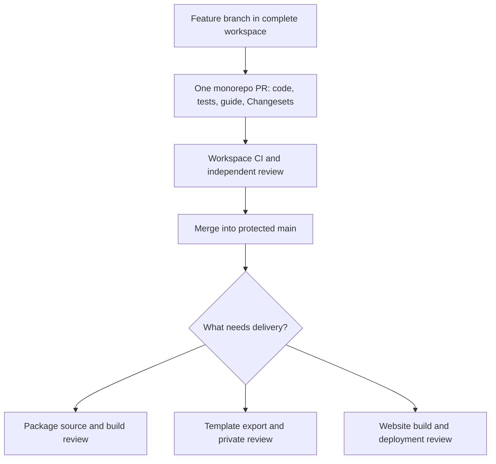

## Recommended strategy

Use one private **`cloudigniter-io/cloudigniter`** repository for the complete integration workspace. This is the proposed canonical name, recorded as `workspaceRepository`; an administrator must create or select the actual remote before using it. Keep the existing backup separate.

Open one feature PR for a coherent change, even when it touches several packages, the application template, shared configuration and the guide. Reviewers then see the complete behavior and dependency impact in a single diff. Merge that PR into protected `main` before creating a release request.



The toolkit now supports ordinary PR inspection, creation, review and merge for `--project=workspace`. These commands operate on an already-pushed branch. They do not initialize a repository, migrate the backup, push local commits, or replace the package-specific release approval checks.

## What belongs in a monorepo PR?

| Change | Review together | Publication afterward |
| --- | --- | --- |
| Cross-package feature | Contracts, implementation, providers, consumers, tests and guide | Release affected packages, including propagated dependency versions. |
| Template behavior | Application composition and any supporting package changes | Release changed packages first, then deliver the template using available versions. |
| Publishing infrastructure | Toolkit, policy, workflow templates, docs and tests | Review generated updates in each affected build repository. |
| Documentation or shared tooling | Complete guide/tooling change and validation | Deploy the guide or release the internal toolkit only if needed. |

Include a Changeset when packages need a version bump. The PR template asks for behavior, ownership, test-first evidence and validation. A PR may legitimately require no publication. `dev npm publish --changed` reads pending Changesets; it is not a command to review every modified file.

## Developer workflow

Create a feature branch, make the change, run its package checks and guide validation, then commit and push that branch to the canonical private workspace repository using your normal Git workflow. Ensure the push target is the organization repository, not the backup.

Prepare a UTF-8 `/tmp/cloudigniter-pr.md` description following `.github/pull_request_template.md`. Include the affected packages, validation results and any release sequence. Then:

```bash
dev github pr create --project=workspace --head=feature/request-context \
  --title="Add request context support" --body-file=/tmp/cloudigniter-pr.md \
  --profile=developer
```

`--head` names the branch already on GitHub. The base comes from policy (`main`). `--body-file` supplies the exact multiline description, and configured reviewers are requested. Add `--draft` while the work is unfinished. Creation uploads no local files and performs no npm release.

```bash
dev github pr view --project=workspace --number=123 --profile=developer
dev github pr checks --project=workspace --number=123 --profile=developer
```

Replace `123` with the actual PR number. `view` shows its description, state, checks and `headRefOid` (the commit SHA). `checks` shows CI outcomes; pending or failing checks are not approval to merge.

## Approver workflow

```bash
dev github pr diff --project=workspace --number=123 --profile=approver
dev github pr view --project=workspace --number=123 --profile=approver
```

The diff shows the complete repository change. Inspect the related test artifacts and use `view` to obtain the current head commit. Copy its full 40-character SHA into the following commands in place of `REVIEWED_HEAD_SHA`. Put review findings in `/tmp/cloudigniter-review.md`.

```bash
dev github pr review --project=workspace --number=123 \
  --head-sha=REVIEWED_HEAD_SHA --review=approve \
  --body-file=/tmp/cloudigniter-review.md --profile=approver
dev github pr merge --project=workspace --number=123 \
  --head-sha=REVIEWED_HEAD_SHA --profile=approver
```

Review is attached to that exact commit. Use `--review=request-changes` to block pending corrections, or `--review=comment` for a non-approval comment. Merge requests a squash merge and fails if the head changed. It exposes no administrator bypass. GitHub’s required checks, reviews and branch rules remain the final merge gate; configure them before using this workflow.

After merge, update the local workspace to `main` using Git and keep it clean and committed. Start [package release requests](./release-packages), [template publication](./template) or [website delivery](./websites) only for the outputs that actually changed.

## How this relates to paired release PRs

A monorepo PR establishes review of the integrated change. A package source PR establishes the exact versioned package snapshot. A build PR establishes the exact tarball that will be sent to npm. Keep links between the monorepo PR, release request ID, source PRs, build PRs and CI evidence.

The current release implementation verifies source/build approvals; it does **not** automatically prove that the source integration commit came from an approved monorepo PR. Protecting the canonical workspace branch supplies the organizational gate. A future automated link between the monorepo PR and release metadata can strengthen that check without dropping artifact review.

Multiple repository merges are not atomic. Finish creating the source PR batch before merging any part of it; then verify every source approval before building. Do not announce a cross-package release until every required npm version is available.

## Introduce the canonical workspace safely

An administrator should create the private repository, configure protections, review the existing tracked history and establish the initial organization branch explicitly. Ordinary `dev github pr` commands do not perform this migration. Keep credentials, local outputs and ignored data out of the tracked tree. Once the organization remote is established, update developer onboarding and CI to use it consistently.

