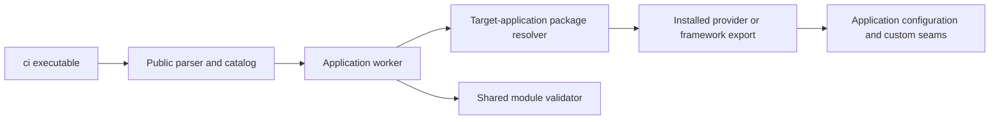

`packages/cli` owns the public `ci` executable. Its parser dispatches application
operations to focused workers; provider implementations are resolved from the
target application's installed packages.

## Ownership boundaries

| Surface | Responsibility |
| --- | --- |
| `packages/cli/bin` | Enter the CLI through a thin executable shim. |
| `packages/cli/src/cli` | Public parsing, help, prompts, dispatch and process policy. |
| `packages/cli/src/workers` | Application operations and orchestration. |
| `@cloudigniter/cli/runtime/package-entry` | Load supported package exports from the target application. |
| `@cloudigniter/cli/tooling/modules` | Shared application module validation used by CLI and DEV. |
| Provider packages | Provider-specific implementations, loaded through public exports. |

Resolving provider implementations from the application avoids a CLI/provider
dependency cycle and selects the application's installed implementation. The public
CLI never depends on restricted DEV or imports its internal modules. See the
[CLI tooling API](/docs/api-reference/build-time-apis/cli-tooling) for supported exports.

## Extending an application operation

Keep parsing and process policy in the CLI and provider behavior with its provider.
Use the target application's configuration and explicit paths; an operation must
not silently switch to the contributor workspace's provider installation.

Apply the [shared command design rules](../cli-architecture.mdx), then update the
relevant [ci command manual](/commands/ci). For generation and deployment changes,
also preserve the [Resource Studio lifecycle](./resource-studio.mdx).
