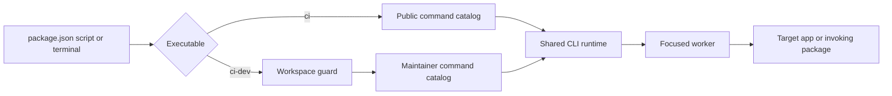
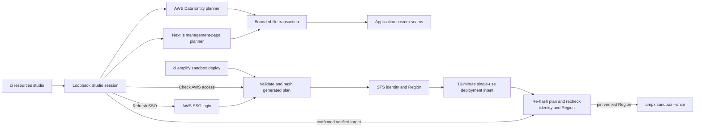

`packages/cli` owns CloudIgniter's reusable command parsing, terminal UX, error boundary, process execution, and migrated build/operations workers. It exposes two executables from one package so both products share infrastructure while keeping separate command catalogs.

| Executable | Audience | Responsibilities |
| --- | --- | --- |
| `ci` | Application developers and system operators | Resource Studio, application modules, provider bootstrap, supported operational workflows |
| `ci-dev` | CloudIgniter maintainers | Package builds, source switching, quality scans, framework assets, core module maintenance |

`ci-dev` validates the private monorepo before dispatch. This prevents accidental use in consumer projects but is not an authorization mechanism. Create separate npm packages only if access, release cadence, dependency weight, or ownership must diverge.

The previous `cloudigniter` and `cloudigniter-dev` executable names have been removed rather than retained as aliases. Repository package scripts, downstream automation, and contributor instructions must use `ci` and `ci-dev`.



## Ownership boundaries

- Executable shims under `packages/cli/bin` do nothing except enter the appropriate CLI.
- `src/cli` owns parsing, help, prompts, dispatch, alerts, workspace detection, and process policy.
- `src/workers` owns focused migrated operations.
- `src/tooling` exposes shared build configuration through `@cloudigniter/cli/tooling/tsup` and `@cloudigniter/cli/tooling/entries`.
- Package-specific step ordering, entry lists, and source-switch mappings remain beside the package under its local configuration directory.
- Provider-specific implementations remain in provider packages. Public workers resolve the provider export from the target application, preventing a `cli ↔ provider` dependency cycle.
- Resource Studio's CLI layer owns loopback serving, session protection, subprocess policy, and file-transaction orchestration. AWS schema compilation remains in `packages/aws`, Next.js artifact compilation remains in `packages/next`, and reusable generated-manager UI remains in `packages/ui`.

## Resource Studio flow



The file transaction snapshots every target before applying a generated plan. A rollback first verifies all expected after-images and refuses the entire target-file restore when any path has drifted. AWS deployment is outside that transaction: reconciling a deployed sandbox after local rollback requires another explicit one-shot deploy, and DynamoDB record recovery requires an independent data-backup plan.

The deployment intent is held in memory, consumed once, and bound to the selected profile and identifier, STS account/caller identity, resolved Region, and hash of the exact generated file plan. The Studio shows the verified account, caller ARN, Region, profile, and identifier in its confirmation. At the mutation boundary, the runtime recomputes the plan hash, repeats STS and Region resolution, rejects drift or expiry, and supplies the verified Region as both `AWS_REGION` and `AWS_DEFAULT_REGION` to the shell-free `ampx` child.

`ci amplify sandbox deploy --profile=<name> --identifier=<value>` is the explicit non-browser entry point to the same preflight/intent/deploy runtime. It requires those target values for headless operation, prints the resolved account, ARN, and Region, and never refreshes SSO automatically. Resource Studio's **Refresh SSO login** action does run the login and then automatically performs a fresh verification.

The loopback server limits a bootstrap link to one exchange within five minutes and gives the resulting `HttpOnly` cookie-backed session a fixed eight-hour lifetime. Lifecycle events live in ignored, private machine-local state. Logging drops known credential-bearing properties and also redacts common secret patterns inside arbitrary strings before persistence; callers must still avoid passing secrets into log messages.

## Command grammar

Use noun-led domains and stable actions:

```text
ci <domain> <action> [subject] [options]
ci-dev <domain> <action> [options]
```

Use kebab-case, strict known flags, explicit enum validation, deterministic defaults, and complete non-interactive invocations in package scripts. Treat published command and flag names as compatibility contracts.

See the [complete CLI command reference](./cli-command-reference) for every public and maintainer command, its working-directory contract, supported flags, side effects, and examples.

## Terminal and process standards

The CLI uses [Meow](https://github.com/sindresorhus/meow) for help and flags, [Enquirer](https://github.com/enquirer/enquirer) for TTY-only prompts, [Ora](https://github.com/sindresorhus/ora) for buffered long-running status, [Execa](https://github.com/sindresorhus/execa) for shell-free subprocesses, and Picocolors for consistent semantic output.

Apply these invariants when adding a command:

- provide a complete `--no-interactive` path before adding prompts;
- use argument arrays and `shell: false` for subprocesses;
- specify the worker `cwd` explicitly so package-local operations stay scoped;
- stop spinners before streamed output or errors;
- use exit `2` for command/workspace usage failures, `1` for operational failures, and `130` for cancellation;
- keep concise normal errors and gate stacks behind `--verbose`;
- never clear the terminal unless the user passes `--clear`.
- keep local generation offline and require a fresh target-bound intent before every generated-resource deployment;
- revalidate plan, profile, identifier, identity, account, ARN, and Region immediately before the provider subprocess;
- expire local browser sessions and deployment intents, and sanitize both structured and string log values.

## Add a command

1. Choose the public or maintainer executable and an existing domain when one fits.
2. Add strict flags and help text to that executable.
3. Add a focused worker or reuse an existing one; keep package configuration with its owner.
4. Add a complete package-script invocation when automation needs the command.
5. Test help visibility, audience segregation, invalid input, exit codes, non-interactive behavior, and the real working directory.
6. Typecheck the CLI tooling export and at least one consuming package.
7. Run `pnpm --filter @cloudigniter/cli check` and `pnpm --filter @cloudigniter/cli check:package`.
8. Search for stale direct script paths and update the user and contributor guides.

The repository's `cloudigniter-development` skill contains the concise agent checklist in `references/cli/development.md`.
