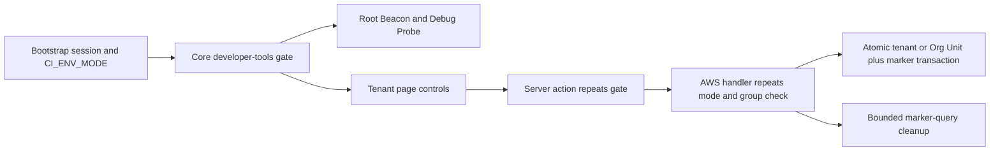

CloudIgniter treats developer tooling as a server-authorized capability, not as a side effect of running a local
Next.js process. `ciCanAccessDeveloperTools()` is the shared provider-neutral decision: mode must be exactly
`development`, the actor must be authenticated, and at least one configured exact role ID must match. The default
role is `developer`.



## Ownership map

| Layer                                 | Responsibility                                                                                                    |
| ------------------------------------- | ----------------------------------------------------------------------------------------------------------------- |
| `packages/core`                       | Public gate, canonical developer/seeder types, confined server JSON loader                                        |
| `packages/next`                       | Server-resolved capability propagation into root and client wrappers                                              |
| `packages/aws`                        | AppSync handler validation, DynamoDB transactions, marker queries, least-privilege IAM                            |
| `packages/ui`                         | Toolbar-triggered Seeder dialog, pending buttons, outcome alerts, cleanup confirmation, tenant-row reconciliation |
| `apps/template/src/custom/dev/seeder` | Application manifest and fixture JSON                                                                             |
| Template core                         | Thin operation allowlist, server actions, Amplify bindings, route composition                                     |

Role IDs are authorization identifiers and remain case-sensitive. Do not map `DEVELOPER` to `developer` inside
the access decision. Fix provider configuration and persisted assignments to use the canonical ID.

## Seeder lifecycle

The application manifest describes data location and trusted operation IDs. The server adapter rejects unknown
operation names before reading or mutating data. `ciReadJsonSeederData()` resolves every file under the configured
custom root, applies regular-file, extension, size, JSON-shape, and path-containment checks, then the domain adapter
validates each record.

Tenant creation uses the existing System-table bounded context because tenants, seed markers, IAM, lifecycle, and
operational ownership align. Each tenant and its `SEED_MARKER` record are created in one conditional transaction.
The marker partition is:

```text
PK = CI#DEVELOPER#SEEDER#<seederId>
SK = CI#RESOURCE#TENANT#<tenantId>
```

Cleanup strongly queries that base-table partition with pagination. It strongly reads each target and
transactionally deletes target and marker only while provenance and protection conditions still match. This
finds resources removed from later fixture revisions and avoids a request-path scan. Orphan markers whose targets
are already absent are collected; malformed, protected, or ownership-mismatched records are preserved.

The System table remains on its existing capacity, backup, encryption, and deployment lifecycle. This change adds
two writes per newly seeded tenant and two transactional deletes per cleanup. The cheaper alternative—storing only
provenance on the tenant—cannot reliably discover fixtures removed from JSON without a scan, so the bounded marker
item is justified.

The `test-tenants` fixture also carries a parent-first multi-company Org Unit tree. Tenants are created first; each canonical node, its tenant/path attachments, parent update, and `ORG_UNIT` marker are transactional. Cleanup sorts Org Unit markers by predecessor depth, removes descendants and attachments first, then removes tenant records. This ordering prevents a partial cleanup from deleting a predecessor while a seeded descendant survives.

DynamoDB authorizes a transaction through `dynamodb:TransactWriteItems` and also checks the action matching every
transaction component. The System-table policy must therefore cover `ConditionCheckItem`, `PutItem`, `UpdateItem`,
and `DeleteItem` wherever the handler's transaction actually uses them. In particular, Org Unit creation updates the
predecessor's child list, Org Unit update may delete tenant attachments, and cleanup updates predecessor child lists.
Keep exact policy-output assertions for the seed, cleanup, create, and update handlers; changing the package policy
still requires Amplify synthesis and deployment before an existing Lambda execution role gains the action.

## Extending seeders

1. Add the application definition and JSON only under `src/custom/dev/seeder`.
2. Add a domain validator and allowlisted operation adapter.
3. List every authoritative and derived participant before implementing seed and cleanup.
4. Create provenance/markers atomically where one store permits it; use an idempotent saga when stores differ.
5. Repeat environment, authentication, role, and domain authorization at the provider boundary.
6. Add UI through reusable controls and semantic feedback.
7. Test retries, collisions, ownership drift, fixture removal, partial failures, pagination, IAM, and no-scan access.

The `test-users` seeder uses an idempotent cross-service flow because Cognito, the profile table, assignments, and
audit evidence are separate participants. Profile creation failure rolls back the Cognito identity; matching emails
are adopted or cleaned only when decoded `extensions.cloudigniterSeeder` provenance equals `test-users`. Its
object-shaped address, provenance extension, status transition, and deletion metadata are encoded only at the
AppSync `AWSJSON` boundary and decoded before ownership/lifecycle checks.

## CLI boundary

No `ci seed` command is published yet. A workstation AWS identity is not the application actor, and direct table
access would bypass the deployed authorization boundary. A future CLI command must identify and verify the target
deployment, authenticate as or obtain an explicit delegated application actor, and invoke the same deployed
least-privilege capability. It must not import fixtures and write provider tables directly.

See the [user workflow](/docs/environment-modes/development-tools-and-seeding) and the repository skill reference
`references/cli/development-tools-and-seeding.md`.
