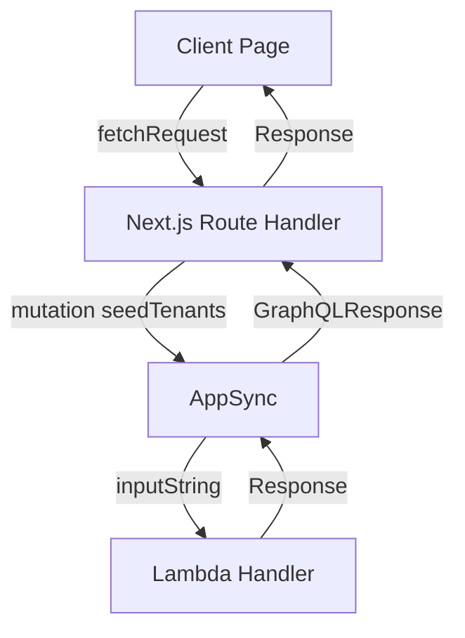

# Error Handling Strategy

All errors must follow the `Response<T>` structure.

Example:

```json
{
  "statusCode": 400,
  "body": { "error": "Invalid input" },
  "message": "Validation failed",
  "parameter": "{...}",
  "event": {...},
  "context": {...}
}
```

---

# 9. Benefits for Startups

CloudIgniter enforces:

- Consistent API workflow
- Faster new developer onboarding
- Strong security enforcement
- Easier debugging
- AWS-native patterns
- Future-proof architecture

This is particularly valuable for small teams who cannot afford inconsistent backend patterns.

---

# 10. Developer Guidelines Checklist

### ✔ Mandatory Rules

- [ ] Always use `Request<T>`
- [ ] Always return `Response<T>`
- [ ] Never leak raw exceptions
- [ ] Do not invent new response shapes
- [ ] Never call AppSync directly from client
- [ ] Always wrap client calls in fetch
- [ ] All route handlers must validate requests
- [ ] Lambda handlers must validate envMode
- [ ] Use JSON.stringify for inputString
- [ ] Use parseApiResponse for GraphQLResponse

### ✔ Recommended Rules

- [ ] Keep input types minimal
- [ ] Avoid deeply nested payloads
- [ ] Use TypeScript generics everywhere
- [ ] Log normalized errors only
- [ ] Use CloudIgniter utilities where possible

---

# 11. Short Developer Onboarding Guide

A one-page summary for new joiners:

1. Every client call sends `Request<T>`
2. Every handler returns `Response<T>`
3. The route handler is the gateway
4. All logic must pass through AppSync
5. Lambda handlers must validate input
6. No deviations from the pattern allowed
7. If you need a new API → always follow the same structure

---

# 12. Stakeholder-Friendly Explanation

CloudIgniter provides **architecture discipline as a service**.

For non-technical stakeholders:

- Ensures stable applications
- Reduces bugs and regressions
- Provides clarity across teams
- Guarantees scalable AWS integration
- Reduces onboarding time for new engineers
- Prevents inconsistent API implementations
- Enables predictable development cycles

This is why CloudIgniter is ideal for startups scaling fast with limited engineering capacity.

---

# 13. Diagrams

## ASCII Diagram

```
┌──────────────────────────┐
│        CLIENT PAGE       │
└───────────────▲──────────┘
                │ fetch(Request<T>)
                ▼
┌──────────────────────────┐
│   NEXT.JS ROUTE HANDLER  │
└───────────────▲──────────┘
                │ GraphQL Mutation
                ▼
┌──────────────────────────┐
│          APPSYNC         │
└───────────────▲──────────┘
                │ event.arguments.inputString
                ▼
┌──────────────────────────┐
│       LAMBDA HANDLER     │
└──────────────────────────┘
```

## Mermaid Diagram



---

# 14. Common Mistakes and Fixes

| Mistake                                      | Fix                                  |
| -------------------------------------------- | ------------------------------------ |
| Sending raw payloads instead of `Request<T>` | Wrap input inside `Request<T>`       |
| Returning arbitrary objects                  | Always return `Response<T>`          |
| Route handler throws errors                  | Normalize errors and return Response |
| Lambda parses non-JSON                       | Always JSON.stringify inputString    |
| Using GET to send data                       | Use POST with JSON body              |
| Missing envMode                              | Default via prepareApiRequest        |

---

# 15. Appendix: Recommended Utilities

Example client helper:

```ts
export async function call<TInput, TOutput>(
  url: string,
  request: Request<TInput>
): Promise<Response<TOutput>> {
  const res = await fetch(url, {
    method: "POST",
    body: JSON.stringify(request),
    headers: { "Content-Type": "application/json" },
  });

  return (await res.json()) as Response<TOutput>;
}
```

---

# END OF DOCUMENT
