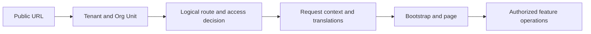

# Architecture and concepts

CloudIgniter supplies reusable capabilities for applications: routing context, identity and authorization,
Tenant and Org Unit management, shared UI, provider integration, and development tooling. The application
template composes those capabilities and supplies places for your own features.

## The layers you work with

| Layer | Responsibility | Typical public entry points |
| --- | --- | --- |
| Application | Configuration, routes, translations, and your business features | Application files under `src/custom` and the scoped custom route trees |
| Core | Generic contracts, types, registries, and shared helpers | `@cloudigniter/core/lib`, `@cloudigniter/core/types` |
| Next.js integration | Proxy, request context, bootstrap integration, layouts, and page rendering | `@cloudigniter/next/server`, `@cloudigniter/next/client`, `@cloudigniter/next/types` |
| Provider | AWS-specific persistence, identity, and backend implementation | The applicable `@cloudigniter/aws` entry point |
| UI | Reusable forms, tables, dialogs, feedback, and management interfaces | `@cloudigniter/ui/client`, `@cloudigniter/ui/types` |
| CLI | Application tooling and resource generation | `ci` |

EmberGuard implements the generic access-control engine internally. Application developers consume its public
helpers and types through Core. Provider selection and Next.js integration remain in their respective layers.

## Learn these concepts in order

1. **Application ownership:** know which files are safe to customize and which files CloudIgniter manages.
2. **Route and request context:** a public URL resolves to a logical feature route before rendering starts.
3. **Configuration and settings:** distinguish application wiring from values resolved for the running application.
4. **Identity and authorization:** authentication identifies an actor; permissions decide which operations that actor may perform.
5. **Tenant and Org Unit:** a Tenant provides a scope; an Org Unit adds organizational structure within that scope.
6. **Resources and providers:** a resource identifies something the application manages; a provider implements its persistence or external integration.

These concepts meet on each request:

Resolving a Tenant or displaying a permitted button does not authorize a data mutation. Server operations and
provider handlers enforce their own authoritative scope and permission checks.

## Read at the right level

Follow this Users guide to build applications. Use the [Dictionary](/dictionary) to look up terminology and
the [API Reference](/docs/api-reference/overview) for exact public contracts. When extending CloudIgniter itself,
continue into [CloudIgniter Developers](/company-developers/architecture/core-custom-ownership).

Next: [Application structure and ownership](/docs/architecture/application-structure).
