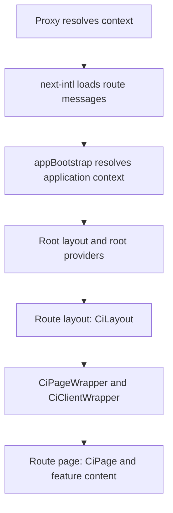

# How a request becomes a page

A normal application page receives its route and scope before it renders. Understanding this order helps you
register features correctly and locate failures without adding a second resolver inside a page.

## Resolve the public request

`src/proxy.ts` delegates to `ciNextProxyResponse()` from `@cloudigniter/next/server/proxy`:

1. Normalize the public pathname.
2. Resolve the Tenant, then any Org Unit path.
3. Remove those transport segments to obtain `featurePathname`.
4. Match the logical route and apply its scope and access decisions.
5. Construct minimal `CiRequestContext` and forward it in the configured request header.
6. Rewrite to the appropriate internal page tree, or return the required redirect/information response.

For example, a resolved request for `/t/acme/finance/dashboard/books` can select Tenant `acme`, Org Unit
`finance`, and feature route `/dashboard/books`. Register the feature route, without the Tenant or Org Unit prefix.

## Load messages and bootstrap

`next.config.ts` registers `src/kernel/server/i18n/request.ts`. That hook reads the resolved request context,
selects the route namespace, and loads the matching messages. The application `appBootstrap()` helper then
combines configuration, request context, user, settings, environment mode, and provider status.

Layouts and pages call the cached server `appBootstrap()` helper and pass its context to their wrappers.
`CiLayout` supplies the layout and shared providers. `CiPage` supplies page scrolling, header, breadcrumbs,
loading, and page messages. A page beneath a CloudIgniter layout does not need another `CiPageWrapper`.

## Understand context transport

| Transport | Meaning |
| --- | --- |
| Proxy-generated request header | Context for the same server request. |
| Context cookie | A bridge for a later request; it can be stale and must be validated against the requested pathname. |

The context contains the selected Tenant, Org Unit, logical pathname, and route; it is not the whole route
registry or application configuration. A client-supplied context is not authorization evidence.

API and `ci-internal` paths bypass the template's proxy matcher. A separate fetch to them does not inherit the
page's forwarded header. Such endpoints resolve their own prerequisites rather than invoking page bootstrap.

## Diagnose in order

For a missing context, incorrect route, or `MISSING_MESSAGE`, check the public request, matcher, resolved Tenant
and Org Unit, feature route, namespace, locale registry, and loaded message bundle in that order. A translation
file existing on disk does not prove the current route loaded it.

Continue with [Configure your application](/docs/configuration/overview). For implementation details, see
[Tenant route lifecycle](/company-developers/routing/tenant-route-lifecycle).
