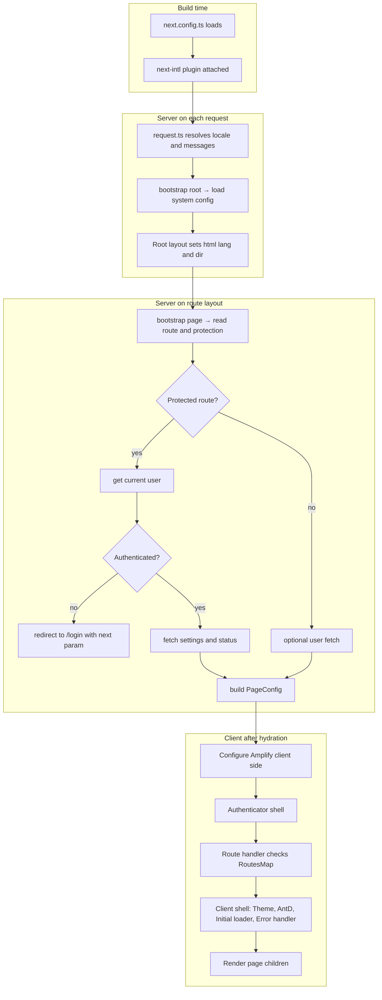

# Bootstrapping CloudIgniter

So, what runs before any page renders?

A CloudIgniter app does a surprising amount of work before your route's layout/page ever renders. This
section maps that startup path—from framework boot → locale resolution → root wiring → page protection →
client shells—so you know where to plug in and what to debug when something feels off.

Below is "at a glance" sequence (timeline):

1. Framework boot
2. i18n plugin attaches (compile-time + request-time)
3. Locale & messages assembled (server, per request)
4. Root configuration bootstraps (theme, i18n, Amplify outputs, etc.)
5. Root providers mount (Intl provider, global styles)
6. Route layout bootstraps (protected route? fetch user, settings, status)
7. Client shells mount (Amplify client config → Auth → Route guard → Theme/AntD → Initial loader → Error handler)
8. Your page finally renders

