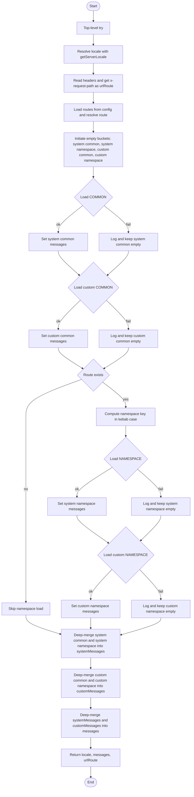

# 2. Locale Resolution & Message Assembly

On every request, <a href="https://next-intl.dev/docs/usage/configuration#i18n-request" target="_blank">getRequestConfig</a>
runs server-side to:

- determine the currently selected locale (cookies + defaults),
- compute the current route and its namespace,
- load system messages from `json` files:
  1. `Common` messages, which are always loaded for any route. Shared by all routes.
  2. Route `Namespace` specific messages that load only when the corresponding route is requested.
- load custom overrides from your app, and
- "deep-merge" them into a single messages object delivered to the client.

**More about this in the localization section.**

```ts {15} title="src/kernel/i18n/request.ts" showLineNumbers
import { getRequestConfig } from "next-intl/server";
import { headers } from "next/headers";
import { deepmerge } from "deepmerge-ts";
import type { AbstractIntlMessages } from "next-intl";

import { getServerLocale } from "@cloudigniter/next/server";
import { resolveRoute } from "@cloudigniter/next/routing";
import { getErrorMessage } from "@cloudigniter/next/utility";
import { pascalToKebab } from "@cloudigniter/next/utility";
import type { RoutesMap } from "@cloudigniter/next/types";

import config from "@/../cloudigniter.config";
import { locale } from "@cloudigniter/next/locale";

export default getRequestConfig(async () => {
  try {
    const loc = await getServerLocale({
      cookieName: config.i18n.cookieName,
      defaultLocale: config.i18n.defaultLocale,
    });

    const hdr = await headers();
    const urlRoute = hdr.get("x-request-path") ?? "";
    const routes = config.routes as RoutesMap;
    const route = resolveRoute(urlRoute, routes);

    let commonMessages = {};
    let namespaceMessages = {};
    let customCommonMessages = {};
    let customNamespaceMessages = {};

    try {
      commonMessages = locale[loc]["common"];

      customCommonMessages = (await import(`../../locale/${loc}/common.json`))
        .default;
    } catch (error) {
      console.log(
        `Could not load the common language file! Error: ${getErrorMessage(
          error
        )}`
      );
    }

    if (route !== null) {
      // If we have a named route, load “namespace” JSON files:
      const nsKebab = pascalToKebab(route.namespace);
      try {
        namespaceMessages = locale[loc][nsKebab];
        customNamespaceMessages = (
          await import(`../../locale/${loc}/${nsKebab}.json`)
        ).default;
      } catch (error) {
        console.log(
          `Could not load the current route language file! Error: ${getErrorMessage(
            error
          )}`
        );
      }
    }

    const systemMessages = deepmerge(
      commonMessages,
      namespaceMessages
    ) as AbstractIntlMessages;

    const customMessages = deepmerge(
      customCommonMessages,
      customNamespaceMessages
    ) as AbstractIntlMessages;

    const messages = deepmerge(
      systemMessages,
      customMessages
    ) as AbstractIntlMessages;

    return {
      locale: loc,
      messages,
      urlRoute,
    };
  } catch (error) {
    throw error;
  }
});
```

:::info
CloudIgniter implements a special strategy for request-time Locale resolution and message assembly. The very first
thing CloudIgniter does per request is guarantee that the right dictionary is ready for your page.
Route namespaces let you keep translations modular and small. Custom app messages cleanly override system defaults
via deep-merge.
:::


