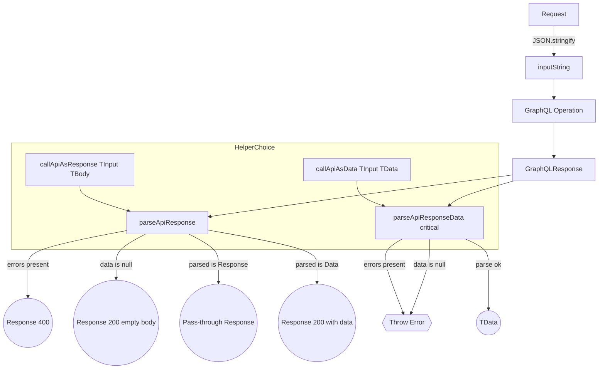

CloudIgniter provides a set of helper utilities that can be used by developers to parse requests (within the API Handler code) and
normalize GraphQL results (by the caller code). The following helpers make server-side API calls safer and more predictable by
validating inbound `Request` payloads and by converting raw `GraphQLResponse` objects into the standardized `Response` shape
from `@cloudigniter/next/types`.

## `safeParseRequest<T>()`

This utility safely parses a serialized `Request<T>` without throwing.

```ts
import type { Request } from "@cloudigniter/next/types";

/**
 * Returns a Request<T> if JSON is valid; otherwise null.
 */
export function safeParseRequest<T>(json?: string | null): Request<T> | null {
  if (!json) return null;
  try {
    return JSON.parse(json) as Request<T>;
  } catch {
    return null;
  }
}
```

**When to use**

You accept an optional JSON string and want a typed `Request<T>` or null if it's missing/invalid. Great for
edge/API routes where you may receive malformed input.

**Example**

```ts title="Example on how to use the safeParseRequest<T>() helper utility" showLineNumbers
const maybeReq = safeParseRequest<{ userId: string }>(
  headers().get("x-ci-request")
);
if (!maybeReq) {
  return NextResponse.json({ error: "Invalid request" }, { status: 400 });
}
// use maybeReq.input.userId, maybeReq.scope, maybeReq.action, etc.
```

---

## `parseApiResponseData<Ok>()`

THis utility performs a typed extraction for the payload inside a returned GraphQLResponse. It attempts to parse
`response.data` into the expected `Ok` shape, handling stringified JSON, arrays, primitives, and objects. If GraphQL
reported errors or parsing fails, you can choose between:

1. **Non-critical mode** (critical=false, default): returns a 400-shaped Response with `{ error: string }` in body.
2. **Critical mode** (critical=true): throws on any error.

```ts title="The Overloads of parseApiResponseData<Ok>() helper utility" showLineNumbers
import type {
  GraphQLResponse,
  JsonValue,
  Response,
} from "@cloudigniter/next/types";

export function parseApiResponseData<Ok = JsonValue>(
  response: GraphQLResponse
): Ok;
export function parseApiResponseData<Ok = JsonValue>(
  response: GraphQLResponse,
  critical: true
): Ok;
export function parseApiResponseData<Ok = JsonValue>(
  response: GraphQLResponse,
  critical: false
): Ok | Response<never, { error: string }, 400>;
```

```ts title="The JsonValue type" showLineNumbers
type JsonPrimitive = string | number | boolean | null | object;
type JsonValue = JsonPrimitive | { [k: string]: JsonValue } | JsonValue[];
```

**Behavior**

- If response.errors?.[0] exists → error.

- If response.data == null → error.

- If data is a string → JSON.parse (if fails → error).

- If data is array/number/boolean/object → returned as-is (typed as Ok).

**Examples**

```ts title="Example on how to use the parseApiResponseData<Ok>() helper utility" showLineNumbers
// 1) Non-critical: never throws; may return a 400-shaped Response on failure
const users = parseApiResponseData<{ users: { id: string }[] }>(gqlResp, false);
if ("statusCode" in users && users.statusCode === 400) {
  // handle parse/GraphQL error path
  return { ok: false, reason: users.body.error };
}
return { ok: true, list: users.users };

// 2) Critical: throws on any error (use try/catch)
try {
  const data = parseApiResponseData<{ deleted: boolean }>(gqlResp, true);
  // safe to use data.deleted here
} catch (err) {
  // map to your error UX/logging
}
```

:::tip
Use `non-critical` mode in controllers where you want to propagate a uniform `Response` error without exceptions.
Use `critical` in small, well-scoped utilities where exceptions simplify control flow.
:::

---

## `parseApiResponse()`

This utility is an End-to-end normalizer that converts a raw GraphQLResponse into your standard `Response`. It behaves as follows:

- If GraphQL errors exist → returns 400 with combined messages.
- If data is null/undefined → returns 200 with empty body (useful for delete/void ops).
- Otherwise uses `parseApiResponseData` (non-critical).
  - If that returns a Response (already shaped 4xx/2xx), it passes through (adding response if missing).
  - Otherwise it wraps the parsed value into a 200 Response.

```ts title="The parseApiResponse() helper utility" showLineNumbers
import type { GraphQLResponse, Response, JsonValue } from "@CI/types";
import { parseApiResponseData } from "./parse-api-response-data";

function isObjectLike(v: unknown): v is Record<string, unknown> {
  return typeof v === "object" && v !== null;
}
function isResponse(v: unknown): v is Response {
  return (
    isObjectLike(v) &&
    "statusCode" in v &&
    "body" in v &&
    typeof (v as any).statusCode === "number"
  );
}

export function parseApiResponse(input: GraphQLResponse): Response {
  const { errors, data } = input;

  if (Array.isArray(errors) && errors.length > 0) {
    const errorMessages = errors
      .map((e) =>
        e && typeof e.message === "string" ? e.message : "Unknown error"
      )
      .join("\n");
    return {
      statusCode: 400,
      body: { error: `GRAPHQL_ERRORS: ${errorMessages}` },
      message: "Error(s) generated by GraphQL API",
      response: input,
    };
  }

  if (data == null) {
    return {
      statusCode: 200,
      body: {},
      message: "Successful response with no data.",
      response: input,
    };
  }

  const parsed = parseApiResponseData<JsonValue | Response>(input, false);

  if (isResponse(parsed)) {
    return { ...parsed, response: (parsed as any).response ?? input };
  }

  return {
    statusCode: 200,
    body: parsed,
    message: "Data returned successfully.",
    response: input,
  };
}
```

**Example**

```ts title="Example on how to use the parseApiResponse() helper utility" showLineNumbers
// Controller example
const gqlResp = await serverClient.graphql({
  /* ... */
});
const normalized = parseApiResponse(gqlResp);

// From here on, always a `Response`
if (normalized.statusCode >= 400) {
  return NextResponse.json(normalized.body, { status: normalized.statusCode });
}
return NextResponse.json(normalized.body);
```

---

## `callApiAsResponse<TInput, TBody>()`

This is a convenience wrapper that:

1. Serializes a `Request<TInput>` into the `inputString` variable for GraphQL.
2. Calls the provided operation.
3. Normalizes the result using `parseApiResponse`.
4. Returns a standardized `Response<TBody>`.

**Example**

```ts title="Example on how to use the callApiAsResponse<TInput, TBody>() helper utility" showLineNumbers
const result = await callApiAsResponse<{ userId: string }, { user: User }>(
  serverClient.getUser,
  { input: { userId: "123" }, scope: "User", action: "Get" }
);

if (result.statusCode === 200) {
  console.log(result.body.user);
}
```

---

## `callApiAsData<TInput, TData>()`

Similar to `callApiAsResponse`, but:

- Uses `parseApiResponseData` in critical mode.
- Returns the parsed data directly (TData) rather than a Response wrapper.
- Will throw if the GraphQL response has errors or invalid data.

**Example**

```ts title="Example on how to use the callApiAsData<TInput, TData>() helper utility" showLineNumbers
try {
  const user = await callApiAsData<
    { userId: string },
    { id: string; name: string }
  >(serverClient.getUser, {
    input: { userId: "123" },
    scope: "User",
    action: "Get",
  });
  console.log(user.name);
} catch (err) {
  console.error("API call failed", err);
}
```

---

## Quick Reference

- Input parsing: `safeParseRequest<T>(json)` → `Request<T> | null`
- Low-level data extraction: `parseApiResponseData<Ok>(gql, critical?)`
  - critical=false → returns Ok or a 400-Response error
  - critical=true → returns Ok or throws
- High-level normalization: parseApiResponse(gql) → always a standardized Response
- Operation wrappers:
  - `allApiAsResponse(op, req)` → `Response<TBody>`
  - `callApiAsData(op, req)` → `TData` (throws on error)

:::info
All helpers preserve or attach the original GraphQLResponse on the returned Response (via response) so you can log,
trace, or inspect the raw payload if needed.
:::

## Helper Comparison Table

| Helper                   | Input                            | Output                                                         | Error Handling                                                | When to Use                                                              |
| ------------------------ | -------------------------------- | -------------------------------------------------------------- | ------------------------------------------------------------- | ------------------------------------------------------------------------ |
| **safeParseRequest**     | JSON string (`string` \| `null`) | `Request<T>` \| `null`                                         | Returns `null` if invalid JSON                                | Safely parse inbound request payloads (e.g., from headers or cookies).   |
| **parseApiResponseData** | `GraphQLResponse`                | `Ok` type or 400-`Response` (non-critical) / throws (critical) | Flexible: choose between exception throwing or error response | Low-level extraction of data from GraphQL responses with strong typing.  |
| **parseApiResponse**     | `GraphQLResponse`                | Standardized `Response`                                        | Always returns a `Response`, even on errors                   | Normalize responses into a consistent shape for controllers/middleware.  |
| **callApiAsResponse**    | GraphQL op + `Request<T>`        | `Response<TBody>`                                              | Normalized via `parseApiResponse`                             | End-to-end calls where you want a uniform `Response` object.             |
| **callApiAsData**        | GraphQL op + `Request<T>`        | Strongly typed `TData`                                         | Throws if errors/invalid data                                 | End-to-end calls where you just want typed data (and prefer exceptions). |

:::tip Rule of Thumb

- Use **`safeParseRequest`** at input boundaries.
- Use **`parseApiResponseData`** for typed extraction inside utilities.
- Use **`parseApiResponse`** for uniform response normalization.
- Use **`callApiAsResponse`** in controllers where you need a consistent `Response` object.
- Use **`callApiAsData`** in business logic where exceptions simplify flow and you only need the data.  
  :::

  ## Request → GraphQL → Helpers Flow


