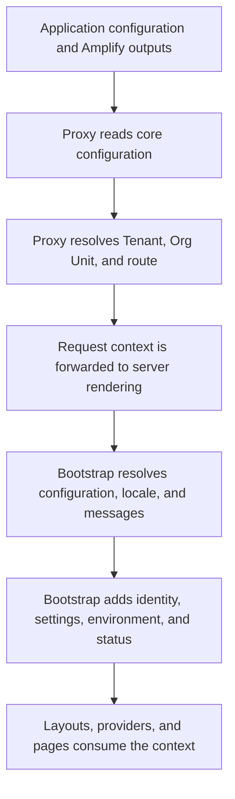

# How configuration is resolved

CloudIgniter combines your configured inputs with values resolved for the current page request. The result
gives layouts and pages their effective configuration, language, identity, settings, and environment mode.
Use this sequence to understand where a displayed value comes from and which source to change.

The paths below are relative to the application template downloaded from GitHub. The template supplies the
application helpers; reusable configuration types and runtime integrations come from the `@cloudigniter/...`
packages installed from npm.

## Identify the inputs

| Input | Role |
| --- | --- |
| `next.config.ts` | Configures Next.js and registers `src/kernel/server/i18n/request.ts` with next-intl during framework setup. |
| `cloudigniter.config.ts` | Supplies capability configuration: authentication, providers, routes, tenancy, localization, theme inputs, and development tools. Its route registry includes the definitions under `src/custom/routes`. |
| `amplify_outputs.json` | Supplies the generated connection details for the deployed Amplify backend. |
| `src/custom/locales/index.ts` and registered message files | Supply application translations that can override CloudIgniter messages. |
| `src/custom/theme/customTheme.ts` | Exports `appThemeProviderProps`, the application's theme-provider overrides. |
| Runtime environment variables | Supply the environment mode read during bootstrap. See [Configure CI_ENV_MODE](/docs/environment-modes/CI_ENV_MODE). |
| `appGetSettings()` in `src/kernel/server/settings/app-get-settings.ts` | Supplies the settings placed in the application context. The supplied resolver returns static values. |

`next.config.ts` configures the framework; it is not merged into the CloudIgniter configuration object.
Request-specific values, such as the selected language and current user, are resolved during server rendering.

## Follow a page request



### 1. Prepare configuration for the proxy

`src/proxy.ts` calls `appGetCoreConfig()` before delegating routing to
`ciNextProxyResponse()` from `@cloudigniter/next/server/proxy`.

The helper reads `cloudigniter.config.ts` and includes the imported `amplify_outputs.json` contents at
`providers.aws.amplify.amplifyOutputs`. It preserves the other configured provider fields. The imported outputs
take precedence over any value already present at that exact property; the helper does not rewrite your
configuration file. You do not need to copy the generated outputs into `cloudigniter.config.ts` manually.

This configuration is safe to resolve before page rendering: the helper does not call request-scoped locale,
message, header, or cookie APIs. The proxy then resolves the Tenant, Org Unit, and logical route and forwards
their minimal [request context](/dictionary/r#request-context) to the server. The complete configuration stays
separate from that routing snapshot.

### 2. Resolve server configuration and language

During server rendering, `appBootstrap()` calls `appGetAllServerConfig()`. Both helpers are supplied under
`src/kernel/server`. The configuration resolver combines the same application configuration and Amplify
outputs, then obtains the locale and messages through next-intl and collects `appThemeProviderProps`.

The next-intl request hook registered by `next.config.ts` resolves the language as follows:

1. Read the cookie named by `i18n.cookieName`; when it is absent, use `i18n.defaultLocale`.
2. Read the proxy-generated request context and its resolved route namespace.
3. Load the registered common and namespace message files for that locale.
4. Merge CloudIgniter common messages, CloudIgniter namespace messages, custom common messages, and custom
   namespace messages, in that order. Later values override earlier values at the same key.

For example, namespace `dashboard.settings` selects `common`, `dashboard`, and `dashboard-settings`.
Application translations must be registered under `src/custom/locales/index.ts` to participate. See
[Localization and direction](/docs/configuration/localization) for the registration workflow.

The resolver returns a `CiNextConfig` with three sections. Both `CiNextConfig` and `CiNextCoreConfig` are
available from `@cloudigniter/next/types`.

| Section | Resolved contents |
| --- | --- |
| `appCoreConfig` | The application configuration, including the automatically supplied `providers.aws.amplify.amplifyOutputs`. |
| `appResolvedCoreConfig` | The selected `locale`, its `direction`, and the language diagnostics endpoint. |
| `appNextResolvedConfig` | The route's `messages`, `appThemeProviderProps`, and the `version` and `routerMode` copied from the application's `app` configuration. |

For an application whose default locale is `en`, a visitor's `ar` locale cookie can produce
`appResolvedCoreConfig.locale === "ar"` and `direction === "rtl"`. The configured `i18n.defaultLocale`
remains `en`; the resolved values describe that visitor's request.

### 3. Assemble the bootstrap context

After resolving configuration, `appBootstrap()` reads the forwarded request context. It then obtains the
authenticated user from the AWS integration, calls `appGetSettings()`, and reads request headers and cookies.
It resolves the environment mode and includes provider status checks in the returned `CiNextContext`, whose
type is available from `@cloudigniter/next/types`.

The main values are arranged as follows:

```text
context
├── config
│   ├── appCoreConfig
│   ├── appResolvedCoreConfig
│   └── appNextResolvedConfig
├── tenant, orgUnit, featurePathname, route
├── auth
├── settings
├── env
├── headers, cookies
└── status
```

Read effective configuration from `context.config`, the authenticated identity from `context.auth.user`,
settings from `context.settings`, and the environment mode from `context.env.mode`.
`ciGetEnvMode()` from `@cloudigniter/next/server` reads `CI_ENV_MODE` first and falls back to
`NEXT_PUBLIC_CI_ENV_MODE` when the server variable is absent. Bootstrap fails if no environment mode is resolved.
Keep both values aligned as described in [Environment modes](/docs/environment-modes/intro).

Settings are a separate context value; they are not merged over `cloudigniter.config.ts`. The supplied
`appGetSettings()` does not automatically query persisted settings or load a custom settings registry. Connect
application-owned persisted values through the workflow in [Settings and runtime values](/docs/configuration/settings).

### 4. Apply values in layouts and providers

The root layout, route layouts, and server pages call the cached `appBootstrap()` helper. Calls participating
in the same server render share its result. The context belongs to that request; each visitor receives their
own resolved language and identity.

The root layout uses the resolved locale and direction for the document's `lang` and `dir`. The root provider
receives the resolved locale and messages. `CiLayout` variants, such as `@cloudigniter/next/layout/cp-standard`,
supply the layout's provider stack. `CiPage` from `@cloudigniter/next/client` uses the route message bundle unless
its `setup.messages` explicitly supplies a page override.

Theme-provider overrides are collected during server configuration resolution and applied when the layout
installs `CiThemeProvider`. The standard client wrapper sets `attribute: "class"` and `defaultTheme: "system"`
after applying the application's theme-provider props. Other supplied overrides, such as `forcedTheme`, reach
the provider. Theme settings returned by `appGetSettings()` are not automatically substituted for these inputs.
See [Themes and styling](/docs/configuration/themes) for the customization points.

The root layout also includes `AppAmplifyClientConfig`, which imports the generated outputs to configure the
browser's Amplify client. This complements the server configuration used by bootstrap.

When passing resolved values to your own Client Components, select the fields those components need and keep
private settings and server-only data on the server.

## Check the source of an unexpected value

- **Wrong backend:** check the generated `amplify_outputs.json` supplied with the application; copying a
  different object into `cloudigniter.config.ts` does not override the imported outputs.
- **Wrong language or missing translation:** check the locale cookie, default locale, resolved route namespace,
  and registered message files. A translation file on disk is not proof that the current route loaded it.
- **Settings edits have no effect:** check the service used by the consuming feature; registering a setting does
  not change the static values supplied by bootstrap.
- **Theme override has no effect:** check the custom theme-provider props and the standard wrapper's fixed
  `attribute` and `defaultTheme` values.
- **Missing request context:** check the [request lifecycle](/docs/architecture/request-lifecycle). API and
  `ci-internal` endpoints bypass the page proxy and must resolve their own prerequisites instead of invoking
  page bootstrap.

Continue with [Authentication and identity](/docs/identity/authentication).
