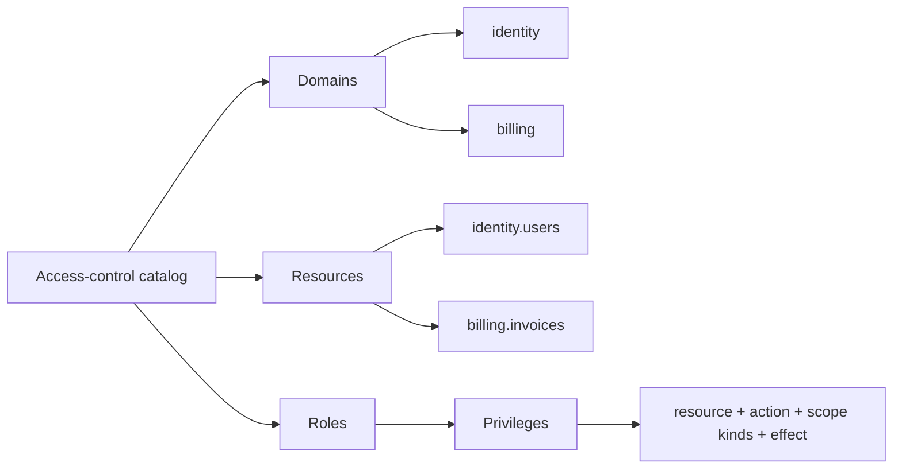
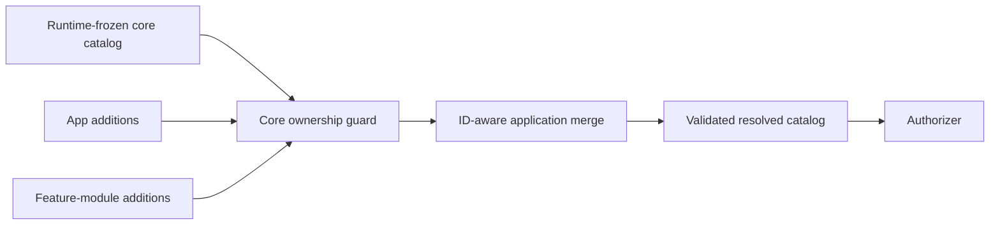

# Catalog and Permission Design

The access-control catalog is the vocabulary of the application's security model. Design it around business
capabilities before assigning privileges to roles.

## Catalog hierarchy



### Domain

A domain groups related resources for ownership and administration. It is not itself an access decision.

```ts
const domain = {
  id: "billing",
  title: "Billing",
  description: "Invoices, payments, refunds, and billing configuration.",
};
```

Good domains usually correspond to application modules or bounded business areas:

```text
identity
billing
learning
reporting
platform
```

### Resource

A resource is a stable protected capability, not necessarily one database row.

```ts
const resource = {
  id: "billing.invoices",
  domainId: "billing",
  title: "Invoices",
  actions: [
    { id: "read", title: "Read invoices" },
    { id: "create", title: "Create invoices" },
    { id: "approve", title: "Approve invoices", sensitive: true },
    { id: "void", title: "Void invoices", sensitive: true },
  ],
  scopeKinds: ["tenant", "orgUnit"],
};
```

The current engine authorizes the resource **type** and request scope. If access depends on a record's owner,
classification, workflow state, or another relationship, resolve those facts in the service and perform the
additional object-level check there. Never assume that access to one invoice means access to every invoice in
the same tenant.

### Action

Actions describe business operations. Prefer precise names over generic `manage` permissions.

| Prefer | Avoid | Reason |
| --- | --- | --- |
| `approve` | `write` | Approval may require a special role. |
| `refund` | `update` | A refund is financially sensitive. |
| `publish` | `edit` | Publishing affects visibility. |
| `invite` | `create` | Inviting a user has identity-provider effects. |

Common actions such as `read`, `create`, `update`, and `delete` are useful, but an application should not be
limited to CRUD.

## Privilege structure

A privilege is a serializable policy statement:

```ts
import type { CiPrivilege } from "@cloudigniter/core/types";

const approveInvoices: CiPrivilege = {
  id: "approve-invoices",
  effect: "allow",
  resource: "billing.invoices",
  action: "approve",
  scopeKinds: ["tenant", "orgUnit"],
  description: "Allows invoice approval within the assigned boundary.",
};
```

Every privilege has:

- a stable `id` for storage and audit records;
- an `allow` or `deny` effect;
- a resource pattern;
- an action pattern;
- one or more request scope kinds where it may match.

The concrete tenant or Org Unit belongs to the assignment, not the privilege.

## Naming rules

Use lowercase IDs for domains, resources, actions, and privileges. Resources may contain dotted segments.

```text
identity.users
identity.groups
billing.invoices
billing.payment-methods
platform.settings
```

Role IDs may also use CloudIgniter's existing uppercase core-role convention, but lowercase kebab case is easier
to use consistently in application catalogs.

Keep IDs immutable after release. Titles and descriptions may change; IDs appear in assignments, audit records,
cache keys, and persistence indexes.

## Wildcard patterns

Resource and action patterns support `*` segments.

```ts
const privileges = [
  // Every registered action on exactly identity.users.
  {
    id: "manage-users",
    effect: "allow",
    resource: "identity.users",
    action: "*",
    scopeKinds: ["tenant", "orgUnit"],
  },

  // Read registered resources below identity.
  {
    id: "read-identity-domain",
    effect: "allow",
    resource: "identity.*",
    action: "read",
    scopeKinds: ["tenant", "orgUnit"],
  },
];
```

A trailing resource wildcard includes deeper registered resource segments. A middle wildcard matches one
segment. Authorization still rejects unknown resources and actions before evaluating a wildcard, so a wildcard
does not make arbitrary strings valid.

:::warning Sensitive actions
Prefer literal privileges for `delete`, `approve`, `refund`, security configuration, and other sensitive actions.
A broad wildcard may cover a sensitive action added in a future release.
:::

## Dot-delimited permission helpers

The core package includes helpers for dot-delimited permission strings:

```ts
import {
  ciFormatPermission,
  ciMatchesPermission,
  ciParsePermission,
} from "@cloudigniter/core/lib";

ciFormatPermission("identity.users", "read");
// "identity.users.read"

ciParsePermission("identity.users.read");
// { resource: "identity.users", action: "read" }

ciMatchesPermission(
  "forum.posts.*",
  "forum.posts.comments.delete",
);
// true
```

Permission strings are useful for configuration UIs and compact displays. The evaluator uses the explicit
`resource` and `action` properties on `CiPrivilege`, avoiding ambiguity between nested resources and actions.

## Build a resource inventory first

Before creating roles, list the application's protected capabilities:

| Domain | Resource | Action | Scopes | Sensitive? |
| --- | --- | --- | --- | --- |
| identity | `identity.users` | `read` | tenant, Org Unit | No |
| identity | `identity.users` | `invite` | tenant | Yes |
| billing | `billing.invoices` | `approve` | tenant, Org Unit | Yes |
| platform | `platform.settings` | `update` | system | Yes |

This inventory helps identify missing checks and prevents one oversized `admin.*` permission from becoming the
entire security model.

## Validate catalogs

`ciDefineAccessControl()` throws when the catalog contains validation errors. Administration and CI tooling can
inspect structured issues without throwing:

```ts
import { ciValidateAccessControlDefinition } from "@cloudigniter/core/lib";

const issues = ciValidateAccessControlDefinition(appAccessControl);

for (const issue of issues) {
  console.log({
    severity: issue.severity,
    code: issue.code,
    path: issue.path,
    message: issue.message,
  });
}
```

Validation detects:

- invalid or duplicate identifiers;
- empty action or scope lists;
- unknown domains, resources, actions, and inherited roles;
- invalid precedence values;
- unsupported scope combinations;
- role-inheritance cycles;
- broad all-resource/all-action wildcards.

Broad wildcards are warnings. Integrity problems are errors.

## Catalog ownership strategy

### Protected core catalog plus application layers

CloudIgniter ships `CI_DEFAULT_ACCESS_CONTROL_DEFINITION`. Build the resolved application catalog with
`ciCreateAppAccessControl()` while keeping only application-owned additions in application code. Core entries
are runtime-frozen and protected from collisions:

```ts title="src/custom/auth/app-access-control.ts" showLineNumbers
import { ciCreateAppAccessControl } from "@cloudigniter/core/lib";
import type { CiAccessControlLayer } from "@cloudigniter/core/types";

export const appAccessControlExtension = {
  resources: [
    {
      id: "identity.users",
      actions: [
        { id: "suspend", title: "Suspend user", sensitive: true },
      ],
    },
  ],
  roles: [
    {
      id: "APP_ADMIN",
      title: "Application administrator",
      precedence: 25,
      inherits: ["ADMIN"],
      privileges: [
        {
          id: "suspend-users",
          effect: "allow",
          resource: "identity.users",
          action: "suspend",
          scopeKinds: ["tenant", "orgUnit"],
        },
      ],
    },
  ],
} as const satisfies CiAccessControlLayer;

export const appAccessControl = ciCreateAppAccessControl(
  appAccessControlExtension,
);
```

Applications may extend a core resource with a new action, as above, but cannot redefine the resource or one
of its core actions. Create a custom role that inherits `ADMIN` instead of adding privileges to `ADMIN`.

Feature modules may follow the main application layer. They can refine application-owned entries but remain
unable to redefine core-owned entries:

```ts title="src/custom/auth/app-access-control.ts" showLineNumbers
const resolvedAccessControl = ciCreateAppAccessControl(
  appAccessControlExtension,
  featureModuleAccessControlLayer,
);
```



The protected application merge follows these ownership rules:

| Entry | Application behavior |
| --- | --- |
| Core domain | Read-only; new resources may reference it |
| Core resource | Read-only; new application actions may be added beneath it |
| Core action | Read-only |
| Core role and privilege | Read-only; a new application role may inherit a core role other than `SYSTEM_SUPER_ADMIN` |
| Application-owned entry | Later application layers may merge it by stable `id` |
| New entry | Appended in layer order and must include all required fields |

`ciMergeAccessControlDefinitions()` remains the low-level unrestricted merge primitive for standalone catalogs
and the audited core-override implementation. Do not use it to bypass the application ownership guard.

### Audited core overrides

A core edit never mutates `CI_DEFAULT_ACCESS_CONTROL_DEFINITION`. A directly assigned
`SYSTEM_SUPER_ADMIN` creates a versioned override record, and the application replays the persisted history over
the resolved catalog:

```ts title="src/kernel/server/auth/create-core-override.ts" showLineNumbers
import {
  ciApplyCoreAccessControlOverrides,
  ciCreateCoreAccessControlOverride,
} from "@cloudigniter/core/lib";

const override = ciCreateCoreAccessControlOverride({
  id: "core-override-2026-08-05-001",
  expectedRevision: 0,
  reason: "Use the organization-specific identity label.",
  subject,
  currentDefinition: appAccessControl,
  layer: {
    domains: [{ id: "identity", title: "Identity directory" }],
  },
});

const effectiveAccessControl = ciApplyCoreAccessControlOverrides(
  appAccessControl,
  [override],
);
```

The creator verifies the dedicated `platform.authorization.core.override` capability and requires the subject
to hold `SYSTEM_SUPER_ADMIN` directly at system scope. Direct privileges and roles that merely inherit
`SYSTEM_SUPER_ADMIN` do not qualify; application composition rejects that inheritance and any non-core role that
grants the override capability. Override records carry the actor, reason, timestamp, and consecutive revision
metadata. Bootstrap access for `SYSTEM_SUPER_ADMIN` and the core-administration resource cannot be weakened.

Persist override records with an atomic condition on `expectedRevision`. The helper creates the record and
validates the prospective catalog; the persistence adapter remains responsible for the conditional write,
step-up authentication, and durable audit retention.

Use one of these approaches deliberately:

### Code-owned catalog

CloudIgniter owns the core domains, resources, actions, roles, and privileges. Store application additions in
version-controlled TypeScript. This keeps framework invariants stable while application releases and permission
changes remain synchronized.

### Data-owned assignments

Store subject-to-role assignments and direct exceptions in persistence. They change operationally without an
application release.

### Data-owned custom roles

Allow tenants to define roles only when the administration UI, validation, versioning, auditing, and cache
invalidation are ready. The engine accepts serialized definitions, but dynamic policy authoring is an
operational security feature—not merely a form.

:::tip Recommended starting strategy
Keep the protected core catalog in `@cloudigniter/core/lib`, application additions in application code, and
scoped assignments in DynamoDB. Add dynamic tenant roles and audited core overrides only through trusted
server-side administration workflows.
:::

Next: [Roles, Inheritance, and Precedence](./roles-and-precedence).
