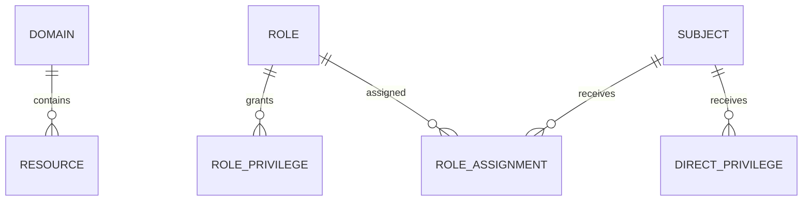
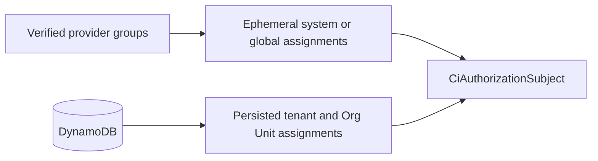
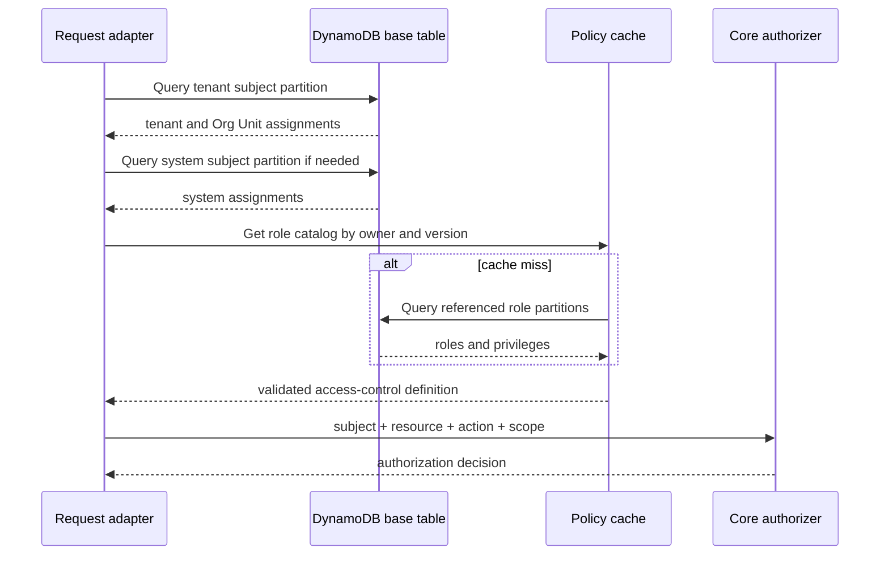

# DynamoDB Persistence

The core package intentionally contains no DynamoDB types or clients. An adapter in `@cloudigniter/aws` or the
application infrastructure layer should translate DynamoDB records into the core types.

This chapter presents the recommended persistence strategy. It is an access-pattern design, not a requirement
of the evaluator.

## Source-of-truth strategy

Do not store a flattened list of every effective user permission as the canonical policy. A role change would
require rewriting every assigned user and stale copies could preserve revoked access.

Store these entities separately:

- resource domains and resources;
- role metadata;
- one item per role privilege;
- one item per scoped role assignment;
- one item per direct privilege;
- catalog and assignment versions;
- append-only audit events in an appropriate audit store.



## Tenant isolation

Use an owner prefix on every partition:

```text title="Authorization owner prefixes" showLineNumbers
SYSTEM
GLOBAL
TENANT#tenant-123
TENANT#tenant-456
```

This keeps tenant items in different partitions and makes accidental cross-tenant reads less likely.

## Suggested primary keys

| Entity | PK | SK |
| --- | --- | --- |
| Catalog version | `AUTHZ#<owner>#META` | `VERSION` |
| Domain | `AUTHZ#<owner>#CATALOG` | `DOMAIN#<domainId>` |
| Resource | `AUTHZ#<owner>#CATALOG` | `RESOURCE#<resourceId>` |
| Role metadata | `AUTHZ#<owner>#ROLE#<roleId>` | `META` |
| Role privilege | `AUTHZ#<owner>#ROLE#<roleId>` | `PRIVILEGE#<privilegeId>` |
| Subject assignment | `AUTHZ#<owner>#SUBJECT#<subjectId>` | `ASSIGNMENT#<scopeToken>#ROLE#<roleId>` |
| Direct privilege | `AUTHZ#<owner>#SUBJECT#<subjectId>` | `DIRECT#<scopeToken>#<privilegeId>` |

Canonical scope tokens:

```text title="Canonical authorization scope tokens" showLineNumbers
SYS
GLB
TEN#tenant-123
ORG#tenant-123#finance
```

Store the structured scope attributes as well. The encoded key accelerates queries; it should not be the only
representation of the policy.

## Example role privilege item

```json
{
  "PK": "AUTHZ#TENANT#tenant-123#ROLE#invoice-approver",
  "SK": "PRIVILEGE#approve-invoices",
  "entityType": "AUTHZ_ROLE_PRIVILEGE",
  "owner": "TENANT#tenant-123",
  "roleId": "invoice-approver",
  "privilege": {
    "id": "approve-invoices",
    "effect": "allow",
    "resource": "billing.invoices",
    "action": "approve",
    "scopeKinds": ["tenant", "orgUnit"]
  },
  "policyVersion": 17,
  "updatedAt": "2026-08-04T10:00:00.000Z",
  "updatedBy": "user:security-admin"
}
```

## Example subject assignment item

```json
{
  "PK": "AUTHZ#TENANT#tenant-123#SUBJECT#user-456",
  "SK": "ASSIGNMENT#TEN#tenant-123#ROLE#invoice-approver",
  "entityType": "AUTHZ_ROLE_ASSIGNMENT",
  "owner": "TENANT#tenant-123",
  "subjectId": "user-456",
  "roleId": "invoice-approver",
  "scope": {
    "kind": "tenant",
    "tenantId": "tenant-123"
  },
  "propagation": "descendants",
  "validFrom": "2026-08-01T00:00:00.000Z",
  "expiresAt": "2027-08-01T00:00:00.000Z",
  "assignmentVersion": 8,
  "createdAt": "2026-08-01T00:00:00.000Z",
  "createdBy": "user:security-admin"
}
```

The adapter selects only core fields when creating `CiRoleAssignment`. Fields such as `createdBy` remain useful
for administration and audit.

## Provider groups and persisted assignments

Do not write a new DynamoDB assignment every time a token contains an identity-provider group. For a small set
of centrally managed system and global roles, resolve the verified group claim at request time with
`ciCreateRoleAssignmentsFromIdentityGroups()` and combine those assignments with DynamoDB results.



If the product needs an administration screen that searches external group membership, choose one explicit
source of truth:

- query the identity provider's administration API; or
- run a directory-sync process into a separate projection such as
  `IDENTITY_GROUP#<provider>#<groupId>`, clearly marked with `syncedAt` and treated as eventually consistent.

Do not use that search projection as runtime proof of access. Verified current claims and strongly consistent
application assignment reads remain the authorization inputs. Persist global, tenant, and Org Unit roles in the
assignment records above, because a flat provider group does not carry reliable hierarchical scope.

## Search indexes

### GSI 1: roles and privileges by resource/action

```text
GSI1PK = AUTHZ#<owner>#RESOURCE#<resourcePattern>
GSI1SK = ACTION#<actionPattern>#EFFECT#<effect>#ROLE#<roleId>#PRIVILEGE#<privilegeId>
```

This supports administration questions such as:

- Which roles can update `identity.users`?
- Which policies explicitly deny `billing.invoices.approve`?
- Which roles contain a broad wildcard?

Wildcard patterns should be stored in their own pattern bucket. Administration queries may need to retrieve
both an exact bucket and relevant wildcard buckets.

### GSI 2: subjects by role and scope

```text
GSI2PK = AUTHZ#<owner>#ROLE#<roleId>
GSI2SK = SCOPE#<scopeToken>#SUBJECT#<subjectId>
```

This supports:

- Who is a tenant administrator?
- Which subjects have a role in Finance?
- Which assignments must be reviewed before deleting a role?

:::warning Runtime consistency
Use the base table for the authorization request path. Global secondary indexes are eventually consistent and
should be used for administration and search, not as proof that a subject currently has a grant.
:::

## Tenant authorization read path



For a tenant request:

1. Query `AUTHZ#TENANT#<tenantId>#SUBJECT#<subjectId>`.
2. Query `AUTHZ#SYSTEM#SUBJECT#<subjectId>` only if system grants may reach tenants.
3. Filter expired and out-of-scope assignments safely in the adapter or let core ignore them.
4. Fetch referenced role partitions, including inherited roles.
5. Combine them with the registered domain/resource catalog.
6. Create or reuse an authorizer for the policy version.
7. Evaluate the request through core.

Most subjects have few assignments, so querying the subject partition and filtering against the resolved scope
is usually simpler and safer than adding many authorization-path indexes.

## Policy and assignment versions

Maintain at least:

- a catalog/policy version per owner;
- an assignment version per subject or owner;
- timestamps and actor IDs for every change.

A cache key might be:

```text
authz-policy:<owner>:<catalogVersion>
authz-subject:<owner>:<subjectId>:<assignmentVersion>
```

Update policy records and the catalog version in one DynamoDB transaction. Use conditional writes to prevent
lost updates in the administration UI.

## Caching rules

Safe things to cache:

- validated resource catalogs;
- compiled authorizers keyed by immutable policy version;
- role definitions keyed by owner, role ID, and version;
- short-lived subject assignments keyed by an assignment version.

Avoid caching a bare `allowed = true` result without policy, assignment, subject, resource, action, scope, and
expiry versions. Revocation must invalidate positive decisions promptly.

## Expiration and TTL

DynamoDB TTL deletion is asynchronous. Store a numeric TTL for cleanup if desired, but always preserve the
ISO-8601 `expiresAt` field and let the authorizer evaluate it synchronously.

```text
expiresAt: 2026-08-04T12:00:00.000Z
ttl:       1785844800
```

An item that remains after its TTL is still inactive once `expiresAt` has passed.

## Write operations

Use transactional or conditional writes for:

- creating or replacing a role and its privileges;
- incrementing the policy version;
- assigning mutually exclusive roles;
- ensuring a deleted role has no active assignments;
- revoking emergency access;
- recording an audit event or an outbox record.

## Audit guidance

At minimum record:

```text
event ID
timestamp
actor subject ID
target subject ID
owner and scope
role or privilege ID
operation: create, update, revoke, expire
before and after values
reason or ticket ID
request trace ID
```

Do not place secrets or raw identity tokens in authorization records.

## References

- [DynamoDB data-modeling building blocks](https://docs.aws.amazon.com/amazondynamodb/latest/developerguide/data-modeling-blocks.html)
- [CloudIgniter Multi-Tenancy](../multi-Tenancy/intro)

Next: [Testing and Troubleshooting](./testing-and-troubleshooting).
