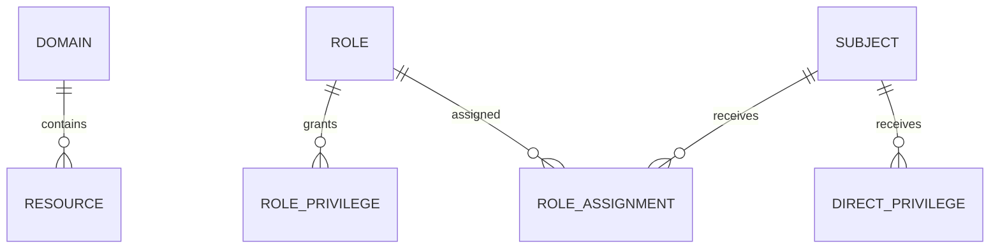
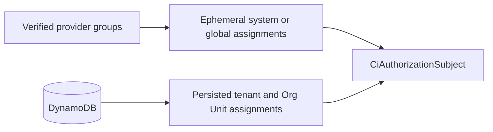
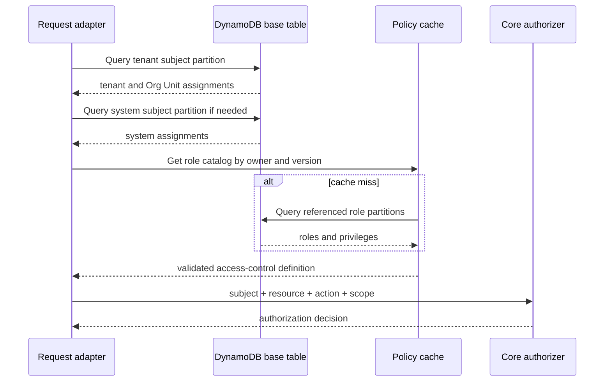

# DynamoDB Persistence

The Emberguard engine intentionally contains no DynamoDB client dependency. The AWS connector accepts a
database/provider object from the application, then translates DynamoDB records into Emberguard catalog,
assignment, custom-domain, and resource-inventory contracts.

This chapter presents the recommended persistence strategy. It is an access-pattern design, not a requirement
of the evaluator.

The AWS implementation uses a dedicated `EmberguardAccess` bounded-context table. “Single-table” here means
that related EmberGuard item types share that table; it does not mean that tenants, profiles, settings, and
unrelated CloudIgniter capabilities share one platform-wide table. See the
[DynamoDB bounded-context strategy](/company-developers/persistence/dynamodb-strategy).

All examples follow the [CloudIgniter table-key convention](/docs/library/dynamodb/table-key-convention): every
primary and secondary-index key begins with the helper-generated `CI#` namespace.

## Active definition address

The AWS repository stores the active access-control definition at one canonical address:

```text
PK = CI#EMBERGUARD#ACCESS_CONTROL
SK = CI#DEFINITION#ACTIVE
```

All saves and reads use only this address. Because the convention was adopted before production, CloudIgniter
does not retain a fallback or dual-write path for the previous development key. Reset or reseed disposable
development data when adopting the new key.

The `sandbox:bootstrap` workflow conditionally creates this item when it is absent, using
`CI_DEFAULT_ACCESS_CONTROL_DEFINITION` imported through `@cloudigniter/core/lib`. Runtime definition reads apply
the same create-if-absent safeguard, so a missing item self-recovers even when deployment bootstrap was skipped.
Creation uses one conditional, insert-only `PutItem`, which is cheaper than a transaction and never replaces an
existing definition. Before creating the state, EmberGuard reads the strongly consistent assignment collection
and builds the initial counters from any retained assignments. A newly initialized state starts at revision `0`;
normal mutations advance it from there.

The local bootstrap command does not query DynamoDB with the developer's AWS SSO role. It prefers the
get-definition Lambda name in `amplify_outputs.json`. If Amplify omits that custom output, bootstrap uses the
read-only Lambda control plane to find functions with the stable get-definition capability token, then accepts
only the unique function whose runtime environment names the exact EmberGuard table from application outputs.
It invokes that handler synchronously. The handler owns only the required `GetItem`, `Query`, and `PutItem`
permissions and executes the same runtime create-if-absent path. This keeps workstation credentials out of the
table's data plane, avoids broad developer grants, prevents cross-sandbox selection, and leaves infrastructure
code as the source of truth for access.

## Ready role-counter projection

The active definition item also stores a compact `roleCounters` projection keyed by role ID. Each value contains
`permissionCount`, `directUserCount`, and `inheritedUserCount`. Keeping the projection with the definition makes
the role-list access pattern one strongly consistent `GetItem`; rendering a role table never queries the role
assignment collection.

The projection is mutation-maintained:

- definition writes rebuild every role counter, so role creation, privilege changes, inheritance changes,
  suspension/restoration, and role deletion immediately update affected roles;
- assignment writes and deletes calculate the next projection and commit the subject assignment, its collection
  copy, and the active access-control state in one `TransactWriteItems` operation;
- every state mutation advances an optimistic `revision` and conditions the write on the revision that was read;
  concurrent administrative mutations fail without committing a partial assignment or stale projection and may
  then be retried against fresh state;
- unique subjects are counted once per role even when several scoped assignment records connect the same subject
  and role;
- direct counts describe stored assignment relationships; inherited counts follow only non-suspended inheritance
  paths. Runtime authorization still evaluates `validFrom` and `expiresAt` independently.

Assignments therefore have two transactionally maintained addresses:

```text
Subject authorization record
PK = CI#EMBERGUARD#SUBJECT#<subjectId>#ROLE_ASSIGNMENTS
SK = CI#ROLE_ASSIGNMENT#<assignmentId>

Administration collection copy
PK = CI#EMBERGUARD#ROLE_ASSIGNMENTS
SK = CI#TENANT#<tenantId-or-global>#SUBJECT#<subjectId>#ROLE_ASSIGNMENT#<assignmentId>
```

The subject partition supports strongly consistent authorization reads. The collection partition supports a
paginated, strongly consistent projection rebuild only during administrative mutations. This deliberately pays
extra storage and transactional write capacity on infrequent security writes to avoid repeated assignment reads
on frequent role-list renders. DynamoDB transactions perform an all-or-nothing write and consume two underlying
writes per item; monitor consumed capacity and the active-state item size. See the AWS documentation for
[transaction semantics](https://docs.aws.amazon.com/amazondynamodb/latest/developerguide/transaction-apis.html)
and [transaction capacity](https://docs.aws.amazon.com/amazondynamodb/latest/developerguide/read-write-operations.html).

The active definition plus counters must remain comfortably below DynamoDB's item-size limit. If measured role
catalog growth approaches that guardrail or mutation frequency makes full projection rebuilds material, move
the projection to versioned/sharded items or an asynchronous projection with an explicit freshness contract;
do not reintroduce render-time assignment fan-out.

## Source-of-truth strategy

Do not store a flattened list of every effective user permission as the canonical policy. A role change would
require rewriting every assigned user and stale copies could preserve revoked access.

Store these entities as separate items within the EmberGuard access boundary:

- resource domains and resources;
- role metadata;
- one item per role privilege;
- one item per scoped role assignment;
- one item per direct privilege;
- catalog and assignment versions;
- append-only audit events in an appropriate separate store when their volume, retention, export, or restore
  requirements differ from authorization state.



## Tenant isolation

Use an owner prefix on every partition:

```text title="Authorization owner prefixes" showLineNumbers
SYSTEM
GLOBAL
TENANT#tenant-123
TENANT#tenant-456
```

This keeps tenant items in different partitions and makes accidental cross-tenant reads less likely.

## Suggested primary keys

| Entity             | PK                                     | SK                                         |
| ------------------ | -------------------------------------- | ------------------------------------------ |
| Catalog version    | `CI#AUTHZ#<owner>#META`                | `CI#VERSION`                               |
| Domain             | `CI#AUTHZ#<owner>#CATALOG`             | `CI#DOMAIN#<domainId>`                     |
| Resource           | `CI#AUTHZ#<owner>#CATALOG`             | `CI#RESOURCE#<resourceId>`                 |
| Role metadata      | `CI#AUTHZ#<owner>#ROLE#<roleId>`       | `CI#META`                                  |
| Role privilege     | `CI#AUTHZ#<owner>#ROLE#<roleId>`       | `CI#PRIVILEGE#<privilegeId>`               |
| Subject assignment | `CI#AUTHZ#<owner>#SUBJECT#<subjectId>` | `CI#ASSIGNMENT#<scopeToken>#ROLE#<roleId>` |
| Direct privilege   | `CI#AUTHZ#<owner>#SUBJECT#<subjectId>` | `CI#DIRECT#<scopeToken>#<privilegeId>`     |

Canonical scope tokens:

```text title="Canonical authorization scope tokens" showLineNumbers
SYS
GLB
TEN#tenant-123
ORG#tenant-123#finance
```

Store the structured scope attributes as well. The encoded key accelerates queries; it should not be the only
representation of the policy.

## Example role privilege item

```json
{
  "PK": "CI#AUTHZ#TENANT#tenant-123#ROLE#invoice-approver",
  "SK": "CI#PRIVILEGE#approve-invoices",
  "entityType": "AUTHZ_ROLE_PRIVILEGE",
  "owner": "TENANT#tenant-123",
  "roleId": "invoice-approver",
  "privilege": {
    "id": "approve-invoices",
    "title": "Approve invoices",
    "effect": "allow",
    "resource": "billing.invoices",
    "action": "approve",
    "scopeKinds": ["tenant", "orgUnit"]
  },
  "policyVersion": 17,
  "updatedAt": "2026-08-04T10:00:00.000Z",
  "updatedBy": "user:security-admin"
}
```

## Legacy privilege-title compatibility

Persisted definitions created before privilege titles became required may omit `title`. EmberGuard normalizes
that missing property in memory during the provider read path. It first recovers the title from a matching
privilege in the configured catalog, then derives a deterministic human-readable label from the stable ID for
an unknown custom privilege. For example, `approve-invoices` becomes `Approve invoices`.

The compatibility step does not mutate the provider response or silently write to DynamoDB. The next deliberate
catalog save persists the generated titles. Explicitly blank titles and unrelated invalid catalog fields are
not repaired and continue to fail validation; this keeps new writes strict and prevents a migration from hiding
policy corruption.

Role suspension is stored in the active definition as `status: "suspended"` plus `statusChange` metadata with
`changedAt`, `changedBy`, and `reason`. Assignments remain untouched, so restoration does not require rebuilding
subject-role relationships. Provider reads must load the active definition before authorization, and compiled
authorizers must be recreated after a status-changing write. An omitted status is interpreted as `active` for
backward compatibility.

## Example subject assignment item

```json
{
  "PK": "CI#AUTHZ#TENANT#tenant-123#SUBJECT#user-456",
  "SK": "CI#ASSIGNMENT#TEN#tenant-123#ROLE#invoice-approver",
  "entityType": "AUTHZ_ROLE_ASSIGNMENT",
  "owner": "TENANT#tenant-123",
  "subjectId": "user-456",
  "roleId": "invoice-approver",
  "scope": {
    "kind": "tenant",
    "tenantId": "tenant-123"
  },
  "propagation": "descendants",
  "validFrom": "2026-08-01T00:00:00.000Z",
  "expiresAt": "2027-08-01T00:00:00.000Z",
  "assignmentVersion": 8,
  "createdAt": "2026-08-01T00:00:00.000Z",
  "createdBy": "user:security-admin"
}
```

The adapter selects only core fields when creating `CiRoleAssignment`. Fields such as `createdBy` remain useful
for administration and audit.

## Provider groups and persisted assignments

Do not write a new DynamoDB assignment every time a token contains an identity-provider group. For a small set
of centrally managed system and global roles, resolve the verified group claim at request time with
`ciCreateRoleAssignmentsFromIdentityGroups()` and combine those assignments with DynamoDB results.



If the product needs an administration screen that searches external group membership, choose one explicit
source of truth:

- query the identity provider's administration API; or
- run a directory-sync process into a separate projection such as
  `CI#IDENTITY_GROUP#<provider>#<groupId>`, clearly marked with `syncedAt` and treated as eventually consistent.

Do not use that search projection as runtime proof of access. Verified current claims and strongly consistent
application assignment reads remain the authorization inputs. Persist global, tenant, and Org Unit roles in the
assignment records above, because a flat provider group does not carry reliable hierarchical scope.

## Search indexes

### GSI 1: roles and privileges by resource/action

```text
GSI1PK = CI#AUTHZ#<owner>#RESOURCE#<resourcePattern>
GSI1SK = CI#ACTION#<actionPattern>#EFFECT#<effect>#ROLE#<roleId>#PRIVILEGE#<privilegeId>
```

This supports administration questions such as:

- Which roles can update `identity.users`?
- Which policies explicitly deny `billing.invoices.approve`?
- Which roles contain a broad wildcard?

Wildcard patterns should be stored in their own pattern bucket. Administration queries may need to retrieve
both an exact bucket and relevant wildcard buckets.

### GSI 2: subjects by role and scope

```text
GSI2PK = CI#AUTHZ#<owner>#ROLE#<roleId>
GSI2SK = CI#SCOPE#<scopeToken>#SUBJECT#<subjectId>
```

This supports:

- Who is a tenant administrator?
- Which subjects have a role in Finance?
- Which assignments must be reviewed before deleting a role?

:::warning Runtime consistency
Use the base table for the authorization request path. Global secondary indexes are eventually consistent and
should be used for administration and search, not as proof that a subject currently has a grant.
:::

## Tenant authorization read path



For a tenant request:

1. Query `CI#AUTHZ#TENANT#<tenantId>#SUBJECT#<subjectId>`.
2. Query `CI#AUTHZ#SYSTEM#SUBJECT#<subjectId>` only if system grants may reach tenants.
3. Filter expired and out-of-scope assignments safely in the adapter or let core ignore them.
4. Fetch referenced role partitions, including inherited roles.
5. Combine them with the registered domain/resource catalog.
6. Create or reuse an authorizer for the policy version.
7. Evaluate the request through core.

Most subjects have few assignments, so querying the subject partition and filtering against the resolved scope
is usually simpler and safer than adding many authorization-path indexes.

## Policy and assignment versions

Maintain at least:

- a catalog/policy version per owner;
- an assignment version per subject or owner;
- timestamps and actor IDs for every change.

A cache key might be:

```text
authz-policy:<owner>:<catalogVersion>
authz-subject:<owner>:<subjectId>:<assignmentVersion>
```

Update policy records and the catalog version in one DynamoDB transaction. Use conditional writes to prevent
lost updates in the administration UI.

## Caching rules

Safe things to cache:

- validated resource catalogs;
- compiled authorizers keyed by immutable policy version;
- role definitions keyed by owner, role ID, and version;
- short-lived subject assignments keyed by an assignment version.

Avoid caching a bare `allowed = true` result without policy, assignment, subject, resource, action, scope, and
expiry versions. Revocation must invalidate positive decisions promptly.

## Expiration and TTL

DynamoDB TTL deletion is asynchronous. Store a numeric TTL for cleanup if desired, but always preserve the
ISO-8601 `expiresAt` field and let the authorizer evaluate it synchronously.

```text
expiresAt: 2026-08-04T12:00:00.000Z
ttl:       1785844800
```

An item that remains after its TTL is still inactive once `expiresAt` has passed.

## Write operations

Use transactional or conditional writes for:

- creating or replacing a role and its privileges;
- incrementing the policy version;
- assigning mutually exclusive roles;
- ensuring a deleted role has no active assignments;
- revoking emergency access;
- recording an audit event or an outbox record.

## Audit guidance

At minimum record:

```text
event ID
timestamp
actor subject ID
target subject ID
owner and scope
role or privilege ID
operation: create, update, revoke, expire
before and after values
reason or ticket ID
request trace ID
```

Do not place secrets or raw identity tokens in authorization records.

## References

- [DynamoDB data-modeling building blocks](https://docs.aws.amazon.com/amazondynamodb/latest/developerguide/data-modeling-blocks.html)
- [CloudIgniter Multi-Tenancy](../multi-Tenancy/intro)

Next: [Testing and Troubleshooting](./testing-and-troubleshooting).
