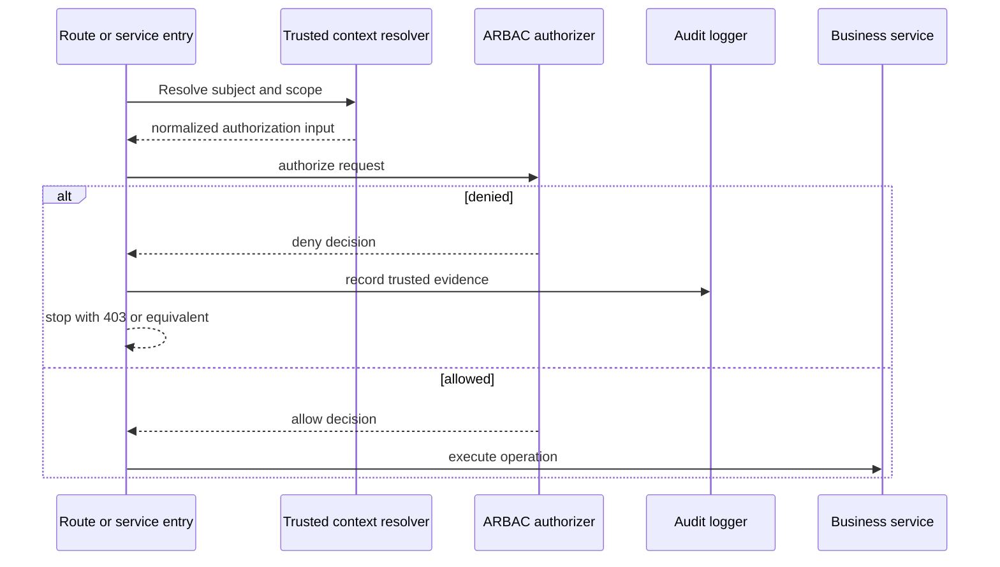

# Enforcing Access

Authorization is complete only when the application prevents a denied operation. The core package returns a
decision; the enforcement point decides how to stop execution or hide a capability.

## Create and reuse an authorizer

```ts
import { ciCreateAppAuthorizer } from "@cloudigniter/emberguard/lib";

import { appAccessControl } from "./app-access-control";

export const appAuthorizer = ciCreateAppAuthorizer(appAccessControl);
```

Creation validates the catalog and compiles role inheritance. Reuse the authorizer for repeated checks. For a
dynamic catalog, create a new instance when its policy version changes.

Options:

```ts
const authorizer = ciCreateAppAuthorizer(appAccessControl, {
  combiningAlgorithm: "deny-overrides",
  clock: () => new Date(),
  validateDefinition: true,
});
```

Do not disable definition validation unless an already validated, immutable catalog is being loaded on a hot
path and the performance tradeoff has been measured.

## Request shape

```ts
type CiAuthorizationRequest = {
  subject: CiAuthorizationSubject;
  resource: string;
  action: string;
  scope: CiAccessScope;
};
```

Example:

```ts
const request = {
  subject,
  resource: "billing.invoices",
  action: "approve",
  scope: ciOrgUnitAccessScope(
    "tenant-123",
    "finance",
    ["company"],
  ),
};
```

## Decision shape

```ts
type CiAuthorizationDecision = {
  allowed: boolean;
  effect: "allow" | "deny";
  reason: CiAuthorizationDecisionReason;
  matches: readonly CiAuthorizationMatch[];
  decidingMatches: readonly CiAuthorizationMatch[];
  evaluatedRoleIds: readonly string[];
};
```

- `matches` contains all applicable policy evidence.
- `decidingMatches` contains the privileges selected by the combining algorithm.
- `evaluatedRoleIds` contains active roles whose assignment scope included the request.

Stable decision reasons are:

| Reason | Meaning |
| --- | --- |
| `allowed` | Matching policy resolved to allow. |
| `explicit-deny` | A selected deny privilege blocked the operation. |
| `unauthenticated` | Subject authentication or ID is missing. |
| `unknown-resource` | Resource is not in the catalog. |
| `unknown-action` | Action is not registered on the resource. |
| `unsupported-scope` | Resource cannot be accessed in this scope kind. |
| `no-role-assignment` | No active assignment/direct grant contains the request scope. |
| `no-matching-privilege` | A scoped grant exists, but none covers the resource/action. |

## Build an application guard

Define the HTTP or framework error in the application layer, not in core:

```ts title="src/kernel/server/auth/require-access.ts"
import type {
  CiAccessScope,
  CiAuthorizationSubject,
} from "@cloudigniter/emberguard/types";

import { appAuthorizer } from "@/custom/auth/app-authorizer";

export class AppForbiddenError extends Error {
  readonly status = 403;

  constructor(readonly reason: string) {
    super("You are not allowed to perform this operation.");
    this.name = "AppForbiddenError";
  }
}

export function requireAccess(input: {
  subject: CiAuthorizationSubject;
  scope: CiAccessScope;
  resource: string;
  action: string;
}) {
  const decision = appAuthorizer.authorize(input);

  if (!decision.allowed) {
    // Send full evidence to trusted audit/trace infrastructure only.
    console.warn("Authorization denied", {
      subjectId: input.subject.id,
      resource: input.resource,
      action: input.action,
      scope: input.scope,
      reason: decision.reason,
      decidingMatches: decision.decidingMatches,
    });

    throw new AppForbiddenError(decision.reason);
  }

  return decision;
}
```

Call the guard immediately before the protected operation:

```ts
requireAccess({
  subject,
  scope,
  resource: "billing.invoices",
  action: "approve",
});

await approveInvoice(invoiceId);
```

Do not perform the write first and check afterward.

## Boolean checks

Use `can()` for internal branching and capability calculation:

```ts
const canApprove = appAuthorizer.can({
  subject,
  scope,
  resource: "billing.invoices",
  action: "approve",
});
```

One-shot equivalents are available when retaining an authorizer is inconvenient:

```ts
import {
  ciAuthorize,
  ciCan,
} from "@cloudigniter/emberguard/lib";

const decision = ciAuthorize(request, appAccessControl);
const allowed = ciCan(request, appAccessControl);
```

These create an authorizer each time. Prefer a reused instance in request-heavy code.

## Any-of and all-of requirements

`canAny()` answers whether at least one requirement is allowed:

```ts
const canModifyInvoice = appAuthorizer.canAny({
  subject,
  scope,
  requirements: [
    { resource: "billing.invoices", action: "update" },
    { resource: "billing.invoices", action: "approve" },
  ],
});
```

`canAll()` requires every listed capability:

```ts
const canRunSensitiveExport = appAuthorizer.canAll({
  subject,
  scope,
  requirements: [
    { resource: "reporting.reports", action: "export" },
    { resource: "identity.users", action: "read" },
  ],
});
```

Both return `false` for an empty requirements array. One-shot `ciCanAny()` and `ciCanAll()` helpers are also
exported.

## Enforcement flow



## Error response guidance

Return a generic forbidden response to untrusted clients:

```json
{
  "error": "FORBIDDEN",
  "message": "You are not allowed to perform this operation."
}
```

Keep `decidingMatches`, role IDs, and internal policy structure in trusted logs. Detailed client responses can
help an attacker map the authorization model.

## Enforcement checklist

- Check authorization on every server request that reads or changes protected data.
- Resolve subject and scope from trusted context.
- Authorize before loading sensitive data when possible.
- Re-check write permissions in the operation handler even if a page route was checked.
- Keep UI checks informational; never make them the only enforcement.
- Audit denied sensitive operations and all policy/assignment mutations.
- Treat exceptions and provider failures as deny.

Next: [Routes, Handlers, and UI](./routes-and-ui).
