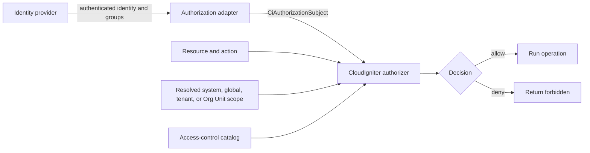
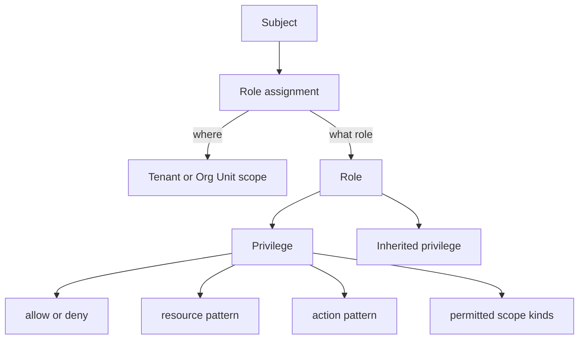
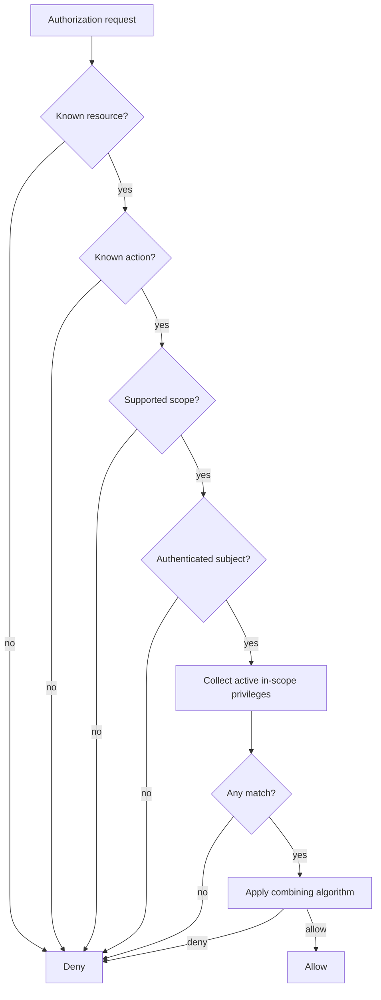

# Concepts and Strategy

CloudIgniter authorization answers one question:

> **May this authenticated subject perform this action on this resource in this scope?**

The implementation lives in `@cloudigniter/core`. It does not import Next.js, AWS, Cognito, DynamoDB, or any
other provider SDK. Applications and provider adapters supply plain TypeScript data; the core engine produces a
deterministic authorization decision.

This guide starts with a small tenant role and gradually builds toward Org Unit inheritance, explicit denies,
route enforcement, direct exceptions, DynamoDB persistence, and production testing.

## Authentication and authorization are different

| Concern | Question | Typical owner |
| --- | --- | --- |
| Authentication | Who is making the request? | Cognito, another identity provider, or application sessions |
| Authorization | What may that subject do here? | The CloudIgniter ARBAC catalog and authorizer |

Authentication must happen first, but being authenticated does not grant access by itself. A route with
`protected: true` requires a signed-in user. A resource/action requirement decides what that user may do.



## The five parts of a request

Every authorization check brings together five concepts:

1. **Subject** — the authenticated user and their scoped role assignments or direct privileges.
2. **Role/group** — a reusable job or responsibility such as `tenant-viewer` or `billing-approver`.
3. **Scope** — the boundary where an assignment is valid: system, global, tenant, or Org Unit.
4. **Resource** — a stable business capability such as `identity.users` or `billing.invoices`.
5. **Action** — the operation being attempted, such as `read`, `update`, `approve`, or `refund`.

A **privilege** connects a resource and action to an `allow` or `deny` effect. A **role assignment** connects a
role to a subject at a concrete scope.



## Why scope belongs to the assignment

Roles should be reusable. `tenant-admin` describes what tenant administrators can do; it should not embed
`tenant-123` in every privilege. The assignment says that user Alice is a tenant administrator **for
`tenant-123`**, while user Bob can receive the same role for `tenant-456`.

This separation avoids creating roles such as:

```text
tenant-123-admin
tenant-456-admin
tenant-789-admin
```

Instead, one role is assigned many times at different boundaries:

```text
role: tenant-admin
assignment: Alice -> tenant-admin at tenant-123
assignment: Bob   -> tenant-admin at tenant-456
```

## Default-deny decision strategy

The engine never assumes access. A request is allowed only when all of the following are true:

- the resource is registered;
- the action is registered for that resource;
- the resource supports the requested scope kind;
- the subject is authenticated and has an ID;
- at least one active, in-scope privilege matches;
- the combining algorithm resolves the matching privileges to `allow`.



The default combining algorithm is `deny-overrides`: any applicable explicit deny wins. A second algorithm,
`highest-precedence`, is available when the strongest matching group must decide.

## Resources are not routes

A route is an enforcement point. A resource is a business capability.

For example, `identity.users.read` might be enforced by:

- `/dashboard/users`;
- a server component that renders a user summary;
- a GraphQL resolver;
- a REST route handler;
- an export job;
- a menu-item visibility check.

All of those checks should reference the same `identity.users` resource instead of inventing route-specific
permissions. Page routes may declare an `access` requirement, but the catalog remains independent.

## Package surfaces

Import runtime helpers from the library surface:

```ts
import {
  ciCreateAuthorizer,
  ciCreateAppAccessControl,
  ciCreateAppAuthorizer,
  ciDefineAccessControl,
  ciTenantAccessScope,
} from "@cloudigniter/core/lib";
```

Import types from the types surface:

```ts
import type {
  CiAccessControlDefinition,
  CiAccessControlLayer,
  CiAuthorizationDecision,
  CiAuthorizationSubject,
} from "@cloudigniter/core/types";
```

## Recommended learning path

Continue in order when adopting the system for the first time:

1. [Build and run a minimal policy](./quick-start)
2. [Design domains, resources, actions, and privileges](./catalog-and-permissions)
3. [Model roles, inheritance, precedence, and denies](./roles-and-precedence)
4. [Apply system, global, tenant, and Org Unit scopes](./scopes-and-assignments)
5. [Adapt authenticated users and identity-provider groups](./subjects-and-providers)
6. [Enforce decisions safely](./enforcing-access)
7. [Connect routes, handlers, and UI capabilities](./routes-and-ui)
8. [Study complete application scenarios](./scenarios)
9. [Persist policies and assignments in DynamoDB](./dynamodb-persistence)
10. [Test and troubleshoot policy behavior](./testing-and-troubleshooting)
11. [Use the API reference and production checklist](./reference-and-checklist)

:::tip Core rule
Authenticate once through the configured provider, resolve scope from trusted server context, and authorize every
protected operation at the point where it executes.
:::

## Background references

- [NIST role-based access control](https://csrc.nist.gov/projects/role-based-access-control)
- [OWASP Authorization Cheat Sheet](https://cheatsheetseries.owasp.org/cheatsheets/Authorization_Cheat_Sheet.html)
