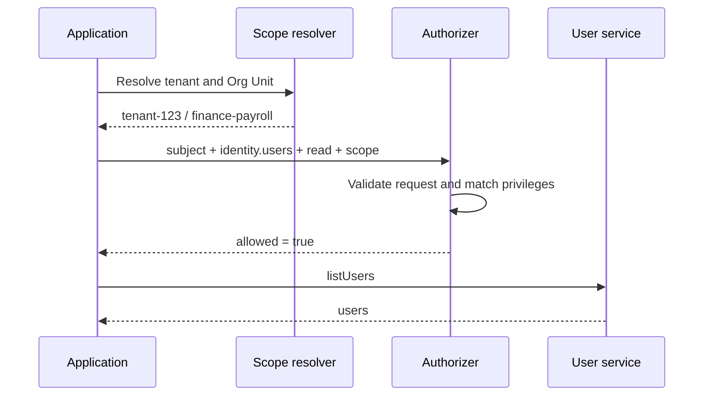

# Quick Start

This example extends CloudIgniter's default catalog with a support role, then gives one support agent permission
to read users in one tenant and all of that tenant's Org Units.

New authorization code should import from `@cloudigniter/emberguard`. The older `@cloudigniter/core` exports are
kept as a compatibility bridge.

## 1. Create the catalog

Create an application-owned authorization file. A common location is
`src/custom/auth/app-access-control.ts`.

```ts title="src/custom/auth/app-access-control.ts" showLineNumbers
import { ciCreateAppAccessControl } from "@cloudigniter/emberguard/lib";
import type { CiAccessControlLayer } from "@cloudigniter/emberguard/types";

export const appAccessControlExtension = {
  roles: [
    {
      id: "support-agent",
      title: "Support Agent",
      precedence: 50,
      privileges: [
        {
          id: "read-users",
          title: "Read users",
          effect: "allow",
          resource: "identity.users",
          action: "read",
          scopeKinds: ["tenant", "orgUnit"],
        },
      ],
    },
  ],
} as const satisfies CiAccessControlLayer;

export const appAccessControl = ciCreateAppAccessControl(
  appAccessControlExtension
);
```

The core catalog already registers `identity.users` and its standard actions. `ciCreateAppAccessControl()`
merges application-owned additions with those defaults and validates the final catalog. Invalid references,
scopes, inheritance, duplicate IDs, and attempts to redefine core entries fail during startup instead of
becoming silent authorization mistakes.

Collections are merged by stable `id` within their ownership boundary. An application may add a new action to a
core resource, create resources beneath a core domain, and create roles that inherit core roles. It cannot
replace core domains, resource fields, existing core actions, core roles, or core privileges. Application roles
also cannot inherit `system-super-admin` or grant the core-override capability.

For a standalone catalog that intentionally does not use the CloudIgniter defaults, use
`ciDefineAccessControl()` instead.

## 2. Create a scoped role assignment

```ts
import {
  ciCreateRoleAssignment,
  ciTenantAccessScope,
} from "@cloudigniter/emberguard/lib";

const tenantScope = ciTenantAccessScope("tenant-123");

const assignment = ciCreateRoleAssignment(
  "support-agent",
  tenantScope,
  "descendants"
);
```

The assignment means:

```text
role: support-agent
scope: tenant-123
propagation: tenant-123 and its Org Units
```

Changing `descendants` to `exact` would allow checks at the tenant itself but not inside its Org Units.

## 3. Create an authorization subject

```ts
import { ciCreateAuthorizationSubject } from "@cloudigniter/emberguard/lib";

const subject = ciCreateAuthorizationSubject(
  {
    id: "user-456",
    authenticated: true,
  },
  [assignment]
);
```

The identity may originate from Cognito, another provider, a service account, or a test fixture. The core engine
only needs a stable ID, authentication state, and resolved grants.

## 4. Create the authorizer

```ts title="src/custom/auth/app-authorizer.ts"
import { ciCreateAppAuthorizer } from "@cloudigniter/emberguard/lib";

import { appAccessControl } from "./app-access-control";

export const appAuthorizer = ciCreateAppAuthorizer(appAccessControl);
```

Create and reuse this object instead of rebuilding it for every check. When catalogs come from persistence,
cache the authorizer by policy version.

## 5. Authorize an operation

```ts
import { ciOrgUnitAccessScope } from "@cloudigniter/emberguard/lib";

import { appAuthorizer } from "@/custom/auth/app-authorizer";

const decision = appAuthorizer.authorize({
  subject,
  resource: "identity.users",
  action: "read",
  scope: ciOrgUnitAccessScope("tenant-123", "finance-payroll", [
    "company",
    "finance",
  ]),
});

if (!decision.allowed) {
  throw new Error(`Forbidden: ${decision.reason}`);
}

const users = await listUsers();
```

The request is allowed because:

- `identity.users` exists;
- `read` is registered on that resource;
- the resource supports `orgUnit`;
- the subject is authenticated;
- `support-agent` has an `allow` privilege for the request;
- its tenant assignment propagates to Org Units in `tenant-123`.



## Boolean checks

Use `can()` when the explanation is not needed:

```ts
const canReadUsers = appAuthorizer.can({
  subject,
  resource: "identity.users",
  action: "read",
  scope: tenantScope,
});
```

Use `authorize()` at enforcement and audit boundaries because its result explains the decision:

```ts
type ExampleDecision = {
  allowed: boolean;
  effect: "allow" | "deny";
  reason: string;
  matches: readonly unknown[];
  decidingMatches: readonly unknown[];
  evaluatedRoleIds: readonly string[];
};
```

The actual result is typed as `CiAuthorizationDecision` and contains the matching `CiPrivilege` objects.

## Confirm the default-deny behavior

The support role does not grant `update`:

```ts
const denied = appAuthorizer.authorize({
  subject,
  resource: "identity.users",
  action: "update",
  scope: tenantScope,
});

console.log(denied.allowed); // false
console.log(denied.reason); // "no-matching-privilege"
```

It also cannot cross tenant boundaries:

```ts
const otherTenant = appAuthorizer.can({
  subject,
  resource: "identity.users",
  action: "read",
  scope: ciTenantAccessScope("tenant-999"),
});

console.log(otherTenant); // false
```

:::warning Do not trust browser scope
Resolve tenant and Org Unit identity from CloudIgniter's server request context. A browser-provided tenant ID is
input, not proof that the user belongs to that tenant.
:::

## Next step

The example used one domain, resource, action, and role. Continue to
[Catalog and Permission Design](./catalog-and-permissions) before expanding the catalog.
