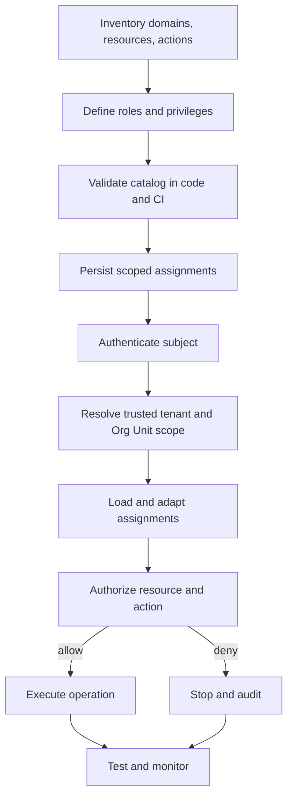

# API Reference and Production Checklist

This page summarizes the implemented `@cloudigniter/emberguard` authorization surface. Import helpers from
`@cloudigniter/emberguard/lib` and types from `@cloudigniter/emberguard/types`.

`@cloudigniter/core` continues to re-export the same helpers for compatibility, but new authorization code should
depend on Emberguard directly.

For exact signatures and per-helper examples, open the
[Authorization API Reference](/docs/api-reference/authorization/ci-create-app-authorizer).

## Catalog helpers

| Helper | Purpose |
| --- | --- |
| `ciCreateAppAccessControl(...layers)` | Merge application additions with protected core defaults and validate. |
| `ciMergeAccessControlDefinitions(...layers)` | Unrestricted low-level merge for standalone or controlled internal use. |
| `ciDefineAccessControl(definition)` | Validate a catalog and preserve its literal TypeScript type. |
| `ciValidateAccessControlDefinition(definition)` | Return structured errors and warnings. |
| `ciAssertValidAccessControlDefinition(definition)` | Throw when at least one validation error exists. |

```ts title="Define a standalone catalog" showLineNumbers
const definition = ciDefineAccessControl({
  domains,
  resources,
  roles,
});
```

## Core ownership and override helpers

| Helper | Purpose |
| --- | --- |
| `ciIsCoreAccessControlEntry(reference)` | Identify an entry owned by CloudIgniter core. |
| `ciGetAccessControlEntryOrigin(reference)` | Return `core` or `application` for administration UI metadata. |
| `ciCanOverrideCoreAccessControl(subject, definition?)` | Require a direct system-scoped `SYSTEM_SUPER_ADMIN` assignment. |
| `ciCreateCoreAccessControlOverride(input, options?)` | Validate and create an immutable, audited override record. |
| `ciApplyCoreAccessControlOverrides(definition, overrides)` | Replay a consecutive override history over a resolved catalog. |

## Authorizer helpers

| Helper | Purpose |
| --- | --- |
| `ciCreateAuthorizer(definition, options?)` | Compile a reusable authorizer. |
| `ciCreateAppAuthorizer(definition?, options?)` | Compile the resolved app catalog, defaulting to the core catalog. |
| `ciAuthorize(request, definition, options?)` | One-shot decision with evidence. |
| `ciCan(request, definition, options?)` | One-shot boolean check. |
| `ciCanAny(batch, definition, options?)` | One-shot any-of check. |
| `ciCanAll(batch, definition, options?)` | One-shot all-of check. |

The authorizer instance exposes:

```ts title="Authorizer instance methods" showLineNumbers
authorizer.authorize(request);
authorizer.can(request);
authorizer.canAny(batchRequest);
authorizer.canAll(batchRequest);
authorizer.definition;
```

## Scope helpers

| Helper | Result |
| --- | --- |
| `ciSystemAccessScope()` | `{ kind: "system" }` |
| `ciGlobalAccessScope()` | `{ kind: "global" }` |
| `ciTenantAccessScope(tenantId)` | Tenant scope |
| `ciOrgUnitAccessScope(tenantId, orgUnitId, ancestors?)` | Org Unit scope |
| `ciAccessScopeContains(grant, request, propagation)` | Scope containment boolean |

## Assignment and subject helpers

| Helper | Purpose |
| --- | --- |
| `ciCreateRoleAssignment(roleId, scope, propagation, window?)` | Create one scoped role assignment. |
| `ciCreateRoleAssignments(roleIds, scope, propagation, window?)` | Map several role IDs to one scope. |
| `ciResolveIdentityGroupRoles(groups, definition, options?)` | Map provider group names to known catalog roles. |
| `ciCreateRoleAssignmentsFromIdentityGroups(groups, definition, scope, propagation, options?)` | Adapt provider groups into scoped assignments. |
| `ciCreateScopedPrivilege(privilege, scope, propagation, window?)` | Create a direct subject privilege. |
| `ciCreateAuthorizationSubject(user, assignments, direct?)` | Adapt authenticated identity data. |

## Permission helpers

| Helper | Purpose |
| --- | --- |
| `ciFormatPermission(resource, action)` | Produce `resource.action`. |
| `ciParsePermission(permission)` | Split the final segment into resource and action. |
| `ciMatchesPermission(pattern, permission)` | Match a full dot-delimited permission pattern. |
| `ciMatchesAuthorizationPattern(pattern, value)` | Match dot-segment wildcard patterns. |

## Role precedence helpers

| Helper/constant | Purpose |
| --- | --- |
| `CI_CORE_ROLE_PRECEDENCE` | Canonical precedence for CloudIgniter core roles. |
| `CI_CORE_ROLES_BY_PRECEDENCE` | Core roles ordered strongest to weakest. |
| `ciResolvePrimaryRole(roles, map?)` | Resolve the strongest known role ID. |

## Main types

### Catalog types

```text
CiAccessControlDefinition
CiAccessControlEntryOrigin
CiAccessControlEntryReference
CiAccessControlLayer
CiResourceDomainDefinitionLayer
CiResourceDefinitionLayer
CiActionDefinitionLayer
CiRoleDefinitionLayer
CiPrivilegeLayer
CiResourceDomainDefinition
CiResourceDefinition
CiActionDefinition
CiRoleDefinition
CiPrivilege
CiPrivilegeEffect
CiAccessControlValidationIssue
CiCoreAccessControlOverride
CiCreateCoreAccessControlOverrideInput
CiCreateCoreAccessControlOverrideOptions
```

### Scope and grant types

```text
CiAccessScope
CiSystemAccessScope
CiGlobalAccessScope
CiTenantAccessScope
CiOrgUnitAccessScope
CiAccessScopeKind
CiScopePropagation
CiGrantWindow
CiIdentityGroupRoleMappingOptions
CiIdentityGroupRoleResolutionOptions
CiRoleAssignment
CiScopedPrivilege
```

### Evaluation types

```text
CiAuthorizationSubject
CiAuthorizationRequest
CiAuthorizationBatchRequest
CiAuthorizationDecision
CiAuthorizationDecisionReason
CiAuthorizationMatch
CiAuthorizationCombiningAlgorithm
CiAuthorizer
CiAuthorizerOptions
CiAccessRequirement
```

## End-to-end implementation recipe



Recommended project structure:

```text
src/
├── custom/
│   └── auth/
│       ├── app-access-control.ts
│       └── app-authorizer.ts
├── kernel/
│   └── server/
│       └── auth/
│           ├── require-access.ts
│           ├── resolve-authorization-subject.ts
│           └── resolve-access-scope.ts
└── app/
    └── ... protected pages and handlers
```

Provider adapters and repositories are exposed through the `Emberguard` facade. Construct it with a provider,
for example `ciCreateAwsEmberguardProvider({ database, tables })`, then use its member functions to load
definitions, assignments, custom domains, and resource inventory through the provider repository.

## Production checklist

### Catalog

- [ ] Application layers do not collide with core-owned IDs.
- [ ] Custom roles inherit core roles instead of modifying them.
- [ ] Every protected business capability has a registered resource.
- [ ] Every sensitive operation has a specific action.
- [ ] Resource and privilege IDs are stable and lowercase.
- [ ] `scopeKinds` are intentionally limited.
- [ ] Broad wildcard warnings have been reviewed.
- [ ] Role inheritance has no cycles or accidental privilege escalation.
- [ ] The catalog is validated in CI.

### Core overrides

- [ ] Only a directly assigned, system-scoped `SYSTEM_SUPER_ADMIN` can create an override.
- [ ] The mutation endpoint enforces step-up authentication.
- [ ] Every override records an actor, reason, timestamp, and consecutive revision.
- [ ] Persistence uses an atomic condition on `expectedRevision`.
- [ ] The effective diff and affected grants are reviewed before confirmation.
- [ ] Existing audit records are immutable; restoration creates a new record.
- [ ] The last active `SYSTEM_SUPER_ADMIN` assignment cannot be removed.

### Assignments

- [ ] Tenant and Org Unit assignments come from trusted persistence.
- [ ] Descendant propagation is used only where required.
- [ ] Global assignments and their descendant propagation receive additional review.
- [ ] Subjects needing both system and all-tenant access receive separately scoped assignments.
- [ ] Temporary grants have `expiresAt`.
- [ ] Direct privileges have an owner, reason, approver, and audit record in persistence.
- [ ] Mutually exclusive roles are enforced by assignment administration.

### Request handling

- [ ] The subject is authenticated and has a stable ID.
- [ ] Global, tenant, and Org Unit context are resolved server-side.
- [ ] Org Unit ancestry uses stable IDs.
- [ ] Authorization happens before protected data or writes.
- [ ] Alternate entry points enforce the same action.
- [ ] UI capability checks are never the only enforcement.
- [ ] Denied clients receive a generic response.

### Persistence and caching

- [ ] Tenant ownership appears in every authorization partition key.
- [ ] Runtime authorization reads use the base table.
- [ ] GSIs are reserved for search and administration.
- [ ] Policy changes increment an immutable version.
- [ ] Positive caches are invalidated on revocation.
- [ ] `expiresAt` is evaluated even when DynamoDB TTL is configured.
- [ ] Policy and assignment writes use transactions or conditions where needed.

### Testing and operations

- [ ] Every policy matrix includes allow and deny cases.
- [ ] Cross-tenant and sibling Org Unit denial tests exist.
- [ ] Both conflict algorithms are tested if precedence mode is used.
- [ ] Time-window tests use an injected clock.
- [ ] Route and handler integration tests prove denied services are not called.
- [ ] Policy mutations and sensitive denials are audited.
- [ ] Audit and trace records never contain raw tokens.

## Migration from a flat group system

Migrate incrementally:

1. Inventory existing group names and permission strings.
2. Register stable domains, resources, and actions.
3. Convert group permission matrices into `CiRoleDefinition` objects.
4. Keep direct user permissions as `CiScopedPrivilege` records temporarily.
5. Create explicit system or tenant assignments for each existing membership.
6. Run the new authorizer in audit-only comparison mode.
7. Investigate differences between old and new decisions.
8. Enable enforcement per resource or route.
9. Remove legacy permission checks after coverage is complete.

Do not silently assign every legacy group to every tenant a user can visit. Resolve the intended assignment
scope during migration.

## Frequently asked questions

### Should every route be a resource?

No. Routes reference resources. Model stable business capabilities and enforce them wherever they are exposed.

### Does a higher-precedence role automatically inherit lower roles?

No. Precedence resolves conflicts. Inheritance is declared explicitly through `inherits`.

### Does `tenant` scope automatically include Org Units?

Only when the assignment propagation is `descendants` and the privilege supports `orgUnit`.

### Does a wildcard grant unknown actions?

No. The resource and action must be registered before privilege matching.

### Can an unauthenticated service use the authorizer?

No. Represent a trusted service as an authenticated subject with a stable service ID and explicit assignments.

### Should full decisions be returned to the browser?

No. Return a generic forbidden result and keep policy evidence in trusted logs.

### Where should DynamoDB code live?

In the AWS provider connector or the application's server infrastructure. The Emberguard engine remains
provider-neutral; only provider modules know how records are stored and loaded.

## Further reading

- [Concepts and Strategy](./overview)
- [Implementation Scenarios](./scenarios)
- [DynamoDB Persistence](./dynamodb-persistence)
- [Testing and Troubleshooting](./testing-and-troubleshooting)
- [OWASP Authorization Cheat Sheet](https://cheatsheetseries.owasp.org/cheatsheets/Authorization_Cheat_Sheet.html)
