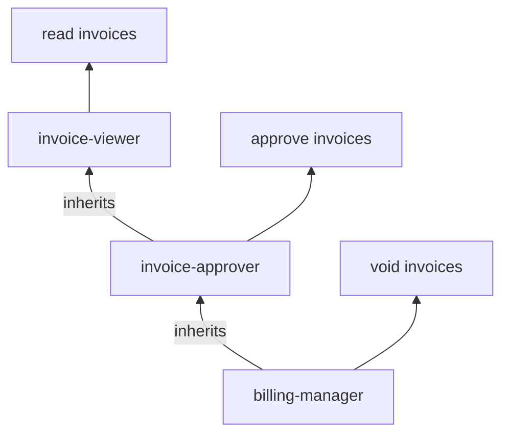
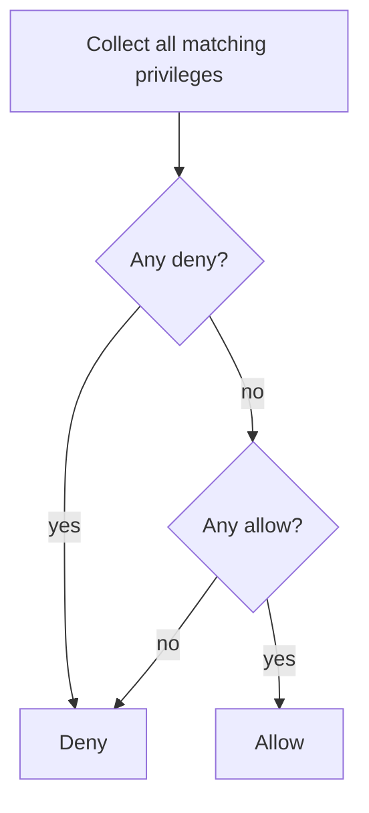
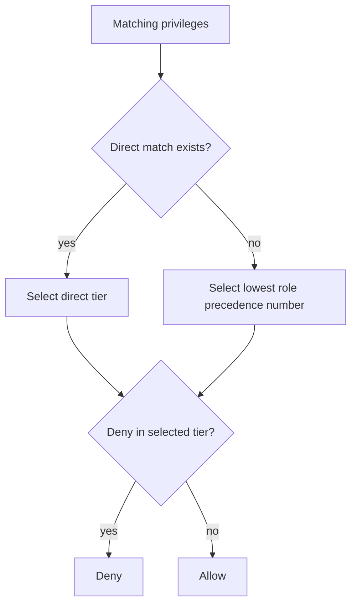

# Roles, Inheritance, and Precedence

A role—also called a group—is a named set of privileges associated with a job, responsibility, or application
feature. Subjects receive access through scoped role assignments.

## Define focused roles

```ts
const roles = [
  {
    id: "invoice-viewer",
    title: "Invoice Viewer",
    precedence: 60,
    privileges: [
      {
        id: "read-invoices",
        effect: "allow",
        resource: "billing.invoices",
        action: "read",
        scopeKinds: ["tenant", "orgUnit"],
      },
    ],
  },
  {
    id: "invoice-approver",
    title: "Invoice Approver",
    precedence: 30,
    inherits: ["invoice-viewer"],
    privileges: [
      {
        id: "approve-invoices",
        effect: "allow",
        resource: "billing.invoices",
        action: "approve",
        scopeKinds: ["tenant", "orgUnit"],
      },
    ],
  },
];
```

The approver inherits the viewer's privileges, avoiding duplication.



## Inheritance rules

- `inherits` contains role IDs from the same catalog.
- Inheritance may have several levels.
- A role may inherit more than one role.
- Cycles such as `a -> b -> a` are rejected by catalog validation.
- An inherited privilege is evaluated using the precedence of the role that was assigned to the subject.
- The decision evidence records both `assignedRoleId` and `privilegeRoleId`.

Example decision evidence for an approver using the inherited read permission:

```ts
decision.matches[0];
// {
//   source: "role",
//   assignedRoleId: "invoice-approver",
//   privilegeRoleId: "invoice-viewer",
//   precedence: 30,
//   privilege: { id: "read-invoices", ... },
//   assignmentScope: { kind: "tenant", tenantId: "tenant-123" }
// }
```

## Precedence

Lower numbers represent stronger precedence, matching CloudIgniter's existing Cognito-style convention.

```text
system-super-admin  0
system-admin       10
tenant-admin       20
approver           30
editor             40
viewer             50
```

Precedence is not scope. A system role assigned at a tenant remains a tenant-scoped assignment unless its
assignment says otherwise.

## Default combining algorithm: deny overrides

```ts
const authorizer = ciCreateAuthorizer(appAccessControl, {
  combiningAlgorithm: "deny-overrides",
});
```

This is the default and recommended algorithm. The authorizer evaluates every matching direct and role
privilege. If any applicable privilege says `deny`, the decision is denied.



This mode favors safe restrictions over group precedence. A lower-precedence restriction role can block an
operation otherwise granted by an administrator role.

## Optional algorithm: highest precedence

Use this algorithm only when the strongest applicable group should decide:

```ts
const authorizer = ciCreateAuthorizer(appAccessControl, {
  combiningAlgorithm: "highest-precedence",
});
```

The evaluator:

1. selects matching direct privileges if any exist;
2. otherwise selects matching privileges from the numerically lowest role-precedence tier;
3. applies deny-overrides within that selected tier.



### Conflict example

Alice has two roles in the same tenant:

```text
editor, precedence 40: allow identity.users.update
blocked-editor, precedence 60: deny identity.users.update
```

| Algorithm | Result | Reason |
| --- | --- | --- |
| `deny-overrides` | Denied | Every applicable deny wins. |
| `highest-precedence` | Allowed | `editor` has stronger precedence than `blocked-editor`. |

Choose the algorithm at application design time. Do not switch algorithms per request unless two clearly
separate policy domains require it.

## Explicit deny patterns

Explicit denies are useful for constraints that should remain visible in the policy:

```ts
{
  id: "prevent-user-deletion",
  effect: "deny",
  resource: "identity.users",
  action: "delete",
  scopeKinds: ["tenant", "orgUnit"],
}
```

Use them for cases such as:

- read-only or suspended operational roles;
- temporary incident restrictions;
- protecting destructive actions from broad wildcard roles;
- separating support access from security administration.

Default deny is still the primary restriction mechanism: if no privilege allows an action, it is denied. Do
not create explicit denies for every action a role lacks.

## Role engineering guidelines

### Name roles after responsibilities

Prefer:

```text
invoice-approver
support-agent
user-security-admin
report-viewer
```

Avoid roles based on individuals or temporary organizational labels:

```text
alice-access
team-7-special
old-admin
```

### Keep sensitive responsibilities separate

An application may intentionally separate:

- creating invoices from approving them;
- inviting users from assigning security roles;
- editing settings from rotating credentials;
- requesting refunds from executing refunds.

Assigning two focused roles is clearer than one role with every capability.

### Keep privilege IDs stable

Privilege IDs are used in decision evidence and persistence. Changing a description is harmless; renaming a
privilege should be treated as a policy migration.

### Avoid inheritance purely to reduce typing

Inheritance should express a real responsibility hierarchy. If two unrelated roles happen to share one
privilege, define that privilege in both roles or introduce a meaningful shared base role.

## Existing CloudIgniter core-role helpers

The default access-control definition includes the canonical `USER`, `DEVELOPER`, `ADMIN`, `SUPER_ADMIN`,
`SYSTEM_ADMIN`, and `SYSTEM_SUPER_ADMIN` roles. CloudIgniter also exports their precedence map and the
primary-role resolver:

```ts title="Resolve a core role's precedence" showLineNumbers
import {
  CI_CORE_ROLE_PRECEDENCE,
  ciResolvePrimaryRole,
} from "@cloudigniter/core/lib";

ciResolvePrimaryRole(
  ["USER", "ADMIN"],
  CI_CORE_ROLE_PRECEDENCE,
);
// "ADMIN"
```

`ciResolvePrimaryRole()` is useful for display, diagnostics, and adapting identity-provider groups. It does not
replace the scoped authorizer because it does not evaluate resource, action, or scope.

Core roles and their privileges cannot be redefined by `ciCreateAppAccessControl()`. Create an application role
that inherits the appropriate core role. A deliberate core change must use the audited override workflow, which
is restricted to a directly assigned `SYSTEM_SUPER_ADMIN`.

See [`CI_DEFAULT_ACCESS_CONTROL_DEFINITION`](/docs/api-reference/authorization/default-access-control-definition)
for the built-in resources and inheritance chain.

Next: [Scopes and Assignments](./scopes-and-assignments).
