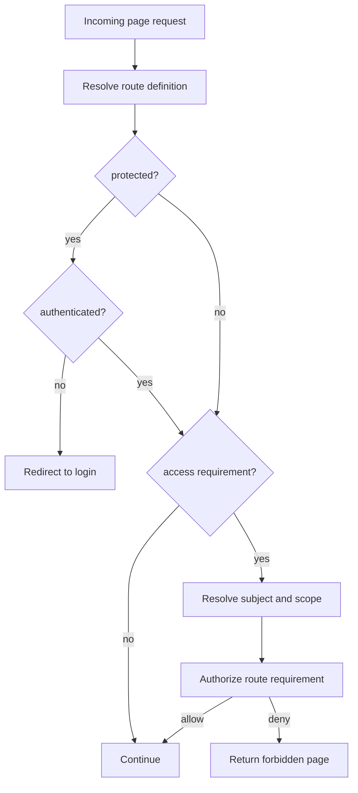

# Routes, Handlers, and UI

CloudIgniter routes may declare a resource/action requirement through `CiRouteDefinition.access`:

```ts
interface CiRouteDefinition {
  title: string;
  namespace: string;
  protected: boolean;
  access?: {
    resource: string;
    action: string;
  };
}
```

This is metadata. `@cloudigniter/core` remains platform-neutral and does not automatically redirect or return an
HTTP response. A Next.js or application adapter must enforce the requirement.

## Authentication versus route authorization

```ts
const routes = {
  "/login": {
    title: "Login",
    namespace: "authentication",
    protected: false,
  },

  "/dashboard/users/*": {
    title: "Users",
    namespace: "users",
    protected: true,
    access: {
      resource: "identity.users",
      action: "read",
    },
  },
};
```

| Field | Responsibility |
| --- | --- |
| `protected` | Requires authentication. |
| `access` | Requires authorization for a registered resource/action. |

A route with `protected: true` and no `access` is authenticated but has no ARBAC capability requirement. Decide
whether that is intentional during route review.

## Route enforcement flow



## Enforce a resolved route

```ts
import type {
  CiAccessScope,
  CiAuthorizationSubject,
  CiRouteDefinition,
} from "@cloudigniter/core/types";

import { appAuthorizer } from "@/custom/auth/app-authorizer";

export function canAccessRoute(input: {
  route: CiRouteDefinition;
  subject: CiAuthorizationSubject;
  scope: CiAccessScope;
}) {
  if (!input.route.access) {
    return true;
  }

  return appAuthorizer.can({
    subject: input.subject,
    scope: input.scope,
    ...input.route.access,
  });
}
```

Authentication should already have been enforced when `protected` is true.

## Server page scenario

In a server-rendered page or layout:

```tsx
export default async function UsersPage() {
  const context = await resolveTrustedRequestContext();
  const subject = await resolveAuthorizationSubject(context);

  requireAccess({
    subject,
    scope: context.accessScope,
    resource: "identity.users",
    action: "read",
  });

  const users = await listUsers({
    tenantId: context.tenantId,
  });

  return <UsersTable users={users} />;
}
```

`resolveTrustedRequestContext()`, `resolveAuthorizationSubject()`, `requireAccess()`, and `listUsers()` are
application functions in this example.

## Route handler scenario

Do not rely only on page access. A write route must authorize its actual operation:

```ts
export async function DELETE(
  request: Request,
  context: { params: Promise<{ userId: string }> },
) {
  const requestContext = await resolveTrustedRequestContext(request);
  const subject = await resolveAuthorizationSubject(requestContext);

  requireAccess({
    subject,
    scope: requestContext.accessScope,
    resource: "identity.users",
    action: "delete",
  });

  const { userId } = await context.params;
  await deleteUser({
    tenantId: requestContext.tenantId,
    userId,
  });

  return new Response(null, { status: 204 });
}
```

Map HTTP verbs to business actions explicitly. A `POST` might mean `create`, `invite`, `approve`, or `publish`.

## GraphQL resolver scenario

```ts
const resolvers = {
  Mutation: {
    approveInvoice: async (_parent, args, context) => {
      requireAccess({
        subject: context.authorizationSubject,
        scope: context.accessScope,
        resource: "billing.invoices",
        action: "approve",
      });

      return approveInvoice(args.invoiceId);
    },
  },
};
```

The same catalog protects REST, GraphQL, and server components.

## Background job scenario

Jobs may run for a human subject or a service identity. Construct an authenticated subject with a stable service
ID and explicit assignments instead of bypassing authorization:

```ts
const serviceSubject = ciCreateAuthorizationSubject(
  { id: "service:nightly-reports", authenticated: true },
  [
    ciCreateRoleAssignment(
      "report-exporter",
      ciTenantAccessScope(job.tenantId),
      "exact",
    ),
  ],
);
```

Do not grant system-descendant access to every job merely because it is server-side.

## Client-side capability flags

UI capability checks improve usability but are not security boundaries. Prefer computing a small capability map
on the server:

```ts
const capabilities = {
  canReadUsers: appAuthorizer.can({
    subject,
    scope,
    resource: "identity.users",
    action: "read",
  }),
  canInviteUsers: appAuthorizer.can({
    subject,
    scope,
    resource: "identity.users",
    action: "invite",
  }),
  canDeleteUsers: appAuthorizer.can({
    subject,
    scope,
    resource: "identity.users",
    action: "delete",
  }),
};
```

Pass those booleans to the client rather than raw access tokens or the entire authorization catalog:

```tsx
{capabilities.canInviteUsers ? (
  <InviteUserButton />
) : null}
```

The invite handler must perform the same server-side authorization check again.

## Access-control administration UI

Treat catalog ownership as server-derived metadata. Use `ciGetAccessControlEntryOrigin()` or
`ciIsCoreAccessControlEntry()` to label rows as `Core` or `Application`:

```ts title="src/kernel/server/auth/get-catalog-row-state.ts" showLineNumbers
import {
  ciCanOverrideCoreAccessControl,
  ciGetAccessControlEntryOrigin,
} from "@cloudigniter/core/lib";

const origin = ciGetAccessControlEntryOrigin(reference);
const canOverrideCore = ciCanOverrideCoreAccessControl(
  subject,
  effectiveAccessControl,
);

const rowState = {
  origin,
  locked: origin === "core" && !canOverrideCore,
  action: origin === "core" ? "Create override" : "Edit",
};
```

The UI state is explanatory only. The server mutation handler must call
`ciCreateCoreAccessControlOverride()` for every core change. Do not submit a core layer to
`ciMergeAccessControlDefinitions()` directly from the browser.

For a core override, show the effective diff, require a reason and step-up authentication, condition the
persistence write on `expectedRevision`, and offer restoration by recording a new override that restores the
core value. Never rewrite or delete an existing audit record.

## Menu and navigation filtering

Associate a menu item with a requirement and filter it using the same authorizer:

```ts
const protectedMenuItems = [
  {
    label: "Users",
    href: "/dashboard/users",
    access: { resource: "identity.users", action: "read" },
  },
  {
    label: "Billing",
    href: "/dashboard/billing",
    access: { resource: "billing.invoices", action: "read" },
  },
];

const visibleItems = protectedMenuItems.filter((item) =>
  appAuthorizer.can({
    subject,
    scope,
    ...item.access,
  }),
);
```

Again, hiding an item is presentation logic. The destination must enforce access independently.

## Middleware considerations

Middleware is appropriate when it can obtain trustworthy subject grants and scope without unsafe latency or
runtime dependencies. If the edge layer cannot load the complete policy safely:

1. use middleware for authentication and coarse route routing;
2. enforce ARBAC in the server layout, handler, resolver, or service entry;
3. never treat a middleware skip as authorization approval.

## Route review checklist

- Does every sensitive page have an `access` requirement?
- Is `protected` set independently and correctly?
- Does the operation handler enforce its specific action?
- Are resource IDs stable business capabilities rather than URLs?
- Are client capability flags computed from trusted server data?
- Do alternate entry points enforce the same permission?

Next: [Implementation Scenarios](./scenarios).
