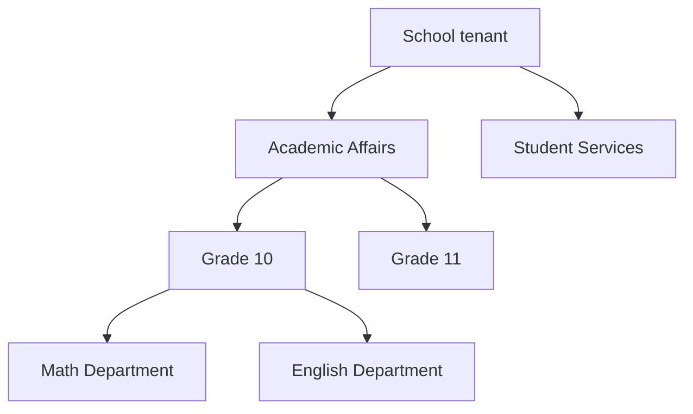
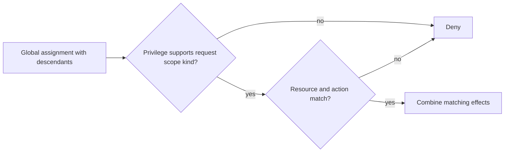

# Implementation Scenarios

The following scenarios build on the same catalog and show how changing assignments, scope, and policy effects
changes the result without coupling authorization to a provider.

## Scenario 1: A user belongs to two tenants

Sam is an administrator in tenant A and a viewer in tenant B.

```ts
const subject = ciCreateAuthorizationSubject(
  { id: "user:sam", authenticated: true },
  [
    ciCreateRoleAssignment(
      "tenant-admin",
      ciTenantAccessScope("tenant-a"),
      "descendants"
    ),
    ciCreateRoleAssignment(
      "tenant-viewer",
      ciTenantAccessScope("tenant-b"),
      "descendants"
    ),
  ]
);
```

The same request produces different results by scope:

```ts
appAuthorizer.can({
  subject,
  resource: "identity.users",
  action: "update",
  scope: ciTenantAccessScope("tenant-a"),
});
// true

appAuthorizer.can({
  subject,
  resource: "identity.users",
  action: "update",
  scope: ciTenantAccessScope("tenant-b"),
});
// false
```

This is why a flat `roles: ["tenant-admin", "tenant-viewer"]` list cannot make a complete decision. The
assignment boundary is essential.

## Scenario 2: A school Org Unit hierarchy

Suppose a tenant contains this hierarchy:



Maya is a Grade 10 administrator:

```ts
const grade10Assignment = ciCreateRoleAssignment(
  "org-unit-admin",
  ciOrgUnitAccessScope("school-dubai", "grade-10", ["academic-affairs"]),
  "descendants"
);
```

The Math request includes its ancestry:

```ts
const mathScope = ciOrgUnitAccessScope("school-dubai", "math-department", [
  "academic-affairs",
  "grade-10",
]);
```

The assignment contains Math because `grade-10` appears in the request's ancestor IDs. It does not contain
Grade 11 or Student Services.

:::note Assignment ancestry versus request ancestry
The engine uses the requested Org Unit's `ancestorOrgUnitIds` to establish descent. The ancestry stored on the
assignment's own scope is descriptive and does not expand the grant.
:::

## Scenario 3: A system operator without tenant access

A system operator manages platform settings but should not see tenant users.

```ts
const systemOperator = {
  id: "system-operator",
  title: "System Operator",
  precedence: 10,
  privileges: [
    {
      id: "update-platform-settings",
      title: "Update platform settings",
      effect: "allow",
      resource: "platform.settings",
      action: "update",
      scopeKinds: ["system"],
    },
  ],
};
```

Assign it exactly at system scope:

```ts
const assignment = ciCreateRoleAssignment(
  "system-operator",
  ciSystemAccessScope(),
  "exact"
);
```

Even if the role accidentally contained a tenant-compatible privilege later, a system assignment cannot reach
global, tenant, or Org Unit requests under either propagation mode.

## Scenario 4: A deliberate cross-tenant system administrator

Only deliberately cross-tenant responsibilities should use global descendant propagation:

```ts title="Create an all-tenant assignment" showLineNumbers
const assignment = ciCreateRoleAssignment(
  "system-super-admin",
  ciGlobalAccessScope(),
  "descendants"
);
```

The role must also contain privileges whose `scopeKinds` include the requested tenant or Org Unit scope.



Require stronger authentication, assignment auditing, and short session lifetimes for this class of role.

## Scenario 5: Broad role plus destructive-action deny

A support administrator can manage users except deletion:

```ts
const supportAdmin = {
  id: "support-admin",
  title: "Support Administrator",
  precedence: 30,
  privileges: [
    {
      id: "manage-users",
      title: "Manage users",
      effect: "allow",
      resource: "identity.users",
      action: "*",
      scopeKinds: ["tenant", "orgUnit"],
    },
    {
      id: "deny-user-deletion",
      title: "Deny user deletion",
      effect: "deny",
      resource: "identity.users",
      action: "delete",
      scopeKinds: ["tenant", "orgUnit"],
    },
  ],
};
```

With either combining algorithm, the deny wins inside this role's tier for `delete`. Other registered actions are
allowed.

## Scenario 6: Temporary individual exception

Leila needs report export permission for four hours during an audit:

```ts
const exportException = ciCreateScopedPrivilege(
  {
    id: "audit-export-2026-08-04",
    title: "Export audit reports",
    effect: "allow",
    resource: "reporting.reports",
    action: "export",
    scopeKinds: ["tenant"],
  },
  ciTenantAccessScope("tenant-a"),
  "exact",
  {
    validFrom: "2026-08-04T08:00:00.000Z",
    expiresAt: "2026-08-04T12:00:00.000Z",
  }
);

const subject = ciCreateAuthorizationSubject(
  { id: "user:leila", authenticated: true },
  normalAssignments,
  [exportException]
);
```

Persist who approved the exception, why, and the related ticket alongside the core fields. The evaluator needs
only the privilege, scope, propagation, and validity window.

## Scenario 7: Separation of duties

One role prepares payments and another approves them:

```ts
const paymentPreparer = {
  id: "payment-preparer",
  title: "Payment Preparer",
  precedence: 40,
  privileges: [
    {
      id: "prepare-payment",
      title: "Prepare payments",
      effect: "allow",
      resource: "billing.payments",
      action: "prepare",
      scopeKinds: ["tenant"],
    },
  ],
};

const paymentApprover = {
  id: "payment-approver",
  title: "Payment Approver",
  precedence: 30,
  privileges: [
    {
      id: "approve-payment",
      title: "Approve payments",
      effect: "allow",
      resource: "billing.payments",
      action: "approve",
      scopeKinds: ["tenant"],
    },
  ],
};
```

ARBAC evaluates whether each operation is permitted. The assignment administration service must additionally
enforce a separation-of-duty rule if the same subject must never hold both roles:

```ts
const mutuallyExclusiveRoles = [["payment-preparer", "payment-approver"]];
```

That constraint belongs in assignment creation and validation, not in every payment authorization request.

## Scenario 8: Tenant suspension

Tenant lifecycle status is not a privilege. Resolve and enforce it alongside ARBAC:

```ts
if (tenant.status !== "active") {
  throw new Error("Tenant is not active.");
}

requireAccess({
  subject,
  scope: ciTenantAccessScope(tenant.id),
  resource: "billing.invoices",
  action: "create",
});
```

Keeping lifecycle and authorization checks distinct makes both policies easier to audit.

## Scenario 9: Object ownership

ARBAC may allow `documents.update` in an Org Unit while a business rule limits ordinary editors to documents
they own:

```ts
requireAccess({
  subject,
  scope: documentScope,
  resource: "content.documents",
  action: "update",
});

if (document.ownerId !== subject.id && !canEditAnyDocument) {
  throw new Error("Forbidden");
}
```

The service must load the document using tenant-scoped keys before checking ownership. Never accept the owner ID
from the client as authoritative.

## Scenario selection guide

| Requirement                         | Recommended mechanism                                              |
| ----------------------------------- | ------------------------------------------------------------------ |
| Same responsibility in many tenants | Reusable role plus separate tenant assignments                     |
| Department hierarchy                | Org Unit assignment with explicit descendant propagation           |
| Platform-only administration        | System assignment with exact propagation                           |
| Cross-tenant administration         | Global assignment with descendants and carefully scoped privileges |
| Remove one dangerous action         | Explicit deny                                                      |
| Temporary individual access         | Direct privilege with `expiresAt`                                  |
| Mutually exclusive responsibilities | Assignment-administration constraint plus focused roles            |
| Tenant suspension                   | Lifecycle guard in addition to ARBAC                               |
| Record ownership                    | Object-level service check in addition to ARBAC                    |

Next: [DynamoDB Persistence](./dynamodb-persistence).
