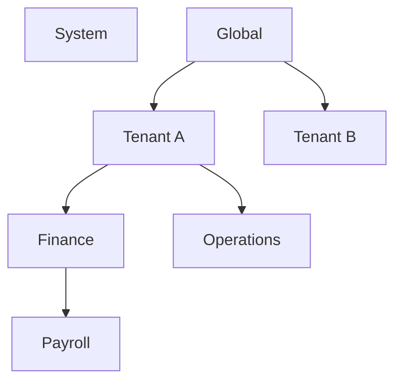
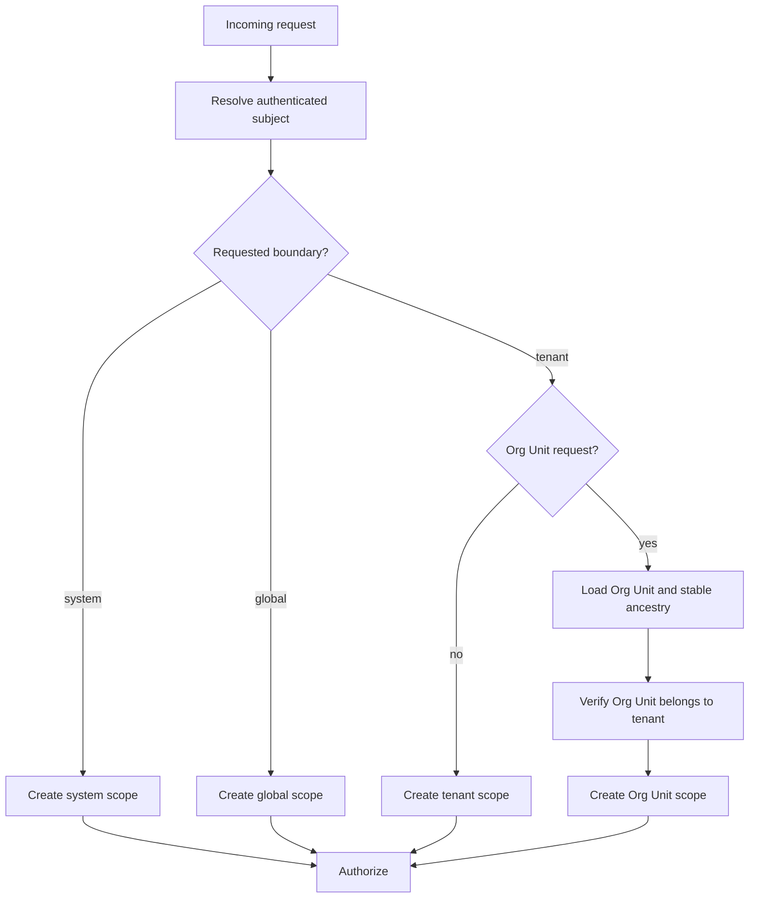

# Scopes and Assignments

Scopes answer **where** a grant applies. CloudIgniter authorization supports four scope kinds:

```ts title="Access scope kinds" showLineNumbers
type CiAccessScopeKind = "system" | "global" | "tenant" | "orgUnit";
```

The scope is part of both the request and the assignment. The assignment scope must contain the request scope,
and the privilege must support the request's scope kind.

## Scope shapes

```ts title="Access scope shapes" showLineNumbers
type CiSystemAccessScope = {
  kind: "system";
};

type CiGlobalAccessScope = {
  kind: "global";
};

type CiTenantAccessScope = {
  kind: "tenant";
  tenantId: string;
};

type CiOrgUnitAccessScope = {
  kind: "orgUnit";
  tenantId: string;
  orgUnitId: string;
  ancestorOrgUnitIds?: readonly string[];
};
```

Use the constructors instead of building these objects repeatedly:

```ts title="Create access scopes" showLineNumbers
import {
  ciGlobalAccessScope,
  ciOrgUnitAccessScope,
  ciSystemAccessScope,
  ciTenantAccessScope,
} from "@cloudigniter/emberguard/lib";

const system = ciSystemAccessScope();
const globalScope = ciGlobalAccessScope();
const tenant = ciTenantAccessScope("tenant-123");
const team = ciOrgUnitAccessScope("tenant-123", "payroll-team", [
  "company",
  "finance",
]);
```

## Exact versus descendant propagation

Every assignment requires an explicit propagation rule:

```ts title="Scope propagation policy" showLineNumbers
type CiScopePropagation = "exact" | "descendants";
```

| Assignment   | `exact` contains    | `descendants` contains                                     |
| ------------ | ------------------- | ---------------------------------------------------------- |
| System       | System requests     | System requests                                            |
| Global       | Global requests     | Global, tenant, and Org Unit requests across all tenants   |
| Tenant `A`   | Tenant `A` requests | Tenant `A` and Org Units inside tenant `A`                 |
| Org Unit `X` | Org Unit `X`        | Org Unit `X` and requests whose ancestor list contains `X` |

A tenant or Org Unit assignment never crosses from one tenant to another. Only a global assignment can span
tenants, and it never reaches system requests.



For example, a role assigned at Finance with descendant propagation reaches Payroll only when the Payroll
request reports Finance in `ancestorOrgUnitIds`.

## Create assignments

```ts title="Create tenant assignments" showLineNumbers
import {
  ciCreateRoleAssignment,
  ciTenantAccessScope,
} from "@cloudigniter/emberguard/lib";

const tenantViewer = ciCreateRoleAssignment(
  "tenant-viewer",
  ciTenantAccessScope("tenant-123"),
  "exact"
);

const tenantAdmin = ciCreateRoleAssignment(
  "tenant-admin",
  ciTenantAccessScope("tenant-123"),
  "descendants"
);
```

Use an explicit global assignment for access across every tenant:

```ts title="Create a cross-tenant assignment" showLineNumbers
const globalAdministrator = ciCreateRoleAssignment(
  "system-super-admin",
  ciGlobalAccessScope(),
  "descendants"
);
```

Use a separate system assignment when the same subject also needs system-only capabilities. Global access does
not imply system access.

The same subject may hold the same role in several scopes:

```ts title="Assign one role in multiple scopes" showLineNumbers
const assignments = [
  ciCreateRoleAssignment(
    "invoice-approver",
    ciOrgUnitAccessScope("tenant-123", "finance"),
    "descendants"
  ),
  ciCreateRoleAssignment(
    "invoice-approver",
    ciOrgUnitAccessScope("tenant-456", "head-office"),
    "exact"
  ),
];
```

Assignments are evaluated independently. The first does not grant access anywhere in `tenant-456`.

## Convert identity-provider groups in bulk

When trusted provider groups have one known assignment scope, map them against the resolved catalog:

```ts title="Convert provider groups to assignments" showLineNumbers
import { ciCreateRoleAssignmentsFromIdentityGroups } from "@cloudigniter/emberguard/lib";

const assignments = ciCreateRoleAssignmentsFromIdentityGroups(
  providerGroupNames,
  appAccessControl,
  ciTenantAccessScope("tenant-123"),
  "exact",
  {
    roleMap: {
      "app-viewers": "viewer",
      "app-beta-testers": "beta-tester",
    },
  }
);
```

Unknown groups are ignored by default and duplicate roles are removed. Do this only after the application has
verified that the subject belongs to the target tenant. A flat provider group claim does not prove tenant
membership by itself.

## Time-bounded assignments

Assignments can be active during a defined window:

```ts title="Create a time-bounded assignment" showLineNumbers
const incidentSupport = ciCreateRoleAssignment(
  "support-agent",
  ciTenantAccessScope("tenant-123"),
  "exact",
  {
    validFrom: "2026-08-04T08:00:00.000Z",
    expiresAt: "2026-08-04T12:00:00.000Z",
  }
);
```

- `validFrom` is inclusive.
- `expiresAt` is exclusive.
- Both are optional ISO-8601 instants.
- Invalid time strings make the grant inactive.
- The authorizer checks time at evaluation, even if a persistence TTL also exists.

Inject a deterministic clock in tests:

```ts title="Inject an authorization clock" showLineNumbers
const authorizer = ciCreateAuthorizer(appAccessControl, {
  clock: () => new Date("2026-08-04T10:00:00.000Z"),
});
```

## Org Unit ancestry

An Org Unit request should contain stable ancestor IDs from root to parent:

```text title="Org Unit hierarchy" showLineNumbers
company
└── finance
    └── payroll
        └── payroll-audit
```

```ts title="Create a scope with ancestry" showLineNumbers
const payrollAuditScope = ciOrgUnitAccessScope("tenant-123", "payroll-audit", [
  "company",
  "finance",
  "payroll",
]);
```

An assignment on `finance` with `descendants` now contains this request. An assignment on `operations` does not.

Use immutable Org Unit IDs—not names, translated labels, slugs, or route paths. If an Org Unit is moved, update
the resolved ancestry before making decisions.

## Inspect containment directly

Tests and adapters can use the same scope predicate as the engine:

```ts title="Check scope containment" showLineNumbers
import { ciAccessScopeContains } from "@cloudigniter/emberguard/lib";

ciAccessScopeContains(
  ciTenantAccessScope("tenant-123"),
  payrollAuditScope,
  "descendants"
);
// true
```

## Scope resolution rules

Resolve scopes on the server in this order:



CloudIgniter's tenant request context also uses `global`. Resolve that context only from trusted routing data,
then create a global authorization scope when the operation genuinely reads or manages data across tenants.
Public global pages generally need route handling, not a fabricated authorization grant.

:::warning Global propagation
A global assignment with `descendants` can reach every tenant and Org Unit. Reserve it for deliberately
cross-tenant responsibilities, require stronger authentication, and audit every assignment change. It never
grants system-only access.
:::

Next: [Subjects and Identity Providers](./subjects-and-providers).
