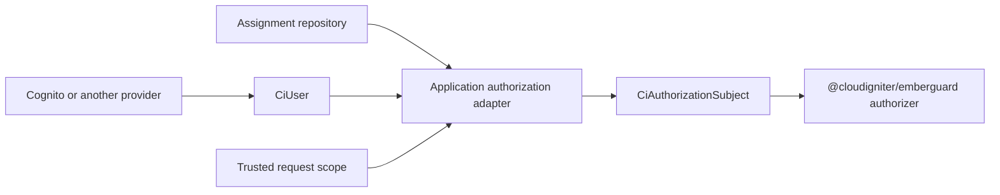
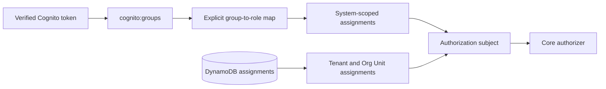

# Subjects and Identity Providers

The authorizer consumes a provider-neutral subject:

```ts
type CiAuthorizationSubject = {
  id: string | null;
  authenticated: boolean;
  roleAssignments: readonly CiRoleAssignment[];
  directPrivileges?: readonly CiScopedPrivilege[];
};
```

The application adapter is responsible for turning Cognito groups, another provider's claims, and persisted
assignment records into this shape.

## Provider boundary



The provider authenticates identity. It should not become the only place where application authorization rules
live, because provider groups usually lack tenant, Org Unit, resource, and action context.

## Adapt a CloudIgniter user

```ts
import { ciCreateAuthorizationSubject } from "@cloudigniter/emberguard/lib";
import type {
  CiRoleAssignment,
  CiScopedPrivilege,
  CiUser,
} from "@cloudigniter/emberguard/types";

export function createAppAuthorizationSubject(
  user: CiUser,
  roleAssignments: readonly CiRoleAssignment[],
  directPrivileges: readonly CiScopedPrivilege[] = [],
) {
  return ciCreateAuthorizationSubject(
    {
      id: user.id,
      authenticated: user.authenticated,
    },
    roleAssignments,
    directPrivileges,
  );
}
```

`CiUser.roles` and `CiUser.primaryRole` are useful provider-facing identity fields. Scoped authorization should
still use `roleAssignments` because a role ID alone does not say where the role applies.

## Identity-provider group adapter

Use `ciCreateRoleAssignmentsFromIdentityGroups()` when trusted provider groups represent application roles. It
maps only to roles registered in the resolved catalog, removes duplicates, and creates ordinary scoped
assignments:

```ts
import {
  ciCreateRoleAssignmentsFromIdentityGroups,
  ciSystemAccessScope,
} from "@cloudigniter/emberguard/lib";

import { appAccessControl } from "@/custom/auth/app-access-control";

const systemAssignments = ciCreateRoleAssignmentsFromIdentityGroups(
  tokenClaims.groups,
  appAccessControl,
  ciSystemAccessScope(),
  "exact",
  {
    roleMap: {
      "cloudigniter-users": "USER",
      "cloudigniter-system-admins": "SYSTEM_ADMIN",
      "billing-readers": null, // Belongs to another application.
    },
  },
);
```

An unmapped group uses its own name as the candidate role ID. Unknown role IDs are ignored by default. Set
`unknownGroupStrategy: "throw"` in provisioning, migration, and administration jobs where a stale mapping
should fail visibly. Matching is exact and case-sensitive.

## Amazon Cognito groups

Amazon Cognito puts the user's group memberships in the `cognito:groups` claim of both ID and access tokens.
A user can belong to multiple groups. Group precedence uses a lower-number-is-stronger convention, with `0` as
the strongest configured precedence. Cognito groups are flat and cannot contain other groups. See AWS's
[user pool group documentation](https://docs.aws.amazon.com/cognito/latest/developerguide/cognito-user-pools-user-groups.html).

The token contains group names, not the complete CloudIgniter assignment scope. Treat the access-control catalog
as authoritative for role precedence and privileges:

```ts
const cognitoGroups = Array.isArray(payload["cognito:groups"])
  ? payload["cognito:groups"].filter(
      (value): value is string => typeof value === "string",
    )
  : [];

const assignments = ciCreateRoleAssignmentsFromIdentityGroups(
  cognitoGroups,
  appAccessControl,
  ciSystemAccessScope(),
  "exact",
  {
    roleMap: {
      "ci-users": "USER",
      "ci-developers": "DEVELOPER",
      "ci-system-admins": "SYSTEM_ADMIN",
    },
  },
);
```

If Cognito groups mirror CloudIgniter roles, keep their configured precedence synchronized with the role's
`precedence` for operational clarity. The core evaluator does not read Cognito precedence; it uses the catalog.
Also do not interpret `cognito:preferred_role` as an application authorization result. That claim selects an IAM
role for identity-pool credentials and does not replace resource/action/scope evaluation.

AWS describes group-based multi-tenancy as an application design in which your code processes group claims for
authorization. For CloudIgniter, prefer provider groups for a small number of system-wide memberships. Store
tenant and Org Unit assignments in application persistence; encoding every tenant-role pair as a group causes
group proliferation and cannot model nested Org Units cleanly. See AWS's
[group-based multi-tenancy guidance](https://docs.aws.amazon.com/cognito/latest/developerguide/group-based-multi-tenancy.html).



## Manual system-group filtering

Provider groups can map cleanly to system assignments when the group is controlled centrally:

```ts
import {
  ciCreateRoleAssignments,
  ciGlobalAccessScope,
  ciSystemAccessScope,
} from "@cloudigniter/emberguard/lib";

const trustedSystemGroups = new Set([
  "SYSTEM_ADMIN",
  "SYSTEM_SUPER_ADMIN",
]);

const systemRoleIds = user.roles.filter((roleId) =>
  trustedSystemGroups.has(roleId),
);

const systemAssignments = ciCreateRoleAssignments(
  systemRoleIds,
  ciSystemAccessScope(),
  "exact",
);
```

System assignments remain system-only under both propagation modes. If a centrally managed role also requires
cross-tenant access, create a separately reviewed global assignment:

```ts title="Create a centrally managed global assignment" showLineNumbers
const globalAssignments = ciCreateRoleAssignments(
  systemRoleIds,
  ciGlobalAccessScope(),
  "descendants",
);
```

Do not derive this global assignment merely from an untrusted client claim.

## Tenant and Org Unit assignments

Tenant-specific membership should normally come from application persistence:

```ts
type AssignmentRepository = {
  listForSubject: (input: {
    subjectId: string;
    tenantId: string;
  }) => Promise<readonly CiRoleAssignment[]>;
};

export async function loadTenantSubject(input: {
  user: CiUser;
  tenantId: string;
  assignments: AssignmentRepository;
}) {
  if (!input.user.authenticated || !input.user.id) {
    return ciCreateAuthorizationSubject(
      { id: input.user.id, authenticated: false },
      [],
    );
  }

  const roleAssignments = await input.assignments.listForSubject({
    subjectId: input.user.id,
    tenantId: input.tenantId,
  });

  return ciCreateAuthorizationSubject(
    input.user,
    roleAssignments,
  );
}
```

The repository is an application or provider adapter. No repository interface is required by the core package.
This keeps the evaluator portable and makes persistence replaceable.

## Direct subject privileges

Direct privileges model an exception assigned to one subject without changing a role:

```ts
import {
  ciCreateScopedPrivilege,
  ciTenantAccessScope,
} from "@cloudigniter/emberguard/lib";

const temporaryExportAccess = ciCreateScopedPrivilege(
  {
    id: "temporary-report-export",
    effect: "allow",
    resource: "reporting.reports",
    action: "export",
    scopeKinds: ["tenant"],
  },
  ciTenantAccessScope("tenant-123"),
  "exact",
  {
    expiresAt: "2026-08-05T12:00:00.000Z",
  },
);
```

Direct privileges are useful for:

- a temporary support exception;
- emergency access with automatic expiry;
- a specific user restriction;
- a controlled migration from legacy user permissions.

Prefer roles for routine access. Direct grants are harder to review at scale and should always carry audit
metadata in the persistence layer, even though audit fields are outside the core policy shape.

## How direct privileges combine

| Algorithm | Behavior |
| --- | --- |
| `deny-overrides` | Direct and role privileges are all evaluated; any matching deny wins. |
| `highest-precedence` | Matching direct privileges form the highest tier; denies win inside that tier. |

Direct user privileges remain subject to the same combining algorithm, including the safer explicit-deny
option.

## Build one request adapter

Centralize subject construction so every enforcement point receives the same interpretation:

```ts title="src/kernel/server/auth/resolve-authorization-subject.ts"
import {
  ciCreateAuthorizationSubject,
  ciCreateRoleAssignments,
  ciSystemAccessScope,
} from "@cloudigniter/emberguard/lib";

export async function resolveAuthorizationSubject(input: {
  user: CiUser;
  tenantId?: string;
  assignmentRepository: AssignmentRepository;
}) {
  if (!input.user.authenticated || !input.user.id) {
    return ciCreateAuthorizationSubject(
      { id: input.user.id, authenticated: false },
      [],
    );
  }

  const systemAssignments = ciCreateRoleAssignments(
    input.user.roles.filter(isTrustedSystemGroup),
    ciSystemAccessScope(),
    "exact",
  );

  const scopedAssignments = input.tenantId
    ? await input.assignmentRepository.listForSubject({
        subjectId: input.user.id,
        tenantId: input.tenantId,
      })
    : [];

  return ciCreateAuthorizationSubject(
    input.user,
    [...systemAssignments, ...scopedAssignments],
  );
}
```

`isTrustedSystemGroup` and `AssignmentRepository` are application-owned pieces in this example.

## Security rules for adapters

- Never accept role IDs or assignment scope directly from a client request.
- Verify the requested Org Unit belongs to the resolved tenant.
- Treat missing or malformed assignment data as no grant.
- Reject or ignore expired assignments even if DynamoDB TTL has not removed them.
- Include all inherited role definitions when building a dynamic catalog.
- Keep identity tokens out of `CiAuthorizationSubject`; the evaluator does not need them.
- Avoid putting the complete decision evidence in a client response.

Next: [Enforcing Access](./enforcing-access).
