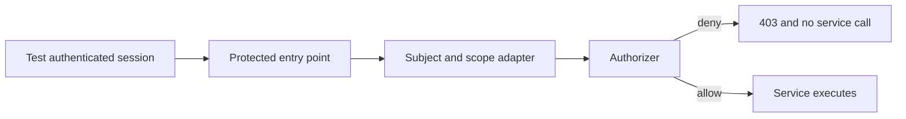

# Testing and Troubleshooting

Authorization tests should prove both intended access and intended denial. A suite containing only positive
administrator tests will miss tenant leaks, wildcard expansion, expired grants, and missing enforcement points.

## Build a policy matrix

Start with a human-readable matrix:

| Role | Scope | Resource | Action | Expected |
| --- | --- | --- | --- | --- |
| viewer | Tenant A | `identity.users` | `read` | Allow |
| viewer | Tenant A | `identity.users` | `update` | Deny |
| viewer | Tenant B | `identity.users` | `read` | Deny |
| editor | Org Finance | `identity.users` | `update` | Allow |
| editor | Org Operations | `identity.users` | `update` | Deny |
| system operator | System | `platform.settings` | `update` | Allow |
| system operator | Tenant A | `identity.users` | `read` | Deny |

Translate every row into a test. Include every sensitive action and every scope boundary.

## Minimal Node test

```ts title="access-control.test.ts" showLineNumbers
import assert from "node:assert/strict";
import test from "node:test";

import {
  ciCreateAuthorizationSubject,
  ciCreateAuthorizer,
  ciCreateRoleAssignment,
  ciTenantAccessScope,
} from "@cloudigniter/core/lib";

import { appAccessControl } from "./app-access-control";

const authorizer = ciCreateAuthorizer(appAccessControl);
const tenantA = ciTenantAccessScope("tenant-a");
const subject = ciCreateAuthorizationSubject(
  { id: "user-1", authenticated: true },
  [ciCreateRoleAssignment("viewer", tenantA, "exact")],
);

test("viewer can read users in the assigned tenant", () => {
  assert.equal(
    authorizer.can({
      subject,
      scope: tenantA,
      resource: "identity.users",
      action: "read",
    }),
    true,
  );
});

test("viewer cannot update users", () => {
  const decision = authorizer.authorize({
    subject,
    scope: tenantA,
    resource: "identity.users",
    action: "update",
  });

  assert.equal(decision.allowed, false);
  assert.equal(decision.reason, "no-matching-privilege");
});
```

## Required negative tests

Every protected resource should cover these categories where applicable:

- unauthenticated subject;
- authenticated subject with no assignments;
- unknown resource;
- unknown action;
- unsupported scope kind;
- wrong tenant;
- sibling Org Unit;
- descendant without ancestry;
- exact assignment used on a descendant;
- expired and not-yet-active grants;
- wildcard privilege versus newly added sensitive action;
- explicit deny conflict;
- missing inherited role;
- direct privilege conflict;
- empty `canAny` and `canAll` requirements.

## Test scope containment

```ts
test("tenant descendants never cross tenants", () => {
  const assignment = ciCreateRoleAssignment(
    "viewer",
    ciTenantAccessScope("tenant-a"),
    "descendants",
  );
  const actor = ciCreateAuthorizationSubject(
    { id: "user-1", authenticated: true },
    [assignment],
  );

  assert.equal(
    authorizer.can({
      subject: actor,
      scope: ciOrgUnitAccessScope("tenant-b", "finance"),
      resource: "identity.users",
      action: "read",
    }),
    false,
  );
});
```

Test valid and invalid Org Unit ancestry separately:

```ts
const validChild = ciOrgUnitAccessScope(
  "tenant-a",
  "payroll",
  ["company", "finance"],
);

const sibling = ciOrgUnitAccessScope(
  "tenant-a",
  "operations",
  ["company"],
);
```

## Test time windows deterministically

```ts
const authorizer = ciCreateAuthorizer(appAccessControl, {
  clock: () => new Date("2026-08-04T12:00:00.000Z"),
});

const expired = ciCreateRoleAssignment(
  "viewer",
  ciTenantAccessScope("tenant-a"),
  "exact",
  { expiresAt: "2026-08-04T12:00:00.000Z" },
);
```

The assignment is inactive because `expiresAt` is exclusive.

## Test both conflict algorithms

When an application uses precedence, make the difference explicit:

```ts
const safeAuthorizer = ciCreateAuthorizer(appAccessControl);

const precedenceAuthorizer = ciCreateAuthorizer(appAccessControl, {
  combiningAlgorithm: "highest-precedence",
});

assert.equal(safeAuthorizer.can(conflictingRequest), false);
assert.equal(precedenceAuthorizer.can(conflictingRequest), true);
```

If both results are expected to be the same, assert both. This prevents a future configuration change from
silently changing security semantics.

## Validate catalogs in CI

```ts
import {
  ciValidateAccessControlDefinition,
} from "@cloudigniter/core/lib";

const issues = ciValidateAccessControlDefinition(appAccessControl);
const errors = issues.filter((issue) => issue.severity === "error");

assert.deepEqual(errors, []);
```

Decide whether broad-wildcard warnings should also fail the application's CI checks for sensitive catalogs.

## Integration tests

Unit tests prove evaluator behavior. Integration tests should prove enforcement:



Test at least:

- page access for an allowed and denied role;
- each write handler with a missing permission;
- tenant IDs that do not match the assignment;
- alternative API/GraphQL entry points;
- revocation and policy-version cache invalidation;
- direct privilege expiry;
- audit emission for denied sensitive operations.

## Troubleshooting by decision reason

| Reason | Check |
| --- | --- |
| `unknown-resource` | Catalog ID and request spelling; make sure the complete catalog was loaded. |
| `unknown-action` | Register the action on the exact requested resource. |
| `unsupported-scope` | Compare the resource's `scopeKinds` with `request.scope.kind`. |
| `unauthenticated` | Both `authenticated: true` and a non-null subject ID are required. |
| `no-role-assignment` | Assignment activity window, role ID, tenant ID, propagation, and Org Unit ancestry. |
| `no-matching-privilege` | Privilege resource/action patterns and `scopeKinds`. |
| `explicit-deny` | Inspect `decidingMatches` and the configured combining algorithm. |

## Common mistakes

### Role exists but is not evaluated

Possible causes:

- assignment role ID differs from the catalog role ID;
- assignment is expired or not yet active;
- assignment scope does not contain the request;
- global or tenant propagation is `exact` when descendants are expected;
- a system assignment was incorrectly expected to reach tenant data.

### Org Unit descendant is denied

Check that:

- both scopes use the same tenant ID;
- the request uses `kind: "orgUnit"`;
- `ancestorOrgUnitIds` includes the assigned ancestor's stable ID;
- propagation is `descendants`;
- the privilege includes `orgUnit` in `scopeKinds`.

### Administrator is denied unexpectedly

Under `deny-overrides`, a deny from any applicable role or direct privilege wins. Inspect:

```ts
console.dir(decision.matches, { depth: null });
console.dir(decision.decidingMatches, { depth: null });
```

Do this only in trusted diagnostics.

### UI hides an action but the API allows it

The UI and API may be using different subjects, scopes, catalog versions, or actions. Compute client capability
flags from the same server policy and keep the API check authoritative.

### Policy changed but access did not

Check catalog-version and subject-assignment cache invalidation. Do not key compiled authorizers only by role ID.

## Package verification commands

The core package currently uses:

```bash
pnpm --filter @cloudigniter/core check
pnpm --filter @cloudigniter/core test
```

Application authorization suites should run in the application's normal test pipeline as well.

Next: [API Reference and Production Checklist](./reference-and-checklist).
