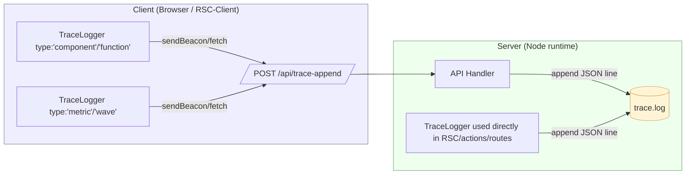

# CloudIgniter Trace Logging System

The CloudIgniter tracing system provides a **unified, isomorphic logging interface** for both server and client environments.  
It is designed to capture fine-grained events across your Next.js app, including components, functions, metrics, and waves.

This section explains how to use the `TraceLogger` and `startTrace` utilities, what each record looks like, and how to instrument your code properly.



---

## 📦 Overview

The tracing system consists of two modules:

| Module                                 | Purpose                                                              |
| -------------------------------------- | -------------------------------------------------------------------- |
| `@cloudigniter/next/trace/TraceLogger` | Core logger class for both server and client                         |
| `@cloudigniter/next/trace/startTrace`  | Convenience factory to create a logger and start a timer immediately |

All records—regardless of origin or type—follow a **standardized format and key order**, ensuring clean, analyzable logs.

---

## 🧩 Log Record Format

Every log entry is a **single JSON line** written to file (server) or sent to `/api/trace-append` (client).

Field order is **strictly preserved**:

| Field        | Type                                              | Description                                                                                                                        |
| ------------ | ------------------------------------------------- | ---------------------------------------------------------------------------------------------------------------------------------- |
| **t**        | number                                            | Timestamp in milliseconds since epoch (auto-inferred).                                                                             |
| **iso**      | string                                            | ISO-8601 date/time (auto-inferred).                                                                                                |
| **src**      | `"server"` or `"client"`                          | Environment that produced the log (required).                                                                                      |
| **type**     | `"component"`, `"function"`, `"metric"`, `"wave"` | Log record type.                                                                                                                   |
| **name**     | string                                            | Depends on type:<br />• `component`: wrapped in `< >`<br />• `function`: suffixed with `()`<br />• `metric`: fixed to `"duration"` |
| **caller**   | string                                            | Only for `"function"`; indicates who called it.                                                                                    |
| **for**      | string                                            | Only for `"metric"`; the item measured (rendered as `<Name>`).                                                                     |
| **scope**    | string                                            | Optional functional grouping (e.g., `"layout"`, `"auth"`).                                                                         |
| **event**    | string                                            | Optional short description of the event.                                                                                           |
| **tag**      | string                                            | Optional tag added by developer or global context.                                                                                 |
| **via**      | `"file"` or `"api"`                               | Indicates how the log was transmitted.                                                                                             |
| **...extra** | object                                            | Any additional developer-defined fields appended to the end.                                                                       |

### Example Record: Component

```json
{
  "t": 1730880000000,
  "iso": "2025-11-06T08:00:00.000Z",
  "src": "client",
  "type": "component",
  "name": "<HeaderLogo>",
  "scope": "layout",
  "event": "Rendering the <HeaderLogo> component",
  "tag": "Page:homepage",
  "via": "api"
}
```

### Example Record: Function

```json
{
  "t": 1730880000000,
  "iso": "2025-11-06T08:00:00.000Z",
  "src": "server",
  "type": "function",
  "name": "bootstrap()",
  "caller": "RootLayout",
  "scope": "init",
  "event": "Initializing server context",
  "via": "file"
}
```

### Example Record: Metric

```json
{
  "t": 1730880000000,
  "iso": "2025-11-06T08:00:00.000Z",
  "src": "server",
  "type": "metric",
  "name": "duration",
  "for": "<HeaderLogo>",
  "tag": "Page:homepage",
  "via": "file",
  "ms": 87,
  "phase": "ok"
}
```

## 🧠 When to Use Each Type

| Type        | Purpose                                              | Typical Usage                   |
| ----------- | ---------------------------------------------------- | ------------------------------- |
| `component` | Log lifecycle events of React components.            | On mount, update, unmount.      |
| `function`  | Trace execution of important functions.              | When a function is called.      |
| `metric`    | Log performance metrics (durations, timings).        | Auto-emitted via timers.        |
| `wave`      | Mark logical sections in log files (visual divider). | Between boot phases or modules. |

## ⚙️ Creating a Logger

You usually don't instantiate `TraceLogger` directly.
Instead, use the `startTrace()` helper, which automatically creates a logger and starts a timer.

**Example: Server-side**

```ts
import { startTrace } from "@cloudigniter/next/trace/startTrace";

const { logger, done } = startTrace(
  config.ciConfig.traceLog, // base config
  { source: "server", prettyWave: true }, // overrides
  { name: "HeaderLogo" } // metric label
);

logger.log({
  type: "component",
  name: "HeaderLogo",
  scope: "layout",
  event: "Rendering the <HeaderLogo> component",
});

done(); // emits a "metric" record for <HeaderLogo>
```

**Example: Client-side**

```ts
"use client";

import { TraceLogger } from "@cloudigniter/next/trace/TraceLogger";

const logger = new TraceLogger({ source: "client" });

export function ThemeSwitcher() {
  logger.log({
    type: "component",
    name: "ThemeSwitcher",
    event: "mounted",
  });

  return (
    <button
      onClick={() =>
        logger.log({
          type: "function",
          name: "toggleTheme",
          caller: "ThemeSwitcher",
          event: "Button clicked",
        })
      }
    >
      Toggle Theme
    </button>
  );
}
```

## ⏱ Measuring Durations

The logger supports high-precision timing via `startTimer()` and `time()`.

**Using `startTrace` (preferred)**

```ts
const { logger, done } = startTrace(
  traceCfg,
  { source: "server" },
  { name: "LoadUserProfile" }
);
// ... code being measured ...
done(); // emits { type:'metric', name:'duration', for:'<LoadUserProfile>', ms, phase:'ok' }
```

**Using `time()`**

```ts
await logger.time("LoadDashboard", async () => {
  await loadWidgets();
});
```

The result is automatically wrapped in a metric record, including status phase (`ok` or `error`).

## 🌊 Waves

Use waves as **logical dividers** in the log file (they can also trigger truncation logic).

```ts
logger.wave("App Initialization Started");
```

This emits:

- A structured record (`type:"wave"`, `name:"App Initialization Started"`)
- An optional pretty banner line (if `prettyWave: true`)

## 🔧 Configuration Reference

| Option               | Type                   | Default             | Description                                         |
| -------------------- | ---------------------- | ------------------- | --------------------------------------------------- |
| **filePath**         | `string`               | —                   | Path to the trace log file (server-only).           |
| **endpoint**         | `string`               | `/api/trace-append` | Client → server POST endpoint.                      |
| **enabled**          | `boolean`              | `true`              | Whether logging is active.                          |
| **source**           | `'server' \| 'client'` | **Required**        | Identifies origin of the log.                       |
| **prettyWave**       | `boolean`              | `false`             | Adds visual dividers for waves.                     |
| **truncateRate**     | `number`               | `0.5`               | Probability (0-1) to truncate log before next wave. |
| **metrics.duration** | `boolean`              | `true`              | Enables duration metrics.                           |
| **debug**            | `boolean`              | `false`             | Logs debug information to console.                  |
| **tag**              | `string`               | —                   | Optional default tag.                               |

## 🧰 API Reference

**`TraceLogger` Methods**

| Method                      | Description                                            |
| --------------------------- | ------------------------------------------------------ |
| **log(entry)**              | Writes a log record. Use `type`, `name`, `event`, etc. |
| **wave(label, extra?)**     | Inserts a “wave” separator in the log.                 |
| **startTimer(name, base?)** | Starts a timer and returns a `done(extra?)` stopper.   |
| **time(name, fn, base?)**   | Measures execution time of `fn()` automatically.       |
| **setEnabled(flag)**        | Enables/disables logging.                              |
| **setFilePath(path)**       | Updates log file path (server only).                   |
| **setEndpoint(url)**        | Updates API endpoint (client only).                    |
| **setTag(tag)**             | Sets a default tag for subsequent logs.                |

## 🚀 Best Practices

- Always include a meaningful `name` for components and functions.
- Use `startTrace()` in async or performance-critical code (it guarantees timer cleanup).
- Use `wave()` between major lifecycle boundaries (boot, render, hydration).
- Avoid logging large payloads (>64 KB). Oversized entries are automatically truncated.
- Keep trace files outside your repo (e.g., `/tmp/trace.log`) to avoid hot-reload loops.
- In production, keep tracing disabled unless debugging.

## 🧩 `trace-append` API Route

```ts title="src/app/api/(ci)/trace-append" showLineNumbers
import { NextResponse, type NextRequest } from "next/server";
import { TraceLogger } from "@cloudigniter/next/trace";
import type { Config } from "@cloudigniter/next/types";
import { getConfig } from "@/kernel";

export const runtime = "nodejs";
export const dynamic = "force-dynamic";

export async function POST(req: NextRequest) {
  const body = await req.json().catch(() => ({}));

  // Tag resolver (unchanged)
  const q = req.nextUrl.searchParams;
  const tag =
    (
      q.get("tag") ??
      q.get("t") ??
      (typeof body?.tag === "string" ? body.tag : "client")
    )
      .trim()
      .replace(/[^A-Za-z0-9_\-\/\.:]/g, "")
      .slice(0, 64) || "client";

  // Load config
  let cfg: Config;
  try {
    cfg = getConfig(`api/trace:${tag}`);
  } catch (e) {
    return NextResponse.json({ ok: false, error: "config" }, { status: 500 });
  }

  const traceLog = cfg.traceLog;

  // Treat undefined as enabled=true (safer default for “dev beacons”)
  const enabled = (traceLog?.enabled ?? true) === true;
  if (!enabled) return new NextResponse(null, { status: 204 });

  // Optional global kill-switch; default allow if unset
  if ((process.env.LOG_ENABLED ?? "true") !== "true") {
    return new NextResponse(null, { status: 204 });
  }

  // Must have a filePath to write
  if (!traceLog?.filePath) {
    if (traceLog?.debug) {
      console.warn("[trace-append] traceLog.filePath missing; skipping write.");
    }
    return new NextResponse(null, { status: 204 });
  }

  const logger = new TraceLogger({
    ...traceLog,
    source: "server",
    tag,
    enabled: true,
  });

  try {
    const payload =
      body && typeof body === "object"
        ? (body as Record<string, unknown>)
        : { msg: String(body) };

    logger.log({
      ...payload,
      via: "api",
      tag,
      route: req.nextUrl.pathname,
    });

    return new NextResponse(null, { status: 204 });
  } catch (e) {
    console.error("ROUTE POST ERROR:", e);
    return new NextResponse(null, { status: 204 });
  }
}
```

This route receives client traces and appends them to the same server log file.

## 🧾 Output Example (mixed client/server)

```json
{"t":1730880000000,"iso":"2025-11-06T08:00:00.000Z","src":"server","type":"wave","name":"Server Boot Started","via":"file"}
{"t":1730880000100,"iso":"2025-11-06T08:00:00.100Z","src":"server","type":"component","name":"<HeaderLogo>","scope":"layout","event":"Rendering","via":"file"}
{"t":1730880000200,"iso":"2025-11-06T08:00:00.200Z","src":"server","type":"metric","name":"duration","for":"<HeaderLogo>","ms":87,"phase":"ok","via":"file"}
{"t":1730880000300,"iso":"2025-11-06T08:00:00.300Z","src":"client","type":"function","name":"toggleTheme()","caller":"ThemeSwitcher","event":"Button clicked","via":"api"}
```

## 🧩 Summary

- Unified trace system works for both client and server.
- Canonical, predictable JSON line format.
- Supports wave dividers, durations, and structured extras.
- Ideal for debugging, profiling, and auditing component behavior.

## ⚠️ Troubleshooting & Common Mistakes

**1. Logs not appearing in the file**

- **Cause:** `filePath` not set when `source: 'server'`.
- **Fix:** Ensure your logger is initialized with a valid file path, e.g.:

```ts
new TraceLogger({ filePath: "/tmp/trace.log", source: "server" });
```

**2. Logs appear in console but not in file**

- **Cause:** Running in Edge Runtime (no Node fs support).
- **Fix:** Move logging to a Node runtime route (`runtime: 'nodejs'`) or use the client → `/api/trace-append` route.

**3. Seeing `"type_x":"metric"` or similar stray keys**

- **Cause:** Old version appended duplicate canonical keys.
- **Fix:** Ensure you’re on the latest version (keys are now sanitized).

**4. Metrics not being recorded**

- **Cause:** metrics.duration disabled.
- **Fix:** Enable it:

```ts
new TraceLogger({ source: "server", metrics: { duration: true } });
```

**5. No logs from client components**

- **Cause:** enabled not set to true or endpoint inaccessible.
- **Fix:** Confirm enabled: true in config. Ensure /api/trace-append route exists and returns 204.

**6. “source is required” error**

- **Cause:** Missing source parameter when creating the logger.
- **Fix:** Always specify:

```ts
const logger = new TraceLogger({ source: "client" });
```

**7. Oversized payloads truncated**

- **Cause:** sendBeacon payloads have ~64 KB limit.
- **Fix:** Reduce logged object size. Large payloads are automatically replaced by a compact “truncated” message.

**8. Log file growing too large**

- **Fix:** Adjust truncateRate (e.g., 0.3) so old sections are pruned on each wave.

## ⚡ Performance Optimization Tips

Tracing is powerful but can impact performance if overused. Follow these best practices to keep your application fast and responsive.

**1. Limit Logging Frequency**

Avoid logging inside tight render loops or repetitive UI updates. Instead, log **state transitions** or **important milestones**, not every frame.

**2. Use Metrics for Duration Only**

If you need performance profiling, use `logger.time()` or `startTrace()` instead of manual timestamps.
They are highly optimized and automatically cleaned up.

**3. Disable in Production**

Keep enabled: false for production builds unless investigating a specific issue.
You can toggle via environment variable, e.g.:

```ts
const traceEnabled = process.env.NODE_ENV !== "production";
new TraceLogger({ source: "server", enabled: traceEnabled });
```

**4. Buffer Writes When Needed**

For high-volume traces on the server:

- Collect multiple records in memory.
- Write them every few seconds using `appendFileSync()` in batches.
  This reduces I/O calls by up to 90%.

**5. Adjust Truncation Rate**

For long-running apps, tune `truncateRate`:

- 0.0 → never truncate
- 0.5 → 50% chance to keep last wave only
- 1.0 → always truncate before each wave

Truncation helps maintain small log files over time.

**6. Use Unique Tags for Grouping**

Add meaningful `tag` values (e.g. `"Page:dashboard"` or `"AuthFlow"`)
so that later analysis and filtering are efficient.

**7. Post-Processing & Analytics**

You can pipe logs to a log processor (e.g., AWS CloudWatch, Loki, or ELK stack).
Each record is JSON-safe, so it can be parsed directly.

**8. Don't Log Sensitive Data**

Avoid including tokens, passwords, or user PII.
Tracing should remain lightweight, non-sensitive, and compliant with privacy standards.
