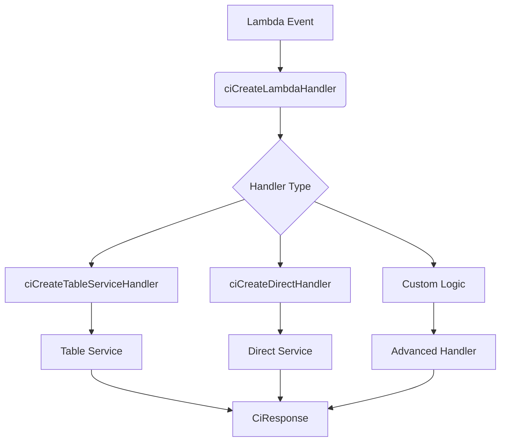
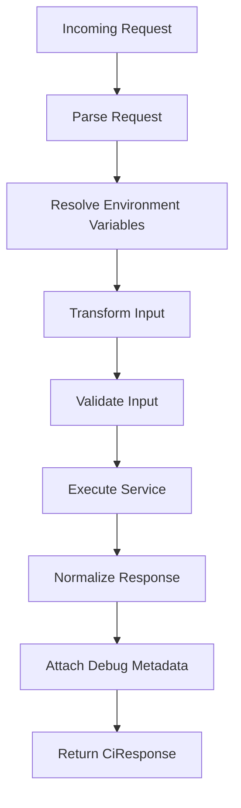
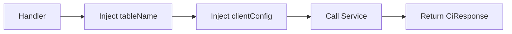
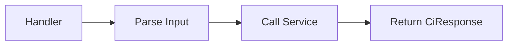

// March 17 2026

# CloudIgniter Handler Architecture (with Diagrams)

This document explains how **CloudIgniter backend handlers** are
structured and how developers should implement them.

CloudIgniter provides a standardized handler architecture that
eliminates repetitive Lambda boilerplate while maintaining strong typing
and consistency.

Instead of manually writing request parsing, environment resolution,
validation logic, and error handling, developers use small handler
factories.

These factories automatically provide:

- request parsing
- environment variable resolution
- validation lifecycle
- error normalization
- debug attachment
- consistent response shape

As a result, most handlers are only **3--5 lines long**.

---

# Architecture Overview

The CloudIgniter backend handler layer is organized around **three
handler factories**.

---

Handler Factory Purpose

---

`ciCreateTableServiceHandler` Standard table/database backed
services

`ciCreateDirectHandler` Direct-input services (Cognito,
utilities)

`ciCreateLambdaHandler` Advanced/custom handlers

---

---

# High Level Architecture



---

# Handler Layer Responsibilities

The handler layer is responsible for:

- request parsing
- environment variable resolution
- validation lifecycle
- invoking the service
- attaching debug metadata
- normalizing errors

Business logic **must always live in the service layer**.

---

# Handler Lifecycle

Every handler follows the same lifecycle.



---

# 1. Table Service Handlers

Table service handlers are used for **database-backed operations**.

They automatically inject:

- table name
- DynamoDB client configuration
- environment variables

### Example

```ts
import { createTenant } from "@CI/server";
import { ciCreateTableServiceHandler } from "@CI/server";

export const createTenantHandler = ciCreateTableServiceHandler({
  moduleUrl: import.meta.url,
  tableEnvVar: "CI_SYSTEM_TABLE_NAME",
  service: createTenant,
});
```

### Table Service Function Shape

```ts
(args: {
  tableName: string;
  clientConfig: DynamoDBClientConfig;
  input: TInput;
}) => Promise<CiResponse>;
```

---

# Table Service Flow



---

# 2. Direct Service Handlers

Direct service handlers are used for services that **do not require
database injection**.

Examples include:

- Cognito operations
- utility functions
- external API integrations

### Example

```ts
import { createCognitoUser } from "@CI/server/lib/cognito/create-cognito-user";
import { ciCreateDirectHandler } from "@CI/server";

export const createCognitoUserHandler = ciCreateDirectHandler({
  moduleUrl: import.meta.url,
  service: createCognitoUser,
});
```

### Direct Service Shape

```ts
(input: TInput) => Promise<CiResponse>;
```

---

# Direct Handler Flow



---

# 3. Advanced Lambda Handlers

Use `ciCreateLambdaHandler` when full lifecycle control is required.

Examples:

- complex validation
- request transformation
- multi-step logic
- orchestration workflows

### Example

```ts
export const seedTenantsHandler = ciCreateLambdaHandler({
  handlerName: "SEED_TENANTS_HANDLER",

  transformInput: ({ input }) => ({
    tenants: input,
    envMode: "test",
  }),

  validate: async ({ input, ciValidationError }) => {
    if (!input.tenants.length) {
      return ciValidationError("Tenants array must not be empty");
    }
  },

  run: async ({ input, env, clientConfig }) =>
    seedTenants({
      tableName: env.CI_SYSTEM_TABLE_NAME,
      clientConfig,
      input,
    }),
});
```

---

# Handler Name Inference

Handler names are automatically derived from the file name.

Example file:

    create-tenant-handler.ts

Automatically becomes:

    CREATE_TENANT_HANDLER

This is implemented using:

    ciInferHandlerName(import.meta.url)

---

# Recommended Usage Patterns

### Table-backed Services

```ts
export const handler = ciCreateTableServiceHandler({
  moduleUrl: import.meta.url,
  tableEnvVar: "CI_SYSTEM_TABLE_NAME",
  service,
});
```

---

### Direct Services

```ts
export const handler = ciCreateDirectHandler({
  moduleUrl: import.meta.url,
  service,
});
```

---

### Advanced Handlers

```ts
export const handler = ciCreateLambdaHandler({...})
```

---

# Separation of Concerns

CloudIgniter strongly enforces separation between layers.

Layer Responsibility

---

Handler wiring
Service business logic
Utilities infrastructure concerns

---

# Benefits

The handler architecture provides:

### Minimal Handlers

Most handlers are only a few lines.

### Consistent Error Handling

All handlers share the same:

- response format
- error normalization
- debug metadata

### Strong Typing

TypeScript automatically infers input types from service functions.

### Maintainability

Business logic stays inside services rather than Lambda handlers.

---

# Summary

CloudIgniter handler architecture provides a **thin, standardized, and
type-safe backend interface**.

The framework manages:

- request parsing
- environment injection
- validation lifecycle
- error normalization
- debug instrumentation

This allows developers to focus exclusively on **business logic** while
maintaining a consistent backend structure.
