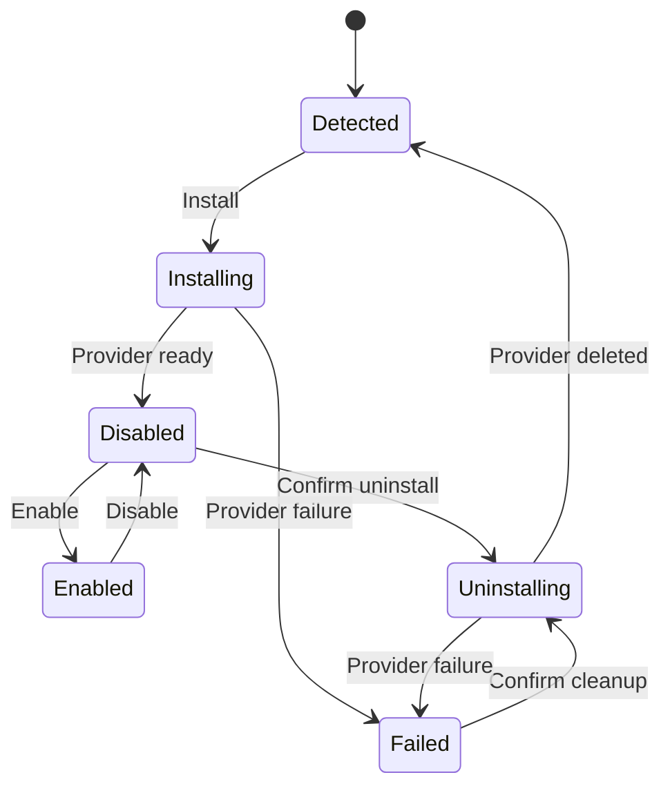

# Module architecture and provider lifecycle

Optional modules extend the existing manifest/client/server/lib/types architecture with a persisted lifecycle.
`CiExtensionManifest` extends `CiModuleManifest`; existing runtime module definitions remain source compatible.
Core capabilities are protected independently of the optional catalogue.

| Owner | Responsibility |
| --- | --- |
| `packages/core` | Extension contracts, lifecycle state machine, dependency checks, configuration defaults, application access-control contributions, To-Do command validation |
| `packages/aws` | Registry persistence, CloudFormation lifecycle, fresh policy evaluation, To-Do provider factory and IAM plans |
| `packages/next` | Authenticated server-action adapter and build-time module registry generator |
| `packages/ui` | Module management and To-Do components using existing themes, feedback, and dialogs |
| `apps/templates/cloudigniter-next-aws-v1` | Trusted local module folders, generated imports, core dashboard slots, thin Amplify and server-action composition |

## Package and folder contract

```text
src/custom/modules/
  todo/
    manifest.ts            # named ciModuleManifest; type-only imports
    client/index.ts        # named CiModulePage
    server/index.ts
    server/aws/index.ts    # named ciModuleBackend
    lib/index.ts
    types/index.ts
  .generated/
    manifests.ts
    client.ts
    aws.ts
```

The reference folder delegates to `CiTodoPage`, `ciCreateAwsTodoModule`, and `ciParseTodoCommand`. A packaged module
can make the same named exports from its supported npm entry points. Trusted source is bundled with the application;
the dashboard never evaluates an uploaded path or writes routes into a running server.

The Users guide's [Creating your own modules](/docs/extending-application/creating-modules) lesson demonstrates
an application-owned Personal note feature through these public contracts. Keep that lesson separate from the
To-Do installation walkthrough, and validate its copyable facets when changing authoring contracts.

`ciGenerateNextExtensionRegistry(applicationRoot)` is exported through `@cloudigniter/next/tooling/modules`.
The generator validates IDs/folder names and confines all inputs and outputs. Client imports never include provider
facets. Incompatible manifests remain discoverable without importing unsupported runtime code. Client-only modules
can omit a server facet; without an infrastructure template the AWS lifecycle uses a `none` reference.

The three `.generated` filenames are reserved for the generator. Writes use the CLI's journaled transaction and
preserve effective filesystem modes. On filesystems without hard links, exclusive creation refuses existing paths;
an interrupted partial write is detected by journal/hash validation. Existing files remain untouched on a conflict.
The module validator accepts the extension manifest type and validates only core dependencies referenced by the
selected user modules. Unrelated core graph validation remains the maintainer command's responsibility.

The core `/dashboard/extensions/[moduleId]` route is a host slot, not application business logic in `(system)`.
Module clients stay under the custom seam. Management uses `dashboard.modules`, while the generic extension host
uses `dashboard`; both retain system scope and the proxy → bootstrap → page-message lifecycle. Both page setups
enable `withBreadcrumbChildrenMenu` and supply the shared Dashboard breadcrumb children.

`CiNextModuleManagementPage` in `packages/next` binds the `modules` messages and resolved locale to the
framework-neutral `CiModuleManagementPage` in `packages/ui`. Register `dashboard-modules.json` in both English
and Arabic package locale maps and both custom application locale maps. Empty custom files inherit defaults;
custom keys override package messages through the existing route loader. Keep next-intl hooks in Next, and
expose UI copy through `CiModuleManagementMessages` from the UI `/types` entry point. Check locale key parity,
route namespace loading, custom precedence, translated status/core labels, and breadcrumb composition together.

## State and recovery



One registry item carries the revision and all installation records. A compare-and-swap serializes lifecycle and
dependency checks across requests. Persist operation intent before invoking a provider. A request timeout leaves
the same retryable operation ID and deterministic stack name. `list()` reconciles pending provider state; it does
not start provisioning. Installation finishes disabled. Source/version mismatch blocks enablement and execution.
Uninstall confirmation is bound to the snapshot shown when the dialog opened. Never refresh the consent revision
implicitly while the developer is confirming a different installation.

AWS exposes `ciAwsExtensionWriteGuard(context)` through `@cloudigniter/aws/server/backend`. It constructs the
registry revision ConditionCheck for the module's DynamoDB transaction, keeping registry keys private to the
provider. Both custom modules and the To-Do factory use it after `assertAccess`, alongside their own item
conditions. It performs no authorization or I/O; the transaction rejects concurrent registry changes, including
changes to other modules. Do not replace the atomic condition with a separate pre-write read.

The Update action intentionally has no backend operation. Implement update compatibility, version lookup, migrations,
rollback, package verification, and download behavior as a separate protocol before changing this boundary.

## Authorization and settings

The Next page/actions and AWS manager require authenticated exact `developer` membership and exact `development`
mode. Lifecycle writes also apply fresh EmberGuard read-only restrictions. Extension execution checks enabled state,
bundled version, provider output binding, and the declared action through an authoritative policy read.

`ciExtensionAccessControl` creates a `module-<id>` domain, `module-<id>.features` resource, declared actions, and an
optional `module-<id>-user` role. `authenticatedAccess` adds that default role for authenticated execution; it does
not replace resource ownership checks. Persisted policy is composed above module defaults, so explicit denial,
suspension and read-only constraints remain effective. Defaults remain code-owned; use policy restrictions to revoke
personal module access. App composition includes these definitions, while older persisted catalogues may require
explicit catalogue synchronization before the new definitions appear in the Security editor.

Boolean and enumerated-string module settings live in the installation registry and are validated against its
manifest. They are separate from the platform Public/Private/User Settings registry. Disable retains values;
uninstall removes them. The To-Do defaults are `defaultPriority: normal` and `showCompleted: true`.

## AWS resources and ownership

The Amplify composition creates a retained Modules registry table and two Data-group resolver functions:
`ManageModules` and `ExecuteModule`. There is no client-writable model exposing registry state. Optional stacks
are separate CloudFormation roots. Their names combine `ci-ext-`, twelve characters from the Amplify root stack's
unique ID, and the module ID. The actual stack ARN and outputs are stored after inspection.

Before deletion, the provider verifies the name, account, Region, environment/module tags, and absence of parent/root
stack links. Creation policies enumerate compiled module resources; cleanup policies permit only the deployed
environment's extension prefix, allowing cleanup when source is missing. The provisioner role supports DynamoDB
tables only; adding other AWS resource types requires extending the version-controlled scoped IAM plan. It has no
permission to delete core Amplify stacks or unrelated tables. See the official
[CreateStack](https://docs.aws.amazon.com/AWSCloudFormation/latest/APIReference/API_CreateStack.html) and
[DeleteStack](https://docs.aws.amazon.com/AWSCloudFormation/latest/APIReference/API_DeleteStack.html) request contracts
for operation tokens and service-role behavior.

The manager and executor share the Data resource group with their Data-table policy consumers. Use the canonical
`CI_ENV` value when wiring the EmberGuard table. Independent stacks outlive Amplify teardown; uninstall them first.
The retained registry preserves recovery identities but is not a substitute for task backups.

## DynamoDB decision and access patterns

The registry is a control-plane bounded context, separate from owner-private task data. A tasks table per installed
module is justified by its independently destructive lifecycle and restore boundary. Sharing the System table
would be cheaper to configure but would prevent a clean resource-level uninstall without affecting unrelated data.

| Data | Key/query | Consistency and atomicity |
| --- | --- | --- |
| Registry | `PK=CI#MODULES#REGISTRY`, `SK=CI#STATE` | Strong Get; conditional revision Put; maximum 300 KB serialized state |
| User tasks | `PK=CI#MODULE#todo#USER#<subject>`, `SK=CI#TASK#<timestamp>-<uuid>` | Strong bounded Query, descending order, 50 items/page |
| Task edit | Same owner key | Strong Get, then conditional revision Put in a transaction with registry revision ConditionCheck |
| Task Trash | Same owner collection and record | Trusted deletion metadata; restore preserves completion; no per-task purge |

Continuation tokens carry only a task identifier; reconstruct the owner partition from verified identity. There are
no request-path scans, GSIs, streams, or replicas. The example uses on-demand Standard tables; request volume, item
size, and transactional writes drive cost. PITR and backups are deliberate deployment decisions, not enabled by the
example. See AWS's [on-demand capacity documentation](https://docs.aws.amazon.com/amazondynamodb/latest/developerguide/on-demand-capacity-mode.html)
and [read consistency](https://docs.aws.amazon.com/amazondynamodb/latest/developerguide/HowItWorks.ReadConsistency.html).

Task writes require the exact registry revision read before authorization. Disable, uninstall, or configuration
changes therefore invalidate an in-flight write. Normal optimistic revisions prevent lost task updates. To-Do is
personal across the account and exposed at system scope; tenant-shared tasks need an explicit tenant authorization
and key-design extension. Trash remains inside the module. No Cognito, blob, search, or external projection participant
exists. Uninstall removes the task table, including Trash, while generic host infrastructure remains.

## Verification and compatibility

Cover state races, stale consent, retries, failed/missing stacks, ownership drift, IAM scoping, owner isolation,
read-only restrictions, malformed inputs, pagination, missing/version-mismatched code, and generation collisions.
Run owner type checks and the template consumer. Provider tests use SDK mocks; a live deployment and AppSync smoke
test are separate, explicitly authorized verification. There is no migration of previously persisted application data.

See the [application workflow](/docs/building-features/modules) and [public API](/docs/api-reference/shared-apis/modules).
