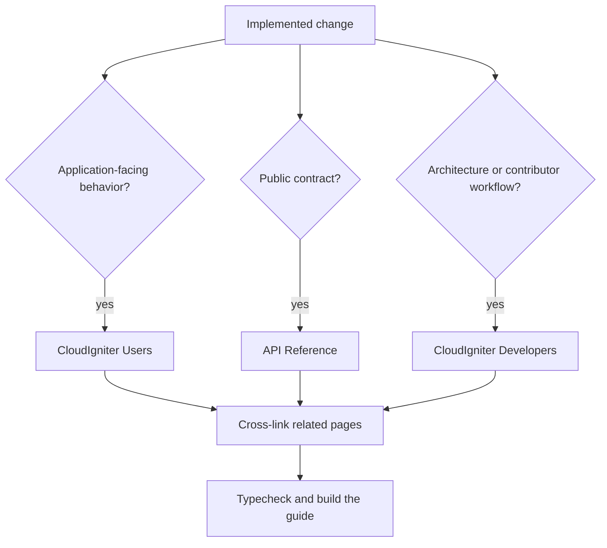

# Developer guide authoring workflow

CloudIgniter treats documentation as part of implementation. A product change is
complete only when the affected guide content describes the behavior that ships.

The repository skill
`.agents/skills/cloudigniter-guide-authoring/SKILL.md` defines the authoring and
validation workflow used by Codex. Its section-specific references keep each
audience focused:

| Guide surface           | Source directory                                                     | Audience and purpose                                                                                                                      |
| ----------------------- | -------------------------------------------------------------------- | ----------------------------------------------------------------------------------------------------------------------------------------- |
| CloudIgniter Users      | `docs/docs` outside `api-reference`                       | Application developers learning concepts, setup, configuration, supported workflows, and troubleshooting                                  |
| CloudIgniter Developers | `docs/company-developers`                                 | Contributors maintaining packages, providers, architecture, runtime boundaries, and extension workflows                                   |
| Dictionary              | `docs/dictionary`                                         | Readers looking up concise, stable CloudIgniter ecosystem terminology, grouped by first letter and alphabetized in the Dictionary sidebar |
| API Reference           | `docs/docs/api-reference`                                 | Developers looking up exact public imports, signatures, fields, defaults, constraints, and runtime requirements                           |
| Skills                  | `.agents/skills` and `.codex/skills` (generated into the Skills tab) | Codex and maintainers reviewing reusable instructions; source content is authoritative outside the guide                                  |

## Route documentation by impact

One implementation can require more than one documentation treatment.



Typical routing:

- A new public feature needs task-oriented user guidance and exact API reference.
- A provider feature needs application setup guidance, contributor-facing provider architecture, and reference pages for public adapters or contracts.
- A configuration change needs updated user setup, typed contract reference, and internal resolution documentation when wiring changes.
- An architecture change needs contributor documentation and the matching `cloudigniter-development` skill reference; update user guidance when the workflow also changes.
- A new or materially changed stable ecosystem term needs a concise Dictionary definition and links to the detailed guide rather than a duplicated tutorial.
- A deprecation or removal needs migration guidance and removal of stale imports and examples across every surface.

## Link Dictionary terms in prose

The catalogs in `docs/dictionary-terms.ts` and `docs/developer-dictionary-terms.ts`
identify Dictionary terms. Link prose only when its meaning matches the definition,
using a canonical URL such as `[proxy](/dictionary/p#proxy)`. The guide intercepts
these links outside the Dictionary tab and opens the searchable Dictionary
Viewer over the current page. Normal URL navigation remains available without
JavaScript and from inside the Dictionary tab. Readers can also select the book
icon beside the Dictionary tab to open the viewer directly without leaving the
current page.

Add links in paragraphs, lists, callouts, and table cells. Skip headings, code,
diagrams, existing links, and the term's own definition. Add or rename the entry
in both its letter MDX file and the matching term catalog; that shared catalog
drives the sidebar, viewer search, alphabet availability, and canonical link.

Use an explicit contextual link for ambiguous bare words such as Layout or Claim.
Package Layout means a folder structure; UI/route Layout means the shared rendered
page structure. CI means Continuous Integration, while the lowercase `ci` executable
keeps its separate command identity. Spell the platform name CloudIgniter in prose.

The `plugins/remark-dictionary-terms.ts` build transform provides a coverage
backstop for CloudIgniter Users, CloudIgniter Developers, and API Reference. It
matches unambiguous terms and qualified aliases, supports case-sensitive abbreviation
policies, and prefers the longest term when names
overlap, and produces the same canonical links without changing headings, code,
diagrams, existing links, Dictionary definitions, or generated Skills content.

## Tutorial learning sections

Each active Users or Developers tutorial declares linked prerequisite topics and
page-specific review questions in its `learning` frontmatter. The shared reading
theme displays **Prerequisite knowledge** directly below the main title and
**Review Questions** after the article content, before the Updated footer. Both
are collapsed when the reader opens a page.

Choose background topics that the reader needs to understand the lesson, linking
to earlier guide lessons or authoritative external introductions. Ask questions
about the lesson's decisions, constraints, and dependencies; each question belongs
to one page. Indexes, reading paths, and summaries declare `learning: false`.
Reference manuals, dictionaries, generated categories, historical pages, and
rendered agent Skills do not receive tutorial exercises. `guide:check` validates
coverage, linked destinations, and duplicate questions before start or build.

## Verify source before writing

Use current code as the source of truth. Existing guide pages can be stale even
when their MDX builds successfully.

Inspect, in order:

1. package `exports` maps and canonical barrels;
2. types, implementation, and configuration schemas;
3. tests that establish defaults, errors, denial, and edge cases;
4. supported application/template consumers;
5. focused repository architecture references;
6. existing guide coverage.

Do not document a helper as public unless an intentional package entry point
exports it. Do not teach application developers to use deep `src` imports or
internal capability packages when a public facade owns the contract.

## Author the guide surfaces differently

### CloudIgniter Users

Lead with the outcome. Explain prerequisites, the minimum mental model, setup,
a runnable example, important defaults, security or lifecycle constraints,
troubleshooting, and the next useful step. Link to API pages for exhaustive
field-level details.

### CloudIgniter Developers

Lead with ownership and boundaries. Explain responsibility, dependency direction,
the end-to-end flow, extension points, registrations and exports, invariants,
failure modes, and the validation chain. Link to user workflows and public
contracts instead of duplicating them.

### API Reference

Document only intentionally public contracts. Include the exact package and
import path, runtime classification, TypeScript signature or type shape,
parameters and defaults, return behavior, errors or side effects, a minimal
example, compatibility status, and related guidance.

## Completion checklist

### Maintain the Updated timestamp {#maintain-created-and-updated-dates}

Every document footer across CloudIgniter Users, CloudIgniter Developers, API Reference, Dictionary, and Skills
shows only the **Updated** timestamp in UTC using `YYYY-MM-DD HH:mm:ss UTC` (for example,
`2026-09-09 15:54:15 UTC`). Creation timestamps remain internal metadata and are not displayed.

The tracked `docs/page-dates.json` registry stores UTC ISO timestamps and a content hash under each
repository-relative Markdown/MDX source path. Category metadata files are tracked too, giving generated category
index pages their own Updated timestamp. Skills entries refer to `.agents/skills` or `.codex/skills`; the generated staging
tree remains disposable. The shared `PageDates` component is used by the Docusaurus document-footer and category-page
wrappers. The sidebar generator attaches each category's source key while preserving normal navigation. The timestamp
uses a year-first date and 24-hour UTC time, independent of the reader's locale and time zone, for consistent
server and browser output. Changing the display format preserves the recorded instants.

After finishing edits, run:

```bash
pnpm --filter docs dates:update
pnpm --filter docs dates:check
```

The update command preserves each existing creation date, advances the updated date only when that page's source
content changes, and initializes both dates for a new page. It leaves unchanged pages untouched and removes
entries for deleted pages. When renaming or moving a document, transfer its existing registry entry to the new
source path before running the command so its creation date survives.

The standard start and build commands validate metadata without changing it. A stale or missing entry fails
validation and names the affected source. Rebuilding, changing site styles, and checking out the repository do
not advance page dates. The guide-authoring skill requires this maintenance for future document and rendered
skill-source edits.

### Validate the change

Before completing a product change:

- search all guide surfaces for the changed symbols and terminology;
- update every affected page, category, index, and cross-link;
- verify examples and imports against current exports and types;
- verify defaults, runtime boundaries, provider assumptions, and failure behavior;
- synchronize contributor architecture with the relevant
  `.agents/skills/cloudigniter-development/references` file;
- refresh page dates and verify that only edited or newly created pages received new timestamps;
- run the implementation's focused tests;
- run the guide checks:

```bash
pnpm --filter docs typecheck
pnpm --filter docs build
```

The standard `start` and `build` scripts clear Docusaurus-generated metadata
before loading the guide. This prevents moved or removed documentation plugins
from leaving stale route and document records that can break client navigation.

If a change is internal and preserves documented behavior, record why no page
needed an edit. Do not create artificial documentation churn, but never skip the
impact review.

## Improve the workflow as it evolves

When authoring reveals a recurring gap, propose a focused improvement. Useful
examples include an API-export inventory check, stricter broken-link handling,
section templates, terminology linting, clearer sidebar ownership, or executable
code examples. Add the improvement to the authoring skill when it is a reusable
rule rather than a one-off preference.

### Skills

The Skills tab is a generated, read-only view of skill entrypoints and Markdown references. It preserves nested reference folders as navigation categories, including deliberate labels and ordering for architecture, CLI, and authoring guidance. Do not edit generated files or duplicate them in this guide. Skill changes normally flow from their source folders without a separate guide edit; if a skill itself can be improved, update it in its owning folder and rebuild the guide.

## Maintain the Users learning path

Use [Users guide structure and page retirement](./users-guide-structure) when organizing a chapter, replacing
older guidance, or removing a page. Update the structure manifest and all inbound links across Users, Dictionary,
Developers, and API Reference together. Keep historical pages under the single **Obsulete** section with current
replacement links.
