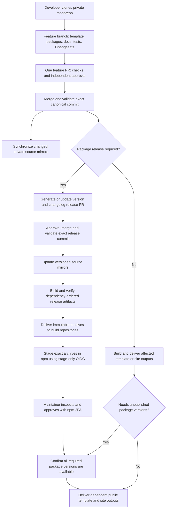

:::note Implementation status
The [source-mirroring workflow](./strategy/source-mirroring) implements post-merge private source synchronization after approval and merged-commit validation. It requires an installed and configured company App. The remaining sections describe the target architecture for automated release delivery. The generated release PR, delivery coordinator, automated staging authorization and Publisher tracking described here still require implementation. The [current package release workflow](./release-packages) continues to use separate source/build requests and reviewer-triggered staging.
:::

## Delivery at a glance {#delivery-overview}

Use **Figure 1** as a map while reading this tutorial. Follow **A → B → C** for
an approved feature and its source mirrors. When packages need a release, follow
**D → E → F → G → H**. A change with no npm release goes directly to the output
gate at **H**. **I** observes the delivery; it does not authorize publication.

<figure>
  
  <figcaption>
    Figure 1. From an integrated feature PR to source mirrors, reviewed releases
    and verified outputs. Click the image, or focus it and press Enter, to enlarge
    and zoom. Solid panels show development and source mirroring; dashed panels
    describe the remaining automation and remote tracking roadmap.
  </figcaption>
</figure>

### Visual key {#delivery-visual-key}

The letters in the image and the section references below describe the same
stages. They also provide a text alternative to the illustration.

| Label | Stage and section | What to remember |
| --- | --- | --- |
| **A** | [Workspace and responsibilities](#authority-and-responsibilities) | The private monorepo contains the complete integrated change. Local builds are previews. |
| **B** | [Feature approval](#feature-approval-and-release-approval) | Independent review approves the PR head; delivery validates the resulting merged commit. |
| **C** | [Source mirrors](#source-mirror-strategy) | The configured company App synchronizes approved snapshots into separate private repositories. This service is implemented and requires App setup. |
| **D** | [Release approval](#feature-approval-and-release-approval) | A planned Changesets release PR reviews versions, changelogs and the lockfile before creating the release commit. |
| **E** | [Build and verify](#build-repository-strategy) | Build from the exact release commit in dependency order, without delivery credentials. |
| **F** | [Build repositories](#build-repository-strategy) | A separate delivery job transfers immutable archives and evidence; destinations do not rebuild them. |
| **G** | [npm staging and publication](#npm-staging-and-final-publication) | Stage an unpublished candidate, obtain maintainer approval with 2FA, then confirm required versions are available. |
| **H** | [Template, Docs and websites](#template-docs-and-website-delivery) | Deliver the intended audience's verified output. Package-dependent outputs wait for available versions; independent outputs need only their own gates. |
| **I** | [Publisher and release record](#publisher-presentation) | The planned remote progress view shows authoritative receipts, checks and recovery while CI continues independently. |

The **No npm release** path does not skip output checks or dependency checks.
It skips package versioning and staging only when no package release is needed.
The [migration order](#implementation-and-migration-order) explains which parts
already exist and how to introduce the remaining automation.

## Authority and responsibilities

**Figure 1 — [A: Workspace](#delivery-overview).** Start with the complete
monorepo; the repositories at **C** and **F** are downstream destinations.

The private integration monorepo is the authoritative development repository. A developer clones the complete workspace, creates a feature branch, and changes the template, packages and documentation together. One feature PR reviews that complete behavior. Individual source repositories become managed downstream mirrors; changes originate in the monorepo and are synchronized after its approved PR merges.

The configured canonical destination is `cloudigniter-io/cloudigniter`. The company main branch is protected. Source App access and each destination branch rule must be verified during setup. A backup remote does not establish company approval or authorize delivery.

| Participant | Responsibility |
| --- | --- |
| Developer and local Publisher | Prepare code, checks, Changesets and the integrated PR; inspect its delivery progress. |
| Monorepo approver | Review the exact feature head and, when packages are released, the generated versions and changelogs. |
| GitHub Actions and a company GitHub App | Verify approval evidence, synchronize source mirrors, build committed releases, transfer verified output and initiate staging. |
| npm maintainer | Inspect the staged package and complete npm publication with interactive 2FA. |
| Website deployment workflow | Deploy the verified site artifact using the configured hosting environment. |

Execution after merge belongs to CI and must continue when the developer closes Publisher or goes offline. Private DEV owns the shared implementation; local CLI, Publisher and CI call the same domain services. Public `ci` remains application tooling.

## Feature approval and release approval

**Figure 1 — [B: Feature PR and D: Release PR](#delivery-overview).** These are
two separate review decisions. **B** approves the integrated behavior; **D**
approves the versions and release contents. The decision between them lets
independent Docs or site changes proceed toward **H** without an npm release.

Approval is attached to a PR's exact head. Delivery starts only after merge into the protected canonical base and successful validation of the resulting merge commit. Record both the reviewed head and merged SHA: a squash merge produces a different commit identifier.

A feature PR contains code, tests, guide changes and a Changeset for packages requiring release. A documentation-only or test-only change can legitimately have no npm release. Changes to shared build configuration must expand the affected checks beyond the directories directly edited.

The recommended release policy is a generated **release PR**. Changesets calculates package versions, dependency propagation and changelogs; the generated PR also commits the resulting lockfile and any required template dependency-policy changes. Its review establishes what will ship and when. It can collect several already-approved features into a single release. This avoids generating a new npm version for every feature merge. [Changesets documents this version-PR pattern](https://github.com/changesets/changesets/blob/main/docs/automating-changesets.md).

The release PR requires current checks and independent approval like other protected changes. Moving its head invalidates previous approval. Its merge supplies the immutable release commit. Package release artifacts are built from that commit; feature-branch builds remain previews. This replaces repeated source approval in each mirror while retaining review of version changes and the integrated result.



Sources can advance ahead of their most recent published version. Each release record therefore identifies the exact source snapshot used for its artifact, even if the mirror's current `main` has advanced. Docs or sites with no dependency on the package batch can deploy independently after their own checks. Output depending on unreleased packages waits for registry availability.

## Source mirror strategy

**Figure 1 — [C: Source mirrors](#delivery-overview).** The App carries approved
source snapshots into independent histories. The versioned-source note at **D**
means an approved release merge also synchronizes versioned source.

Reuse `.cloudigniter/repositories.json` to map monorepo paths to private source and build destinations. A null source path remains unmapped. A configured source root must exist in the reviewed commit; otherwise preparation stops until the inventory is corrected. Determine changes against a persisted previous successful synchronization commit, including deletions and renames. Reconcile any intervening merged PRs when a previous synchronization failed.

Each synchronization creates a normal destination commit whose parent is that repository's current base. Copy only the reviewed project inventory. Reuse the existing confined snapshot and managed-file checks; preserve destination governance and delete stale files only when the previous managed inventory proves ownership. Preserve independent destination history and attach the monorepo repository, PR, reviewed head, merged commit and snapshot digest.

Mirrors are updated through the company App after approval verification. Configure the mirror rules for this writer explicitly; developers contribute through the monorepo. Conflicting managed-source edits or mismatched inventory stop synchronization for inspection. Destination governance stays unmanaged and is preserved. Never overwrite drift or force-push private history into a public repository. Per-target synchronization receipts let a retry complete missing targets without replaying successful writes.

The source mirrors are development snapshots. Their `workspace:*` dependencies and shared configuration do not make them independently buildable; the complete monorepo remains the build workspace.

## Build repository strategy

**Figure 1 — [E: Build & verify and F: Build repositories](#delivery-overview).**
The separation matters: **E** produces and validates the archive without delivery
credentials; **F** verifies the evidence and transfers those exact bytes with
scoped credentials.

Build release packages once in a disposable checkout of the exact release SHA, using the committed lockfile, pinned tools and package-owned quality gates. Build prerequisites in dependency order. Select released packages through Changesets; dependent package or template checks can be necessary even when those consumers are not themselves released. Preserve Next's `release:check` archive and checksum requirements.

The build job has no destination write token, npm staging identity or AWS deployment identity. A separate delivery job uses trusted, reviewed coordinator code to verify the build run, canonical commit, approval evidence, policy, archive inventory and hashes before acquiring scoped write credentials. Arbitrary code from an artifact or PR does not become the delivery verifier.

Keep the existing immutable [package layout](/developer-dictionary/p#package-layout), organized as this release folder structure:

```text
releases/<version>/
  package.tgz
  manifest.json
```

Extend release metadata through an explicitly versioned contract. Record package/version/access/tag, monorepo PRs and commit, source repository/snapshot commit, build run, archive digest, and configuration identity. Resolve the CI run and approval evidence through GitHub; an editable JSON claim alone does not authorize delivery. An existing version with different bytes is a conflict, never an overwrite.

Build repositories store verified release artifacts and their evidence. They do not independently rebuild package source: a later build could produce bytes different from the validated candidate. Package scripts, dependencies and lifecycle hooks never run with staging credentials. Govern updates to workflow/verifier code separately from ordinary artifact delivery.

Delivery can use generated artifact PRs for an audit trail. Under the target automation, their verified upstream approval and artifact checks authorize integration; repeated manual source reviews are unnecessary. Existing branch rules requiring a separate human build review must be deliberately retained or migrated. The current commands cannot simply auto-merge those requests and claim the new approval model exists.

## npm staging and final publication

**Figure 1 — [G: npm staging & approval](#delivery-overview).** Read this stage
from the unpublished candidate, through the maintainer's digest check and 2FA
approval, to confirmed registry availability. An upload alone does not open the
package dependency gate at **H**.

After successful artifact delivery, dispatch the build repository's staging workflow for the exact version and build commit. Prefer explicit dispatch from the coordinator so one committed batch cannot accidentally stage unrelated versions. The dispatch API selects a branch or tag: use an immutable protected release tag whose commit belongs to the protected base history, or require the selected base still to resolve to the recorded commit. Validate that binding inside the workflow and serialize staging per package. A retry must account for any previously staged candidate. Tag dispatch requires an explicit new verifier policy; the current human workflow permits only the configured base branch.

Use an npm trusted publisher restricted to **staging**, bound to the build repository, workflow and environment. npm staging uploads an unpublished candidate; maintainer approval with 2FA makes it available. A public `beta` or `staging` dist-tag is a different mechanism. See [native staging](https://docs.npmjs.com/staged-publishing/) and [trusted publishers](https://docs.npmjs.com/trusted-publishers/).

The existing generated verifier permits configured human actors only. Add a distinct CI authorization path that verifies the company App, exact delivered commit, approved upstream release and recorded workflow run. Do not weaken the guard to accept arbitrary bots or every push to `main`. Original and rerun identities must both be checked. Retain manual dispatch and interactive npm approval as recovery paths.

Record the staging response and candidate identity. A successful upload is `awaiting-npm-approval`, not `published`. The maintainer verifies the downloaded staging archive against its approved digest and approves dependencies before dependants. Confirm the entire required package batch is available before delivering a template that installs those versions.

The current CloudIgniter preflight requires an existing npm package. npm now supports staging a new package with a public placeholder, but configuring trusted publishing still needs an existing package; define a separate owner-controlled bootstrap path. Do not silently remove the current bootstrap guard. npm read access for restricted DEV remains separate from staging OIDC, and private source repositories retain the current provenance limitation.

## Template, docs and website delivery

**Figure 1 — [H: Dependent outputs](#delivery-overview).** Both the package
release route and the **No npm release** route reach the same output gates.
An output that needs new package versions waits for **G**; an independent Docs
or website change can proceed after its own validation and hosting checks.

| Target | Verified output | Delivery gate |
| --- | --- | --- |
| npm package | Exact packed archive and manifest | Build-repository staging, then npm maintainer approval. |
| Public application template | Policy-filtered standalone source with available package versions | Integrated approval, exact export digest, standalone install/checks and public-only destination history. |
| Docs or static website | Verified static output and asset manifest | Hosting-specific deployment of those exact bytes. |
| Server-rendered website | Runtime-specific deployable artifact | Explicit hosting design and validation; static S3 delivery is insufficient. |

A template's public repository is a usable application source export, not an npm package or a `.next` build folder. Update approved per-package versions in template export policy and validate the standalone dependency/lockfile result. Preserve the public repository's independent history and exclude private DEV, credentials and internal workspace files.

Docs builds need an explicit audience/export boundary before public delivery. The current maintainer guide includes company-developer and rendered skill content; an ordinary full guide build is not proof that its contents are intended for public hosting. Deploy the selected audience's verified output. Independent doc changes need no artificial npm bump, while documentation that requires a new package API should follow that release.

## Publisher presentation

**Figure 1 — [I: Publisher & release record](#delivery-overview).** This side
panel observes the process. Closing the local interface does not stop CI, and
displaying a success state requires evidence from the remote delivery record.

Retain Packages, Websites, Templates and Docs navigation. Add a workspace-level change/release view because one PR can affect several selected projects. Before submission, show the complete affected targets, tests, Changesets, destinations and release dependencies. Per-target tabs show the related workspace PRs, mirror snapshot, candidate/build run, staging status and final destination.

Keep these three identities distinct and visible: the developer's verified GitHub profile, the configured canonical workspace repository, and the selected target's source/build destinations. Show when the local checkout is a backup or differs from the canonical reviewed commit. Local builds remain developer previews; delivery links to CI evidence.

Persist progress remotely and load it when Publisher opens. Represent waiting for review, queued, building, delivering, staged, awaiting npm approval, published, failed and blocked-by-dependency explicitly. Provide logs, hashes, PR/run links and a recovery action for each target. Browser shutdown must not cancel an accepted CI delivery run. A local cancelled preview and a remote running release need separate status.

## Implementation and migration order

Use the implementation labels in [Figure 1](#delivery-overview) when planning
setup: **A–B** establish integrated development and review; **C** is the
implemented source-mirroring service; **D–I** describe the remaining automated
release and tracking work. Existing source/build request commands remain the
operational release path during migration.

| Stage | Work | Completion evidence |
| --- | --- | --- |
| 1. Canonical workspace | Verify the company remote, onboarding, access, required checks, independent reviews and branch rules. | A feature PR is tested and merged through the protected company base. |
| 2. Approval and mirror service | Implemented in private DEV and `source-mirror.yml`; configure the company App and destination rules. | Approval/drift/retry/concurrency tests, real merged-commit verification and an initial live mirror run after App setup. |
| 3. Release preparation | Generate a Changesets version/changelog/lockfile release PR and record dependency ordering. Define a new metadata/policy discriminator. | Deterministic plans, reviewed version changes and compatibility tests for outstanding old requests. |
| 4. Build and delivery coordinator | Reuse package gates and archive validators; separate unprivileged builds from credentialed artifact transfer. | Exact-commit archive evidence, immutable destination checks and partial-failure recovery. |
| 5. Automatic staging | Add verified App dispatch authorization to the generated workflow/verifier; configure stage-only npm trust per build repository. | Unauthorized actors and stale commits fail; a reviewed candidate reaches npm staging, then owner-controlled approval. |
| 6. Dependent outputs and Publisher | Add public-template/audience-aware site delivery and remote lifecycle tracking to the shared services and GUI. | Dependent output waits for package availability; reopening Publisher restores authoritative progress. |

The ordinary workflow token is limited to its own repository. Cross-repository updates need the configured company App and scoped installation tokens; see [GitHub workflow authentication](https://docs.github.com/en/apps/creating-github-apps/authenticating-with-a-github-app/making-authenticated-api-requests-with-a-github-app-in-a-github-actions-workflow).

Do not reinterpret existing `schemaVersion: 1` source/build approval records as monorepo authorization. Keep the current workflow available for outstanding requests while enabling the new topology explicitly after its tests and remote setup. Local profile credentials and CI App credentials require separate adapters to the same domain services.

Multi-repository delivery and npm publication are not atomic. Persist a release ID, each target's immutable inputs, receipt and state. Serialize version planning against the canonical base and delivery per destination; never cancel a release midway merely because a newer feature merges. Resume verified identical outputs, reconcile uncertain staging, and require fresh review for changed inputs. A partially published batch remains partial. Correct already-published bytes with a newly reviewed version rather than replacing a version or declaring a rollback succeeded.
