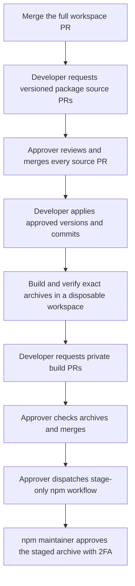

Use this workflow after a change has been reviewed and merged into the complete workspace. The developer requests review and prepares artifacts; the approver reviews them and dispatches staging; an npm maintainer gives final registry approval.

A **release request ID** is the common 24-character identifier for a batch of affected packages. A **PR number** belongs to one GitHub repository. A **commit SHA** identifies one revision, and a **SHA-256 archive hash** identifies the bytes in a tarball. Keep these values distinct when copying them into commands.

## Release flow

The [publishing map](./strategy/#publishing-map) places package releases alongside
template, Docs and independent website delivery. The sequence below expands its
package path.

Click the diagram to enlarge it. Use the viewer’s zoom controls and drag or arrow keys to inspect it.



## 1. Preview the version proposal

From the integration workspace:

```bash
dev npm publish fix --package=@cloudigniter/core --dry-run --json
```

`fix` proposes a patch version. `--package` selects Core; repeat it to request several packages. `--dry-run` calculates the proposal without writing local or remote files, building, logging into GitHub or uploading to npm. `--json` prints structured output so you can inspect versions and destinations.

Changesets calculates dependency propagation and includes existing pending changes. Review the complete resulting package list, not just the package explicitly selected.

| Intent or option | Meaning |
| --- | --- |
| `fix` / `patch` | Patch version change. |
| `feature` / `minor` | Minor version change. |
| `breaking` | Minor before version 1.0, major afterward. |
| `major` | Explicit major version change. |
| `initial` | Propose 0.1.0 only for a package currently below 0.1.0. |
| `--changed` | Use pending Changesets; omit intent and `--package`. It does not mean uncommitted Git changes. |
| `--preid=beta` | Enter a Changesets prerelease cycle; supported IDs include alpha, beta and rc. |
| `--tag=beta` | Assert an allowed npm channel. Prereleases cannot use latest. |
| `--access=restricted` | Assert the access already required by policy; this cannot override it. |

[`dev npm plan`](/commands/dev/npm-plan) is the dedicated offline planning command. Its manual defines proposal options and versioning behavior; the [release workflow](/company-developers/tooling/release-requests) connects planning to source and artifact review.

## 2. Request review of versioned source

Commit intended changes and start from clean integration `main`:

```bash
dev npm publish fix --package=@cloudigniter/core \
  --summary="Correct request context handling" --profile=developer
```

The summary becomes release/changelog text. The selected profile must be an authorized requester. This command opens source-review PRs; despite the `publish` name it performs **no npm upload** and leaves local versions unchanged.

The toolkit calculates concrete manifests and changelogs in a temporary Changesets workspace. Each affected source repository receives tracked package files at its root, versioned metadata, a managed-file inventory and the common request ID. Generated output, local environment files and repository governance are excluded. Existing managed files can be updated; stale files are deleted only when the previous inventory says the toolkit owned them.

Each new commit uses the destination repository’s history. It does not join the backup or full monorepo history into package repositories.

```bash
dev npm status 123 --package=@cloudigniter/core --profile=developer
```

Replace `123` with Core’s source PR number. The package flag selects its source repository. Status tells you whether that request is open, closed or merged; it does not prove build approval or npm publication.

## 3. Approve the whole source batch

Finish creating or recovering all source PRs before merging any of them. A batch spanning repositories cannot be merged atomically. The approver reviews each package’s code, versions, changelog, dependency changes and recorded inventory.

Use the [PR inspection and approval commands](./github-commands#inspect-and-manage-pull-requests), selecting each package’s source project. Every request must be merged into the expected base with a configured different account’s approval attached to its exact head commit. Missing, stale or dismissed approval prevents version/candidate operations.

## 4. Apply approved versions

Copy the common release request ID into these commands, replacing `RELEASE_ID`:

```bash
dev npm version --request=RELEASE_ID --profile=developer --dry-run
dev npm version --request=RELEASE_ID --profile=developer
```

The preview reads GitHub approvals and recomputes the recorded proposal without changing local files. The second command applies the approved Changesets version/changelog changes and updates the lockfile locally. Review the result and commit it through the workspace’s normal protected-branch process before building.

These commands require a clean configured integration base; resolve unrelated working-tree changes first. If source changed after approval, request a new review instead of editing the stored release records.

## 5. Build verified candidate archives

Use a clean disposable copy of the complete integration commit, on its configured base branch, with dependencies available:

```bash
dev npm candidate --request=RELEASE_ID --profile=developer --output=../npm-candidate
```

The new external output directory receives archives and `manifest.json`. The command verifies source approvals and compares package files with the approved inventories before building dependencies, running package-owned gates and packing output. The manifest records the integration commit and each archive’s SHA-256.

Use a disposable workspace because build workers can modify distribution manifests or template aliases. Next’s release path must use its `release:check` archive and checksum. An ordinary successful build does not replace that validation.

## 6. Request review of the archives

From the same integration commit:

```bash
dev npm deliver --manifest=../npm-candidate/manifest.json --profile=developer --dry-run
dev npm deliver --manifest=../npm-candidate/manifest.json --profile=developer
```

The preview reads source approvals and validates manifest identity, package metadata, policy and archive hashes, but writes nothing. The second command uploads the exact archives into PRs in the matching private build repositories. It still performs no npm upload.

Each build PR contains `releases/<version>/package.tgz` and `manifest.json`. The approver inspects the validation evidence and archive hash, checks the packed package contents, and merges the PR. Version directories are immutable; an existing delivered version cannot be overwritten.

## 7. Stage the merged archive

As the approver, open **Actions → Stage approved package → Run workflow** in that package’s build repository. Select protected `main` and enter the exact merged version directory, such as `0.1.1`.

The generated [workflow and verifier](./generated-files) check the context and files, then submit the tarball to native npm staging. Inspect the `npm-staging-result` artifact and logs. A successful staging run means the candidate awaits npm approval; it is not yet the final publication.

## 8. Complete npm approval

Final npm approval uses npm’s own interactive authentication and 2FA. The current toolkit does not wrap these maintainer operations:

```bash
npm whoami
npm stage list @cloudigniter/core
npm stage view STAGE_ID
npm stage download STAGE_ID
```

`whoami` verifies the npm account, which must have package write access. `stage list` finds pending Core candidates. Replace `STAGE_ID` with the selected npm staging ID. `stage view` displays its metadata; `stage download` retrieves the tarball for inspection. Compare its SHA-256 with the approved build manifest and verify its contents.

```bash
npm stage approve STAGE_ID
```

This is the final publishing action and requires interactive 2FA. Approve dependencies before dependants. If review fails, discard the candidate instead:

```bash
npm stage reject STAGE_ID
```

Reject removes that staged candidate from consideration; it does not publish a replacement. Confirm every expected version is available before announcing the batch. See [npm staging commands](https://docs.npmjs.com/cli/v11/commands/npm-stage) and [the staging lifecycle](https://docs.npmjs.com/staged-publishing/).

## Recovery

Source/build requests use deterministic branch names. An unchanged retry can recover an unfinished PR or reviewer assignment. Edited request branches are never overwritten. If a batch stopped halfway, inspect every reported repository and PR before retrying; already merged bases or version directories can require a new request.

The old single-repository `dev npm stage` route remains for legacy policies. Active `topology: "paired"` publication uses generated workflows in individual build repositories. Do not activate the root legacy workflow to bypass that setup.
