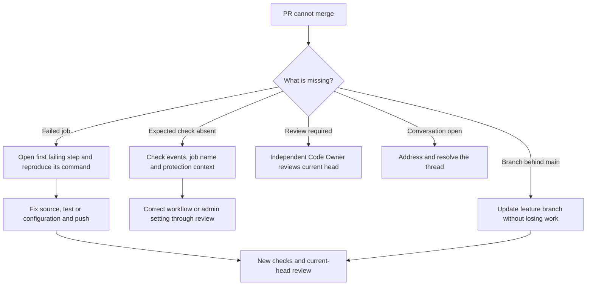

CloudIgniter validates the integrated workspace on every PR and every push to `main`. Its four quality workflows cover all active platform packages, the company toolkit, shared TypeScript presets, the reference templates and Docs. Archived future-package folders are outside the active pnpm workspace. Each independent website runs source checks and artifact builds in its own source repository; its build repository owns AWS deployment.

## Understand the coverage

| Workflow | Jobs | Validation |
| --- | --- | --- |
| `dev-quality.yml` | DEV on Node 22 and 24 | Toolkit checks, behavior tests and package inventory; Node 24 additionally exports/checks the public template and retains the toolkit archive. |
| `next-quality.yml` | Next tests on Node 22 and 24; one build job | Full Next quality gate, test typing, per-file coverage policy, production build, archive validation and a publish-request report with a checksum. |
| `packages-quality.yml` | Six targets on Node 22 and 24 | Existing Core, AWS, UI, EmberGuard and CLI checks/tests and inventory checks; Config TS validates every exported preset and its inclusion in npm files. Node 24 builds runtime packages, packs all six targets and verifies their advertised archive entries. |
| `workspace-quality.yml` | Template on Node 22 and 24; Docs | Full workspace typecheck, template tests; Node 24 builds the template including optional-module and form generation. Docs validates metadata, linking/search behavior, types and production output. Website checks are separate and are not required monorepo jobs. |

Next's strict coverage rollout remains package-specific. Running other packages' existing tests does not give them Next's coverage thresholds or identical archive checks. Raise those gates deliberately as each package's release contract evolves.

The template check works in a fresh clone. `scripts/ci/prepare-template.mjs` creates ignored placeholder Amplify outputs only when none exist; it preserves existing local outputs. `amplify/env.d.ts` describes the provider-generated function environment for typechecking. Neither supplies real credentials or deploys a backend. User-profile schema tests transform the maintained schema offline rather than reading a developer's deployed model snapshot.

The template integration job runs the root `pnpm typecheck` command on both Node versions. Turbo schedules the toolkit typecheck independently: packages use DEV as a build tool while Publisher consumes UI, so recursive prerequisite scheduling would create a task cycle. The toolkit check is uncached and still runs; no typecheck is skipped.

The workspace pins one `@types/react` version through `pnpm-workspace.yaml` and declares it at the root so shared library declarations can resolve it consistently. Shared React declarations must use one type identity across package and guide dependencies; mixed versions can produce non-portable inferred declaration errors that depend on the installation layout. Review the override and lockfile together when updating React types.

The frozen lockfile prevents unreviewed dependency resolution during CI. All checks use explicit build/test steps after installation with lifecycle scripts disabled. Quality jobs have read-only repository permissions and perform no npm publication or AWS deployment. Node 24 package archives, Next review evidence, the DEV template export and both website outputs are retained for 14 days. Docs builds both public and protected editions and tests the server authorization adapter. Docs and template builds are validation outputs, with no production deployment in these jobs.

## Select actual required job names

Run the quality workflows in the company repository first, confirm each job succeeds, and select the names GitHub actually reports. The expected **22 required checks** are:

| Area | Exact display names |
| --- | --- |
| DEV | `Dev toolkit (Node 22)`; `Dev toolkit (Node 24)` |
| Next | `Next tests (Node 22)`; `Next tests (Node 24)`; `Next build and publish request` |
| AWS | `Package aws (Node 22)`; `Package aws (Node 24)` |
| CLI | `Package cli (Node 22)`; `Package cli (Node 24)` |
| Config TS | `Package config-ts (Node 22)`; `Package config-ts (Node 24)` |
| Core | `Package core (Node 22)`; `Package core (Node 24)` |
| EmberGuard | `Package emberguard (Node 22)`; `Package emberguard (Node 24)` |
| UI | `Package ui (Node 22)`; `Package ui (Node 24)` |
| Template | `Template integration (Node 22)`; `Template integration (Node 24)` |
| Docs | `Developer guide` |

Do not require a workflow title such as `Platform packages quality`; require its job checks. When GitHub offers a source selector, bind the check to GitHub Actions. Keep names unique across workflows. Renaming a job requires updating the protection setting too.

The root `npm-stage.yml` is a legacy manually dispatched publication route, disabled by the active paired topology. It is not a quality check and should not be required for a feature PR. The normal staging workflows belong in package build repositories.

## Establish an initially empty company repository

An empty repository needs a base branch before an import PR can exist. An administrator establishes a minimal `main` containing ownership governance, pushes the reviewed full-workspace import to a feature branch and opens an initial PR. That PR runs the quality workflows defined in its proposed tree. This one-time bootstrap does not publish packages.

Verify all job results and configure protection before merging the import. The base branch's `CODEOWNERS` must already assign an eligible independent approver. After approval and merge, developers clone the company repository or explicitly migrate their remotes/history. Keep the personal backup separate; switching a remote does not reconcile unrelated histories automatically.

## Configure protected main in GitHub

An administrator with access to a supporting GitHub plan performs this setup in **`cloudigniter-io/cloudigniter`**, not the personal backup:

1. Open **Settings → Branches**, add a branch protection rule and target the exact branch `main`. A ruleset can enforce equivalent controls, but avoid overlapping rules whose combined effect is unclear.
2. Enable **Require a pull request before merging** and require at least **one approval**. Enable Code Owner reviews, dismissal of stale approvals when new commits are pushed, and approval of the most recent reviewable push by someone other than its pusher.
3. Enable **Require status checks to pass before merging**. Add the successful checks listed above using GitHub's actual names. Enable **Require branches to be up to date before merging** so checks cover the current base.
4. Enable **Require conversation resolution before merging**.
5. Apply the requirements to administrators as well. Leave force pushes and deletions disabled; do not grant ordinary developers a bypass.
6. Save and inspect the effective rule. Confirm `jodaris` has write access and `CODEOWNERS` on `main` assigns all files. Test with a normal developer-authored PR: successful checks alone must leave it waiting for independent approval.

GitHub's [protected-branch reference](https://docs.github.com/en/repositories/configuring-branches-and-merges-in-your-repository/managing-protected-branches/about-protected-branches) explains the requirements and plan availability. [Code Owners](https://docs.github.com/en/repositories/managing-your-repositorys-settings-and-features/customizing-your-repository/about-code-owners) explains base-branch ownership and reviewer eligibility. Local YAML and policy files do not establish remote enforcement; record the actual settings and verification evidence in the internal setup issue.

## Diagnose a blocked PR

A rerun can resolve a transient runner or network failure. It cannot fix a deterministic type error in an unchanged commit. GitHub's [rerun guide](https://docs.github.com/en/actions/how-tos/manage-workflow-runs/re-run-workflows-and-jobs) explains the available actions. Preserve the failed evidence and correct the cause; do not weaken coverage, skip tests or remove a required check merely to merge.

## Post-merge source synchronization

After protected `main` receives an approved PR, [Automatic source mirroring](./source-mirroring) verifies the merged commit and the configured push quality workflows before updating private sources. The workflow requires the company App setup. It runs independently of the developer browser and personal GitHub profile. Build repositories and npm publication keep their release approval gates.
