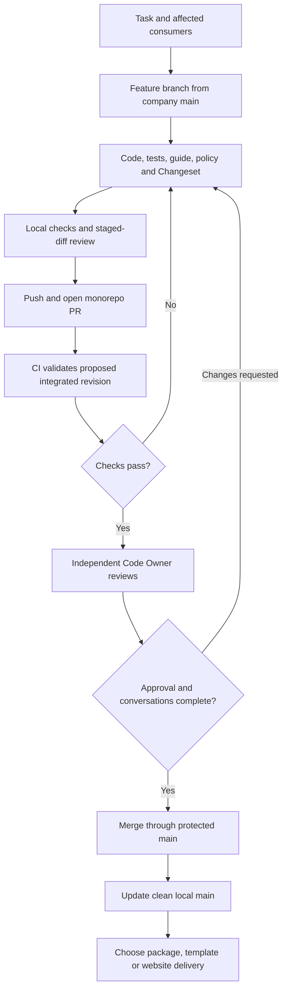

Use the complete private company workspace for a task. Standalone package source repositories are release snapshots; they do not contain the shared lockfile, all consumers, publishing policy and integration configuration needed for this workflow. Clone `cloudigniter-io/cloudigniter`, install its pinned dependencies, and start a feature branch from current `main`.

## Plan the complete change

Suppose a task adds a feature in `apps/template`, needs a public contract in Core, a provider implementation in AWS and a new guide page. The feature belongs in one monorepo PR. A reviewer can follow its contract through the implementation to the application and documentation without reconciling several unrelated package PRs.

Determine ownership before coding. Core owns provider-independent public contracts; EmberGuard owns its internal capability; Next owns framework integration; AWS owns provider behavior; UI owns shared components. The template composes those pieces. Consult `AGENTS.md` and the [development skill](/skills/agents/skills/cloudigniter-development/SKILL) for the complete rules.

For each affected package, add meaningful behavioral tests and run its checks. Next additionally enforces its package-local coverage policy and distribution validation. Include the application consumer when a contract crosses packages. Update the relevant guide and skill references in the same change. A successful package typecheck alone does not prove that the application still integrates correctly.

## Prepare a reviewable PR

1. Keep related source, tests, configuration, Docs and skills together. Do not include local deployment outputs, secrets, caches or generated distribution folders.
2. Add a Changeset when an npm package needs a release. Select the affected package and the appropriate semantic-version impact. Documentation-only changes do not require an npm release; internal package behavior can still require a bump.
3. Run the applicable package checks, full template typecheck, integration checks and guide validation. Record the commands and meaningful results in the PR description.
4. Review `git diff` and the staging area before committing. The repository's `.gitignore` helps exclude local files, but does not remove an unwanted file already tracked by Git.
5. Commit and push the feature branch to **the company repository**. Confirm the remote destination rather than assuming your backup remote is the company workspace.
6. Open one PR against `main`, explain the observable behavior, package ownership, compatibility and release sequence, then inspect its actual CI results.

The [monorepo PR manual](../monorepo-pull-requests) gives the GitHub and DEV operations. [Publisher](/company-developers/tooling/dev/publisher) can run package actions and expose configured identities and destinations; Git still owns local branching and commits.

## Review the current revision

The approver evaluates the behavior, dependency direction, public API, tests, guide and distribution impact. CI is evidence supporting this judgment. The reviewer must be independent of the PR author; using another account owned by the same person separates credentials but does not create independent human review.

An approval belongs to a particular revision. Push corrections to the same feature branch; CI starts again and stale approvals are dismissed by the configured branch rule. Resolve conversations after addressing them. The reviewer inspects the updated diff and approves the new head. DEV's review and merge operations also require an explicit current head SHA to reject a changed target.

GitHub's [review documentation](https://docs.github.com/en/pull-requests/reference/pull-request-reviews) explains approvals and requested changes. The [protection reference](./ci-and-protection) explains the controls the administrator must enable. A PR being open or CI being green does not by itself authorize a merge.

## Decide what needs delivery after merge

| Approved change | Next decision |
| --- | --- |
| Core/AWS/Next capability plus template usage | Release affected package versions and propagated dependencies, then export a template using available registry versions. |
| Shared UI component | Release UI and any consumers needing a dependency update; validate the template. |
| Template-only composition | Export and request approval for the template; no npm upload is needed for the application itself. |
| Docs-only content | Build the intended guide audience and submit reviewed website output for deployment. |
| CI or skill maintenance | No customer delivery is required unless an actual package or website output changed. |

One approved feature does not need to publish every package. Conversely, a dependency version change may require releasing an otherwise unchanged consumer. Changesets determines the planned package/version set; integration CI checks the complete workspace. Keep those two sets distinct.

After merge, update local `main` and use a clean committed integration checkout for release preparation. The current release tools verify paired source/build approvals, but do not automatically attest that a source commit came from an approved monorepo PR. Protecting company `main` and retaining the monorepo PR link are therefore essential parts of the current process. Continue with [release and delivery](./release-and-delivery).

## Post-merge source synchronization

After protected `main` receives an approved PR, [Automatic source mirroring](./source-mirroring) verifies the merged commit and the configured push quality workflows before updating private sources. The workflow requires the company App setup. It runs independently of the developer browser and personal GitHub profile. Build repositories and npm publication keep their release approval gates.
