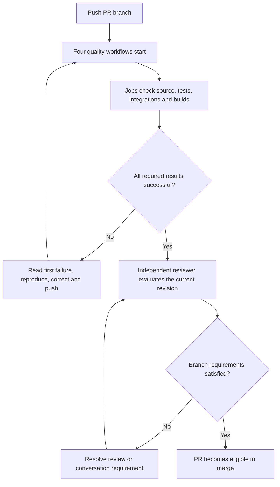

GitHub Actions executes CloudIgniter's automated checks on GitHub-hosted machines. You define that work in committed YAML files under `.github/workflows/`. Actions runs those definitions when an event matches; GitHub then shows their results beside the PR. Read GitHub's [Actions introduction](https://docs.github.com/en/actions/get-started/understand-github-actions) alongside the CloudIgniter examples below.

## Read a workflow from the outside inward

| Concept | CloudIgniter example | What you need to understand |
| --- | --- | --- |
| Workflow | `.github/workflows/packages-quality.yml` | One named automation definition. |
| Event | `pull_request` | Opening or updating a PR starts checks of its proposed change. |
| Job | `check` | A group of steps with one result, executed on its own runner. |
| Runner | `ubuntu-latest` | A fresh Linux machine; it does not have your local configuration. |
| Step | `pnpm --filter @cloudigniter/core test` | One operation inside a job. A failure normally stops later steps. |
| Action | `actions/checkout@v4` | Reusable automation selected with `uses`; this one retrieves source. |
| Matrix | Packages combined with Node 22 and 24 | Creates a separate job for each supported combination. |
| Artifact | A packed `.tgz` uploaded by a build job | Retained output for review; it does not publish to npm. |

The package matrix creates `Package core (Node 22)` and `Package core (Node 24)`, and corresponding jobs for AWS, UI, EmberGuard, CLI and Config TS. `name` controls the display name selected in branch protection; the YAML job key `check` is its internal identifier.

`run` executes a command in the runner's shell. `uses` invokes an action. `needs` declares another job that must complete successfully first. In `next-quality.yml`, Next's build-and-pack job waits for both Next test jobs. Other workflow files run independently. The [workflow syntax reference](https://docs.github.com/en/actions/reference/workflows-and-actions/workflow-syntax) documents these fields.

## Understand when checks start

The four quality workflows respond to every PR, pushes to `main`, and manual dispatch. They intentionally have no path filter: required checks must report for every PR, including documentation changes. A commit on your laptop does not start Actions. Pushing an open PR's branch starts a new run; pushing protected `main` after an eligible merge validates the resulting integrated commit.

GitHub's [event reference](https://docs.github.com/en/actions/reference/workflows-and-actions/events-that-trigger-workflows) explains the event rules. Manual dispatch is available once a workflow exists on the default branch; it is useful for diagnosis, but does not replace the PR's required checks. See [manual workflow runs](https://docs.github.com/en/actions/how-tos/manage-workflow-runs/manually-run-a-workflow).

Each runner installs the pinned pnpm version and the frozen workspace lockfile. Installation uses `--ignore-scripts`, so checking source does not download DEV's managed GitHub CLI or execute dependency lifecycle hooks. Build and test commands are explicit subsequent steps. The template receives non-deployable placeholder Amplify outputs when no local outputs exist; CI does not need an AWS sandbox, npm write token or production credentials.

## Follow a result to its evidence

Open the PR's **Checks** tab, select a job, and expand the first failed step. Its log contains the actual command, exit result and diagnostic. The repository's **Actions** tab groups runs by workflow and shows the branch and commit. Always compare that commit with the PR's current head: a green run for an earlier revision does not validate a later edit.

Logs and downloadable archives are different evidence. Logs explain what ran; artifacts preserve selected outputs such as Next's publish-request report and package archive. Quality artifacts expire after 14 days, so they are temporary review evidence. The release process later stores immutable approved archives in build repositories. Use GitHub's guides to [view run history](https://docs.github.com/en/actions/how-tos/monitor-workflows/view-workflow-run-history) and [download artifacts](https://docs.github.com/en/actions/how-tos/manage-workflow-runs/download-workflow-artifacts).

## Understand what enforces the merge

Workflows calculate results. `CODEOWNERS` identifies responsible reviewers. Repository branch protection requires successful named checks, approval and resolved conversations before merge. These are separate pieces: committing a workflow or an ownership file does not enable a branch rule.

CloudIgniter's `CODEOWNERS` assigns all maintained files to `@jodaris`, including template code, Docs and skills. GitHub uses the ownership file from the PR's base branch. The account must have write access, and branch protection must require Code Owner review. See [Code Owners](https://docs.github.com/en/repositories/managing-your-repositorys-settings-and-features/customizing-your-repository/about-code-owners), [PR reviews](https://docs.github.com/en/pull-requests/reference/pull-request-reviews) and the next page's [contributor workflow](./development-and-review).

## Post-merge source synchronization

After protected `main` receives an approved PR, [Automatic source mirroring](./source-mirroring) verifies the merged commit and the configured push quality workflows before updating private sources. The workflow requires the company App setup. It runs independently of the developer browser and personal GitHub profile. Build repositories and npm publication keep their release approval gates.
