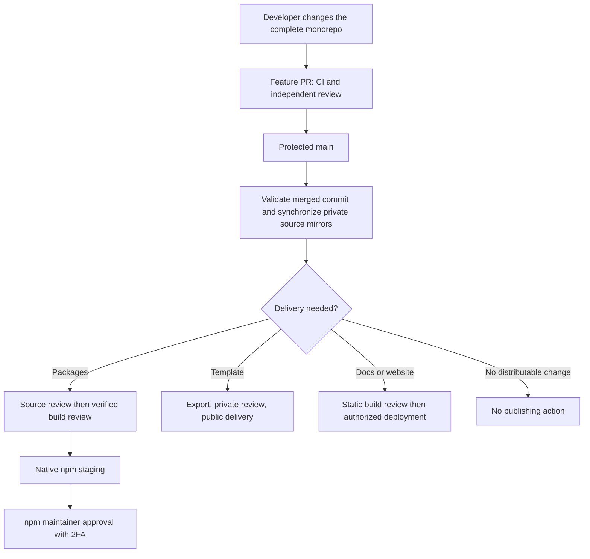

CloudIgniter development starts in the complete private **`cloudigniter-io/cloudigniter` monorepo**. A task may require changes to the application template, several packages and Docs. Keep those changes together so another developer can review the complete feature and CI can check its consumers. Company access to this private workspace is an onboarding prerequisite.

This reading path explains the publishing system before you learn its command syntax or use [Publisher](/company-developers/tooling/dev/publisher). Git manages branches and commits; GitHub hosts review and CI; the [Developer Toolkit](/company-developers/tooling/dev-toolkit) prepares release requests and verified artifacts. Publisher is a local interface to that toolkit. Closing its browser or server does not cancel a GitHub PR or an Actions run.

## Follow the learning path

1. [GitHub Actions and review](./github-actions): learn what workflows, jobs, checks and branch rules do.
2. [Develop and review an integrated change](./development-and-review): follow a task from a feature branch to protected `main`.
3. [Automatic source mirroring](./source-mirroring): understand the post-merge source update, App setup, receipts and recovery.
4. [Release and deliver reviewed work](./release-and-delivery): distinguish source synchronization, release review, build review, npm staging and website delivery.
5. [CI coverage and branch protection](./ci-and-protection): use the actual checks, inspect failures and configure enforcement.

Then follow the operational pages for [account setup](../github-setup), [package releases](../release-packages), [template delivery](../template) or [website delivery](../websites). The [delivery roadmap](../approved-delivery) separates implemented source mirroring from later release and staging automation.

## Know which repository does what

| Location | Purpose | What reaching `main` means |
| --- | --- | --- |
| `cloudigniter-io/cloudigniter` | Integrated source, tests, Docs, skills, policies and shared lockfile | The complete change has passed workspace review and required checks. |
| Package source repository, such as `cloudigniter-io/cloudigniter-core` | Managed downstream package source | The mirrored snapshot is tied to approved monorepo source; release approval remains separate. |
| Package build repository, such as `cloudigniter-io/build-cloudigniter-core` | Immutable npm archives and their manifests | The exact distribution files have completed build review; they are eligible for staging. |
| Template request and public template repositories | Private approval evidence and the public exported application | Approved template files can be delivered without exposing private monorepo history. |
| Website source/build repositories | Website source and reviewed static output | A reviewed build is eligible for an authorized deployment. |

The [repository inventory](../repositories) gives every destination. `.cloudigniter/repositories.json` determines source/build routing; a local backup remote does not select a publishing destination.

## Keep the approvals distinct

The configured developer account is `Shadi-Ayoub`; `jodaris` is the configured approver. The organization `cloudigniter-io` owns repositories and cannot be selected as a personal login. The GitHub account, npm account and AWS identity are separate. Verify the appropriate identity and destination before each request.

A successful CI job provides evidence about a commit. An independent review evaluates the change. A merge records that the repository's requirements were met. Native npm staging creates a candidate awaiting the npm maintainer's final approval. Each step has a different purpose; none implies that a package is already available on npm.

Approved monorepo merges trigger **automatic source mirroring** once the company App is configured. Current releases still use explicit **paired source/build review**. Generated release PRs and automatic staging coordination remain later phases; source synchronization does not authorize publication.
