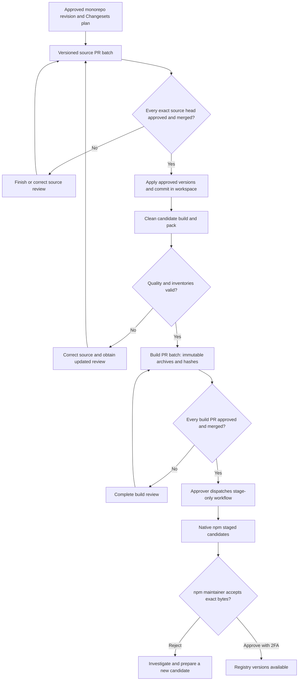
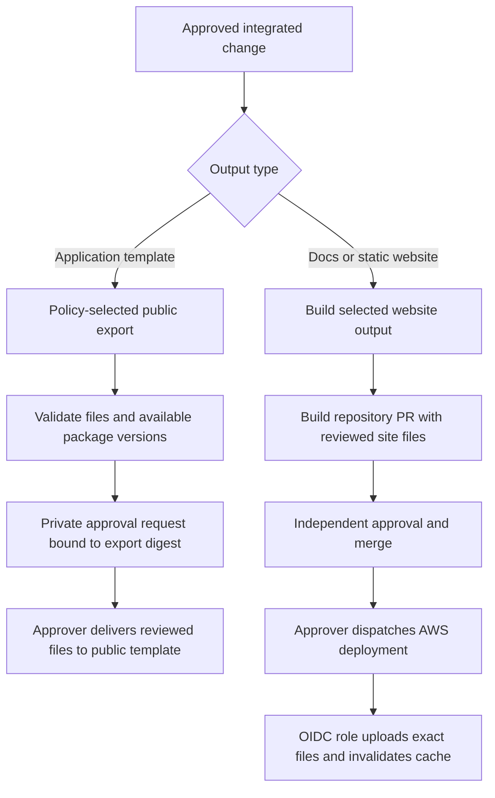

Start release preparation from an approved, committed integration revision. An approved monorepo merge triggers [private source synchronization](./source-mirroring) after merged-commit quality passes, using the configured company App. Release preparation still coordinates explicit requests and verifies separate source/build approvals. A source update does not stage npm packages or deploy a website.

## Packages: follow the paired review process

Each npm package has a private source repository and a private build repository. Product packages publish publicly under `@cloudigniter/`; the company toolkit `@cloudigniter/dev` has restricted npm access. Repository privacy and npm access are separate choices.

| Phase | Developer or approver action | Evidence and result |
| --- | --- | --- |
| Propose versions | Developer prepares a Changesets release plan and requests publication. | A common release request ID links versioned source PRs. Requesting leaves local versions unchanged and uploads nothing to npm. |
| Approve source | Approver reviews and merges every source PR in the batch. | The toolkit verifies an independent configured approval of each exact head and its recorded source inventory. |
| Apply versions | Developer applies the approved version plan locally and commits version/lockfile changes through the workspace review process. | The committed integration checkout matches the approved package snapshots. |
| Build candidates | Developer uses a clean disposable integration checkout to build dependencies and pack candidates. | Quality gates, manifests, integration commit and SHA-256 hashes identify exact archives. Next uses its release-check verified archive. |
| Request build review | Developer delivers verified candidates to private build PRs. | Each PR contains `releases/<version>/package.tgz` and `manifest.json`. |
| Approve builds | Approver inspects and merges every build PR. | Reviewed version directories are immutable distribution evidence. |
| Stage | Approver manually dispatches the package build repository's generated staging workflow. | The verifier checks policy, actors, repository, branch, archive metadata and hash, then submits those bytes to native npm staging. |
| Publish | npm maintainer inspects the staged candidate and approves with interactive npm 2FA. | The package becomes available only after this final registry approval succeeds. |

Use the [package release manual](../release-packages) for the operations. The separate [npm setup](../npm-setup) page covers the `cloudigniter` organization, teams, first publication and package-scoped trusted publishers.

GitHub OIDC identifies the permitted staging workflow to npm; it does not replace npm maintainer approval. An npm `staging` dist-tag would already expose a published package, whereas native staging retains an unpublished candidate. Read npm's [staging lifecycle](https://docs.npmjs.com/staged-publishing/) and [stage command reference](https://docs.npmjs.com/cli/v11/commands/npm-stage).

## Handle partial batches and changed evidence

Source PRs, build PRs and npm approvals across several repositories are not one transaction. Finish creating the complete source batch before merging it, verify all source approvals before building, and complete the complete build review before staging. Publish required dependency versions before dependent packages. Confirm every expected registry version before announcing the release or exporting a template that requires it.

Retain the monorepo PR and commit, release request ID, source/build PR links, CI run, candidate manifests and staging result. If the source changes, obtain new review and build a new candidate. If bytes change, the SHA-256 changes; a prior archive approval cannot authorize the replacement. Never overwrite a merged version directory.

For a failed or uncertain remote operation, inspect its recorded result and the actual GitHub/npm state before retrying. Recovery must not overwrite an edited branch or an already delivered version. A red CI result, missing approval, wrong account or mismatched hash is a reason to correct the evidence, not to skip a gate.

## Template and website delivery use different outputs

The [template export policy](../template) selects explicitly managed files and registry dependency versions. Delivery preserves public-only Git history and repository governance. The application template is not an npm package, and a GitHub template update does not create an npm release.

[Website delivery](../websites) stages reviewed static output in `site/`. Docs builds with its guide command; JODARIS stages its static website with its own script. The generated AWS workflow uploads reviewed files using an explicitly configured S3/CloudFront role. It does not rebuild with production credentials or provision hosting resources. A Next.js server build is not automatically static website output.

The current full guide includes company documentation and rendered internal skills. Audience labels are not access control. Define and verify the intended public or internal edition before deploying it; the public/developer edition separation remains a later phase.

## Future automation

The [source-mirroring workflow](./source-mirroring) makes an approved monorepo merge authorize private source updates after merged-commit quality passes. It requires the configured company App. A generated release PR will establish versions; its approved merged commit will produce verified artifacts for build repositories and stage-only npm delivery. Final npm approval remains with the maintainer.

Source approval verification, drift checks, scoped App token use, mirror receipts and synchronization recovery are implemented. The release coordinator still needs dependency ordering, immutable artifact delivery, automated staging authorization and their remote setup. The current tools continue requiring their paired source/build approvals. Consult [approved monorepo delivery](../approved-delivery) for the design and migration sequence; do not treat the design as an active workflow.
