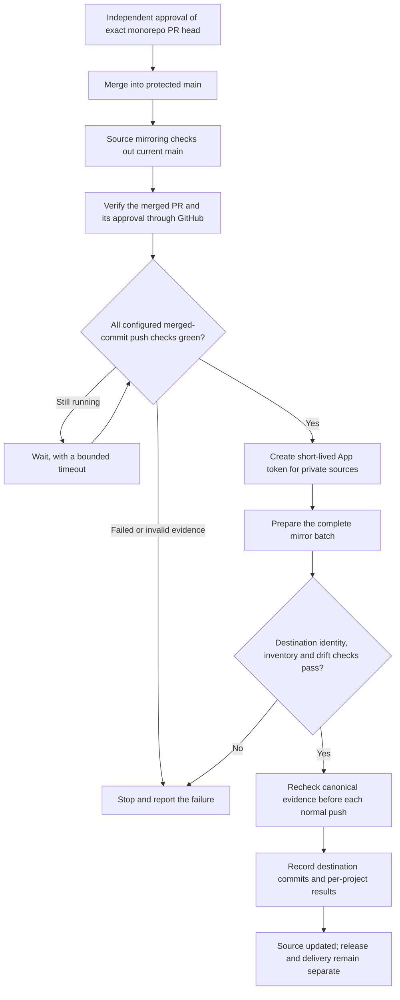
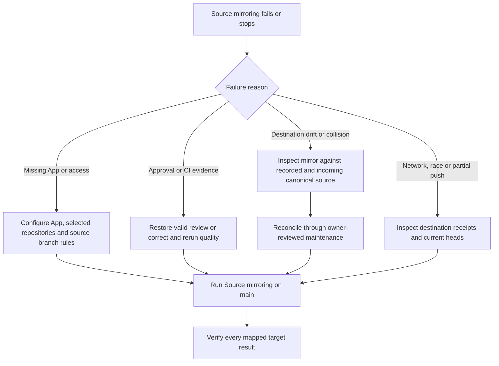

After an independently approved PR merges into `cloudigniter-io/cloudigniter/main`, **Source mirroring** waits for the merged commit's quality workflows and synchronizes the configured private source repositories. Developers continue working in the complete monorepo. A normal feature merge can update source mirrors without creating an npm version.

The workflow and shared DEV service are implemented. An organization owner must complete the [App setup](#configure-the-company-app) before the first remote synchronization. Missing configuration produces an explicit failed setup step; it does not report that repositories were updated. Build-repository delivery, npm staging and public-template delivery keep their existing approval steps.

## What runs after a merge

`.github/workflows/source-mirror.yml` runs on pushes to `main` and supports manual recovery on `main`. It does not run on a PR branch. Its checkout has no persisted Git credential, and its Node entry point runs without a package-manager install, build or lifecycle hook. The App token is created only after verification and is restricted to the selected private source repositories. GitHub explains the [push and manual workflow events](https://docs.github.com/en/actions/reference/workflows-and-actions/events-that-trigger-workflows).

Verification uses live GitHub evidence: the canonical private repository and protected base, a merged PR whose merge commit is the current `main`, and a configured individual review of that PR's exact head from someone other than its author. It also verifies every configured check and the corresponding successful `push` workflow run on the merged SHA. A successful feature-branch check or an approval claim inside a JSON file is insufficient.

The reviewed head and merged commit are recorded separately, so squash merges work. Source approval uses the individuals in `.cloudigniter/release-policy.json` under `reviewers`. The required merged-commit jobs and workflow paths are in `.cloudigniter/source-mirroring.json`; keep them aligned with the [CI coverage reference](./ci-and-protection) when quality jobs change. See GitHub's [commit-associated PR API](https://docs.github.com/en/rest/commits/commits#list-pull-requests-associated-with-a-commit) and [PR review API](https://docs.github.com/en/rest/pulls/reviews).

## Which repositories receive source

`.cloudigniter/repositories.json` supplies each project root and its `sourceRepository`. Seven npm package roots, Docs, the private template source and JODARIS are currently mapped. The mapping for the future CloudIgniter Website has a null source path, so it receives no synchronization. Shared Config TS remains in the monorepo until a separate source destination is explicitly mapped.

| Monorepo source       | Private mirror                                    |
| --------------------- | ------------------------------------------------- |
| `packages/aws`        | `cloudigniter-io/cloudigniter-aws`                |
| `packages/cli`        | `cloudigniter-io/cloudigniter-cli`                |
| `packages/core`       | `cloudigniter-io/cloudigniter-core`               |
| `packages/dev`        | `cloudigniter-io/cloudigniter-dev`                |
| `packages/emberguard` | `cloudigniter-io/cloudigniter-emberguard`         |
| `packages/next`       | `cloudigniter-io/cloudigniter-next`               |
| `packages/ui`         | `cloudigniter-io/cloudigniter-ui`                 |
| `docs`                | `cloudigniter-io/cloudigniter-docs`               |
| `apps/template`       | `cloudigniter-io/source-cloudigniter-next-aws-v1` |
| `apps/jodaris`        | `cloudigniter-io/jodaris-website`                 |

Files appear at the mirror root: `packages/core/src/...` becomes `src/...` in `cloudigniter-core`. Only committed Git objects from the verified canonical SHA are eligible. Dirty local files and newly generated outputs cannot enter the synchronization. Regular files retain their binary content and executable mode; symlinks and submodules are rejected.

Environment files, npm credentials, deployment outputs, build/cache directories, macOS metadata and project-local repository governance are excluded. Maintained application files such as `*.generated.ts` remain source. The monorepo's private history is never attached as a destination parent, and the workflow does not touch any `build-cloudigniter-*` repository or the public `cloudigniter-next-aws-v1` export.

Source mirrors retain workspace dependency ranges and shared configuration references. They provide downstream source history; the full monorepo remains the build workspace. Docs uses shared skills and date metadata from that workspace, so its mirrored root alone is not a standalone maintainer-guide build.

## Configure the company App

The ordinary `GITHUB_TOKEN` can access its own repository. Cross-repository writes use a dedicated organization-owned GitHub App with a short-lived installation token. Follow GitHub's [Actions App authentication guide](https://docs.github.com/en/apps/creating-github-apps/authenticating-with-a-github-app/making-authenticated-api-requests-with-a-github-app-in-a-github-actions-workflow).

1. As an organization owner, open `cloudigniter-io` **Settings → Developer settings → GitHub Apps → New GitHub App**. Use a distinct name such as `cloudigniter-io-source-mirror`, set the homepage to the company monorepo, disable the active webhook and make installation available only to this account. No OAuth callback or webhook server is needed for this workflow. GitHub documents [App registration](https://docs.github.com/en/apps/creating-github-apps/registering-a-github-app/registering-a-github-app).
2. Grant repository **Contents: Read and write**. Metadata read access is implicit. Do not grant npm, organization administration, Actions write or Workflows write for this source-only phase. The monorepo's workflow token supplies its separate read-only approval and check access.
3. Install the App into `cloudigniter-io`, selecting exactly the ten private source repositories in the table. Omit build repositories, the public template, the backup and the monorepo itself. The workflow narrows each token to the destinations selected by the reviewed inventory. See [installing your App](https://docs.github.com/en/apps/using-github-apps/installing-your-own-github-app).
4. From the App settings, copy the **Client ID**. In `cloudigniter-io/cloudigniter` **Settings → Secrets and variables → Actions → Variables**, create `CLOUDIGNITER_SOURCE_MIRROR_APP_CLIENT_ID`. The Client ID and numeric App ID are different; the token action uses the Client ID.
5. Generate an App private key. In the monorepo's **Actions → Secrets**, create `CLOUDIGNITER_SOURCE_MIRROR_PRIVATE_KEY` with the entire PEM file, including its begin/end lines. Store it only as a secret; never commit it or paste it into a PR, issue or chat. See [private-key management](https://docs.github.com/en/apps/creating-github-apps/authenticating-with-a-github-app/managing-private-keys-for-github-apps).
6. Keep the monorepo's existing required checks and human Code Owner approval. Give the App permission to update **source mirror** `main` branches under their destination rules. These branches receive already approved source directly; another required human source PR or an unrelated required build check would block that normal push. Keep force pushes and deletion prohibited. If an update-restriction ruleset needs an App bypass, confine that exception to the source update rule; keep force/deletion rules separately enforced and give the App no monorepo bypass. Review GitHub's [repository rulesets](https://docs.github.com/en/repositories/configuring-branches-and-merges-in-your-repository/managing-rulesets/creating-rulesets-for-a-repository).
7. Merge the reviewed automation change. When the App is installed and configured, the workflow performs the initial synchronization automatically after quality passes. Keep this workflow enabled only on the canonical repository. To initialize later or recover a failure, open **Actions → Source mirroring → Run workflow**, select `main`, and inspect the resulting job.

Empty destinations are initialized with a normal root commit containing their reviewed files and receipt. For an existing destination, its default branch must be the configured `main`; its independent history is preserved. Existing unmanaged files that differ from incoming source block adoption instead of being overwritten. Prepare or reconcile such repositories through owner-reviewed maintenance before retrying.

The App credential is independent of Publisher's locally selected personal GitHub profile. Switching a developer profile does not change the CI writer. Rotating the key means updating the secret and retiring the old key in the App settings; no source configuration file should contain it.

## Receipts, retries and catch-up

Every updated mirror contains `.cloudigniter-mirror.json`. Its explicit `kind: "cloudigniter-source-mirror"` records the project, canonical repository and commit, reviewed head, merged PR, approving account, successful check/run links, managed file modes/blob identities and an inventory SHA-256. This receipt is synchronization evidence; it is not an npm release or a paired source/build approval.

Before a later update, DEV recomputes the previous inventory from the recorded canonical commit and requires that commit to be an ancestor of the new one. It compares destination files with that inventory. Only previously managed files can be deleted. Destination `.github` governance and other unmanaged files are preserved. Changes that already exactly match the newly reviewed canonical source can be reconciled, but conflicting edits stop the batch.

Preparation validates the whole configured batch before any push. Updates then use normal, non-force pushes whose parent is the observed destination base. A concurrent update can reject a push; it is reported as a partial operation. Completed destinations keep their receipts, and a retry can recognize an identical successful update without creating another commit. A lost connection after an accepted push is handled through the same destination receipt.

Runs are serialized with cancellation disabled. GitHub can replace a pending concurrency run with a newer one, so each run reads current `main` and compares complete target snapshots with their last successful receipt. It catches up intervening source changes instead of relying only on one event's file list. If `main` advances while a run is preparing or pushing, it stops further outdated writes; the queued run uses the newer approved commit. See [GitHub concurrency behavior](https://docs.github.com/en/actions/how-tos/write-workflows/choose-when-workflows-run/control-workflow-concurrency).

The job summary and `source-mirror-receipts-...` artifact show verification and per-project results. `updated` means a destination push succeeded; `unchanged` means its managed inventory already matches; `unmapped` means no source root/destination is selected. `blocked`, `failed` or `partial` requires inspection. `prepared` means a local candidate was prepared and has not been pushed. The report artifact is retained for 90 days; the receipt remains in the destination history.

## Recover a failure

Use the latest `main` for recovery. Do not dispatch an old SHA, remove the receipt, reset destination history or force-push to make a job green. A rollback is a reviewed revert PR in the monorepo followed by a new synchronization. Target removal or source-root renaming requires a deliberate inventory migration; removing a mapping never deletes a remote repository.

Existing paired release commands remain available. Their source PRs may change versions before those versions are applied to the monorepo. Such a difference is destination drift: bring the approved release versions into the monorepo through its normal reviewed PR before retrying mirroring. A mirror receipt cannot replace the release request's exact source/head approval or authorize an outstanding archive.

Automatic version PRs, CI release artifact delivery and App-authorized npm staging are the next [delivery-coordinator phases](../approved-delivery). A successful source synchronization alone does not update a build repository, publish npm packages, refresh the public template or deploy a website.
