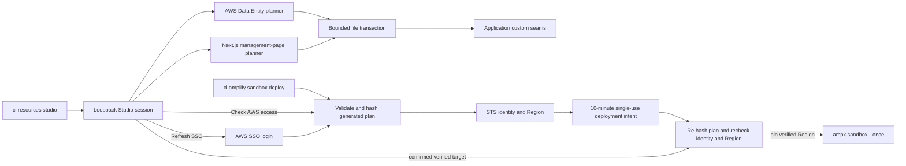

Resource Studio combines a local browser editor with application-owned resource
generation. The [Studio command manual](/commands/ci/resources-studio) covers
invocation, prerequisites and troubleshooting.

## Package ownership

The CLI owns loopback serving, session protection, subprocess policy and file
transactions. AWS Data Entity planning belongs to `packages/aws`, Next.js artifact
planning to `packages/next`, and reusable generated-manager UI to `packages/ui`.
Generated files remain in the application's custom seams. Local generation works
offline; cloud deployment is a separate, explicitly confirmed operation.

## Generation and deployment

The file transaction snapshots every target before applying a generated plan. A rollback first verifies all expected after-images and refuses the entire target-file restore when any path has drifted. AWS deployment is outside that transaction: reconciling a deployed sandbox after local rollback requires another explicit one-shot deploy, and DynamoDB record recovery requires an independent data-backup plan.

The deployment intent is held in memory, consumed once, and bound to the selected profile and identifier, STS account/caller identity, resolved Region, and hash of the exact generated file plan. The Studio shows the verified account, caller ARN, Region, profile, and identifier in its confirmation. At the mutation boundary, the runtime recomputes the plan hash, repeats STS and Region resolution, rejects drift or expiry, and supplies the verified Region as both `AWS_REGION` and `AWS_DEFAULT_REGION` to the shell-free `ampx` child.

[`ci amplify sandbox deploy`](/commands/ci/amplify-sandbox-deploy) provides the non-browser entry point to the same preflight/intent/deploy runtime. Its command manual defines the required target inputs and headless behavior. Resource Studio's **Refresh SSO login** action does run the login and then automatically performs a fresh verification.

The loopback server limits a bootstrap link to one exchange within five minutes and gives the resulting `HttpOnly` cookie-backed session a fixed eight-hour lifetime. Lifecycle events live in ignored, private machine-local state. Logging drops known credential-bearing properties and also redacts common secret patterns inside arbitrary strings before persistence; callers must still avoid passing secrets into log messages.
